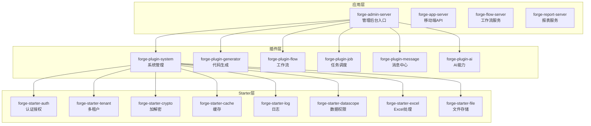
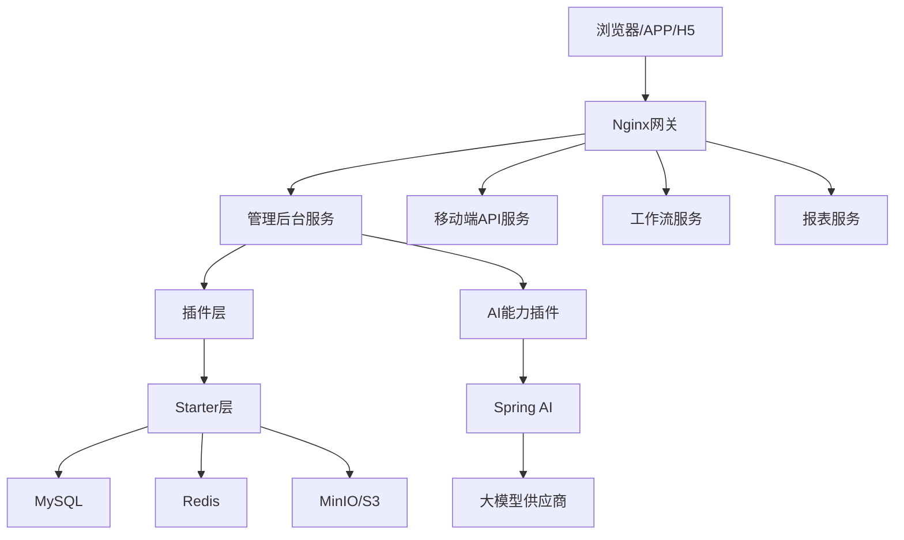
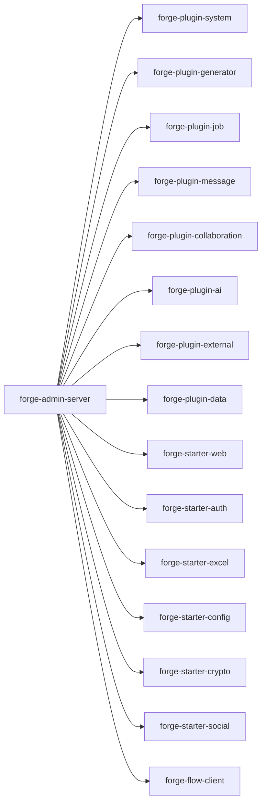
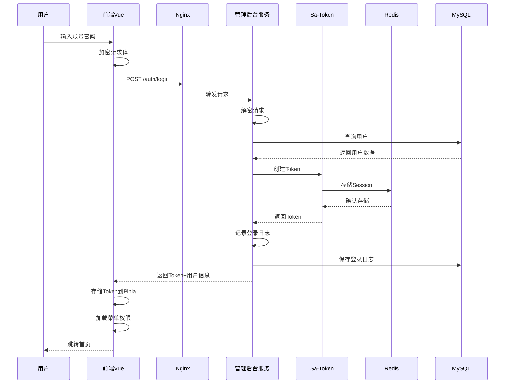
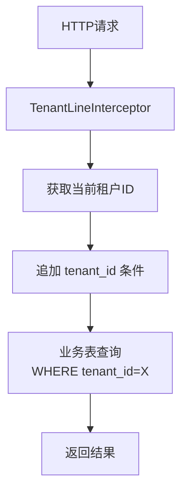
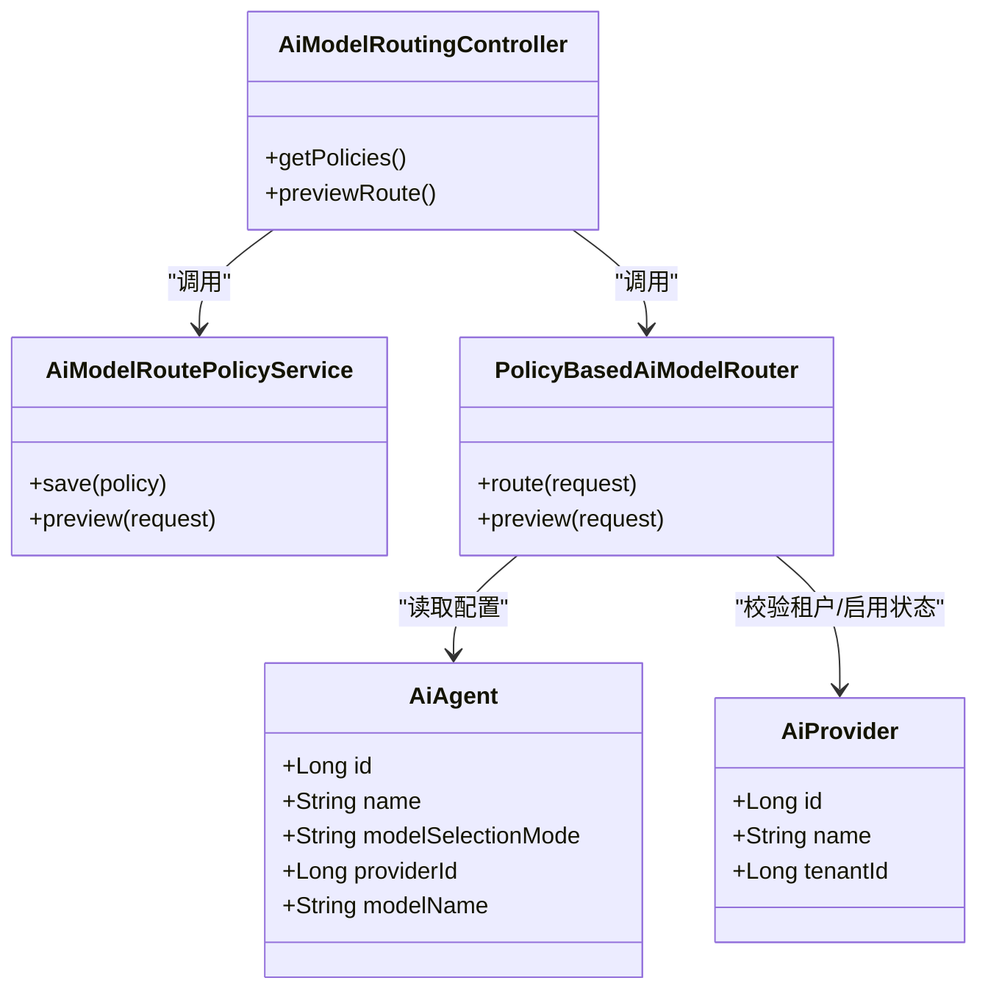
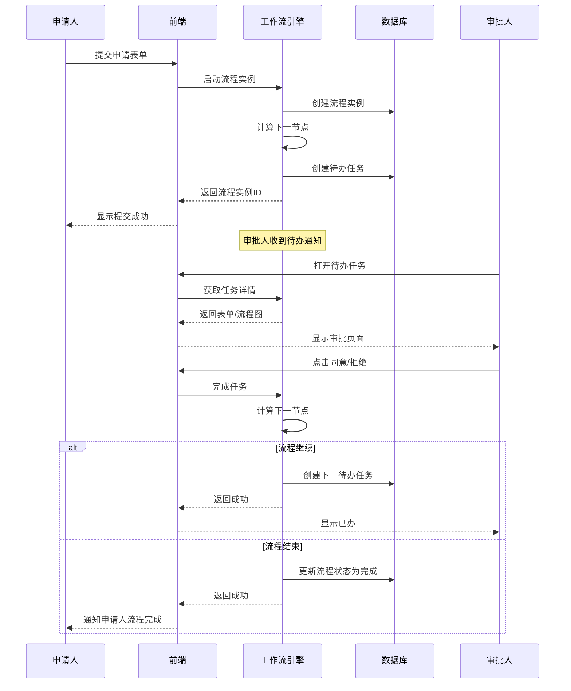
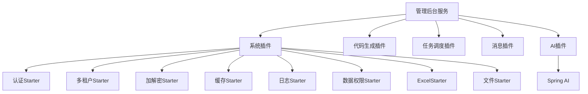

# 整体架构概览

<cite>
**本文引用的文件**
- [README.md](file://README.md)
- [docs/architecture.md](file://docs/architecture.md)
- [forge-server/forge-admin-server/pom.xml](file://forge-server/forge-admin-server/pom.xml)
- [forge-server/forge-framework/forge-plugin-parent/forge-plugin-ai/pom.xml](file://forge-server/forge-framework/forge-plugin-parent/forge-plugin-ai/pom.xml)
- [forge-server/forge-framework/forge-plugin-parent/forge-plugin-ai/src/main/java/com/mdframe/forge/plugin/ai/routing/controller/AiModelRoutingController.java](file://forge-server/forge-framework/forge-plugin-parent/forge-plugin-ai/src/main/java/com/mdframe/forge/plugin/ai/routing/controller/AiModelRoutingController.java)
- [forge-server/forge-framework/forge-plugin-parent/forge-plugin-ai/src/main/java/com/mdframe/forge/plugin/ai/routing/PolicyBasedAiModelRouter.java](file://forge-server/forge-framework/forge-plugin-parent/forge-plugin-ai/src/main/java/com/mdframe/forge/plugin/ai/routing/PolicyBasedAiModelRouter.java)
</cite>

## 目录
1. [引言](#引言)
2. [项目结构](#项目结构)
3. [核心组件](#核心组件)
4. [架构总览](#架构总览)
5. [详细组件分析](#详细组件分析)
6. [依赖关系分析](#依赖关系分析)
7. [性能与横切关注点](#性能与横切关注点)
8. [故障排查指南](#故障排查指南)
9. [结论](#结论)
10. [附录](#附录)

## 引言
本概览面向Forge Admin的整体架构，围绕“微内核+插件化”的核心设计理念，系统阐述分层职责（应用层、业务层、插件层、Starter层）与前后端分离通信机制；说明多租户SaaS的数据隔离、权限控制与配置管理；并给出系统架构图、模块依赖图与部署拓扑图。同时覆盖安全、缓存、消息、文件存储等横切能力，以及AI能力集成的智能体管理、模型路由与会话管理等关键设计。

## 项目结构
后端采用聚合工程组织：应用服务聚合插件与Starter，插件封装业务能力，Starter封装通用技术能力。前端为Vue 3 SPA，通过HTTP与后端交互，支持加密请求与动态路由。

图表来源
- [docs/architecture.md:64-131](file://docs/architecture.md#L64-L131)

章节来源
- [README.md:241-259](file://README.md#L241-L259)
- [docs/architecture.md:64-131](file://docs/architecture.md#L64-L131)

## 核心组件
- 应用层：聚合各插件与Starter，对外暴露统一接口；如管理后台、移动端API、工作流服务、报表服务。
- 插件层：按领域拆分能力，如系统管理、代码生成、工作流、任务调度、消息中心、AI能力等，具备独立演进与按需装配能力。
- Starter层：提供可插拔的技术能力，如认证、缓存、ORM、多租户、数据权限、加解密、日志、文件、Excel、消息、WebSocket等。
- 前端：Vue 3 + Naive UI + Pinia + Vue Router，提供动态菜单、按钮权限、加密请求、组件化CRUD与AI表单等能力。

章节来源
- [docs/architecture.md:64-131](file://docs/architecture.md#L64-L131)
- [docs/architecture.md:134-258](file://docs/architecture.md#L134-L258)

## 架构总览
整体采用前后端分离与微内核+插件化架构：前端通过Nginx反向代理访问后端服务；后端以Spring Boot应用为核心，通过Maven聚合装配插件与Starter；数据层包含MySQL、Redis、MinIO等；AI能力通过Spring AI集成多家大模型供应商，并提供智能体管理与模型路由。

图表来源
- [docs/architecture.md:260-364](file://docs/architecture.md#L260-L364)

章节来源
- [docs/architecture.md:260-364](file://docs/architecture.md#L260-L364)

## 详细组件分析

### 微内核与插件化装配
- 应用服务通过Maven依赖装配所需插件与Starter，形成最小可用内核与按需扩展的插件生态。
- 管理后台服务引入系统、代码生成、任务、消息、协作、AI、外部接口代理、数据等插件，以及Web、认证、Excel、配置、加解密、社交、Flow客户端等Starter。

图表来源
- [forge-server/forge-admin-server/pom.xml:14-155](file://forge-server/forge-admin-server/pom.xml#L14-L155)

章节来源
- [forge-server/forge-admin-server/pom.xml:14-155](file://forge-server/forge-admin-server/pom.xml#L14-L155)

### 前后端分离与通信机制
- 前端使用Axios发起HTTP请求，支持SM4/AES加密传输；后端通过注解对敏感接口进行加解密处理。
- 登录流程：前端加密请求→网关转发→后端解密→验证用户→创建Token并写入Redis→返回Token与用户信息→前端存储并加载菜单权限。

图表来源
- [docs/architecture.md:366-408](file://docs/architecture.md#L366-L408)

章节来源
- [docs/architecture.md:366-408](file://docs/architecture.md#L366-L408)

### 多租户SaaS架构
- 数据隔离：所有业务表包含tenant_id字段，通过拦截器在SQL层面自动追加租户过滤条件；系统配置与资源表有例外策略。
- 权限控制：RBAC模型（用户-角色-资源），支持菜单、按钮、API级别控制；数据权限基于组织/行政区划/自定义规则动态过滤。
- 配置管理：统一配置中心支持登录、水印、安全、加解密、认证、日志等全局配置项。

图表来源
- [docs/architecture.md:410-433](file://docs/architecture.md#L410-L433)

章节来源
- [docs/architecture.md:410-433](file://docs/architecture.md#L410-L433)

### AI能力集成：智能体管理、模型路由与会话管理
- 智能体管理：提供智能体的创建、配置、发布、下线生命周期管理，支持会话与提示词模板。
- 模型路由：基于策略选择供应商与模型，支持显式指定或默认策略；路由决策可预览。
- 会话管理：维护对话上下文，支持多轮对话与流式响应。

图表来源
- [forge-server/forge-framework/forge-plugin-parent/forge-plugin-ai/src/main/java/com/mdframe/forge/plugin/ai/routing/controller/AiModelRoutingController.java:1-29](file://forge-server/forge-framework/forge-plugin-parent/forge-plugin-ai/src/main/java/com/mdframe/forge/plugin/ai/routing/controller/AiModelRoutingController.java#L1-L29)
- [forge-server/forge-framework/forge-plugin-parent/forge-plugin-ai/src/main/java/com/mdframe/forge/plugin/ai/routing/PolicyBasedAiModelRouter.java:33-52](file://forge-server/forge-framework/forge-plugin-parent/forge-plugin-ai/src/main/java/com/mdframe/forge/plugin/ai/routing/PolicyBasedAiModelRouter.java#L33-L52)

章节来源
- [forge-server/forge-framework/forge-plugin-parent/forge-plugin-ai/pom.xml:14-137](file://forge-server/forge-framework/forge-plugin-parent/forge-plugin-ai/pom.xml#L14-L137)
- [forge-server/forge-framework/forge-plugin-parent/forge-plugin-ai/src/main/java/com/mdframe/forge/plugin/ai/routing/controller/AiModelRoutingController.java:1-29](file://forge-server/forge-framework/forge-plugin-parent/forge-plugin-ai/src/main/java/com/mdframe/forge/plugin/ai/routing/controller/AiModelRoutingController.java#L1-L29)
- [forge-server/forge-framework/forge-plugin-parent/forge-plugin-ai/src/main/java/com/mdframe/forge/plugin/ai/routing/PolicyBasedAiModelRouter.java:33-52](file://forge-server/forge-framework/forge-plugin-parent/forge-plugin-ai/src/main/java/com/mdframe/forge/plugin/ai/routing/PolicyBasedAiModelRouter.java#L33-L52)

### 工作流审批流程
- 申请人提交表单后启动流程实例，引擎计算下一节点并创建待办任务；审批人执行同意/拒绝，引擎推进流程直至结束。

图表来源
- [docs/architecture.md:529-565](file://docs/architecture.md#L529-L565)

章节来源
- [docs/architecture.md:529-565](file://docs/architecture.md#L529-L565)

## 依赖关系分析
- 应用层依赖插件层与Starter层，插件之间保持低耦合，通过接口与事件解耦。
- Starter层提供横向能力，被多个插件复用，避免重复实现。
- AI插件依赖Spring AI及多家供应商SDK，并通过租户数据库动态配置模型与密钥。

图表来源
- [forge-server/forge-admin-server/pom.xml:14-155](file://forge-server/forge-admin-server/pom.xml#L14-L155)
- [forge-server/forge-framework/forge-plugin-parent/forge-plugin-ai/pom.xml:14-137](file://forge-server/forge-framework/forge-plugin-parent/forge-plugin-ai/pom.xml#L14-L137)

章节来源
- [forge-server/forge-admin-server/pom.xml:14-155](file://forge-server/forge-admin-server/pom.xml#L14-L155)
- [forge-server/forge-framework/forge-plugin-parent/forge-plugin-ai/pom.xml:14-137](file://forge-server/forge-framework/forge-plugin-parent/forge-plugin-ai/pom.xml#L14-L137)

## 性能与横切关注点
- 安全架构：接口级加解密（SM4/AES）、RBAC权限控制、数据权限拦截、操作与登录日志审计。
- 缓存策略：Redis/Redisson用于Session、缓存与分布式锁；Caffeine用于本地缓存。
- 消息机制：站内信、系统通知、消息模板；支持异步推送与订阅。
- 文件存储：MinIO/S3对象存储，支持分片上传、预览与权限控制。
- 工作流与任务：Flowable流程引擎与Snail Job任务调度，保障业务流程自动化与定时任务可靠性。
- 监控与可观测性：服务监控、SQL性能分析、错误诊断与告警。

章节来源
- [docs/architecture.md:678-697](file://docs/architecture.md#L678-L697)
- [README.md:211-239](file://README.md#L211-L239)

## 故障排查指南
- 首次启动数据库或Redis连接错误：检查application-dev.yml中的连接信息与端口。
- 前端请求失败：确认后端服务端口与VITE_HTTP_PROXY_TARGET/VITE_FLOW_PROXY_TARGET配置是否正确。
- 新增配置项：确保敏感配置不提交，通用配置同步至示例配置文件并使用占位符。
- 迁移脚本未执行：检查FORGE_FLYWAY_LOCATIONS或FORGE_FLYWAY_ENABLED环境变量是否覆盖默认配置。

章节来源
- [README.md:502-519](file://README.md#L502-L519)
- [README.md:330-335](file://README.md#L330-L335)

## 结论
Forge Admin以微内核+插件化为核心，结合前后端分离与多租户SaaS能力，提供了可扩展、高内聚、低耦合的企业级中后台框架。通过Starter层沉淀通用技术能力，插件层承载业务领域功能，应用层按需装配，形成清晰的层次边界与依赖关系。AI能力的智能体管理、模型路由与会话管理进一步增强了平台的智能化水平。整体架构兼顾安全性、性能与可维护性，适合企业级复杂场景的快速交付与持续演进。

## 附录
- 部署拓扑：单机与集群部署方案，包括Nginx、应用服务、数据库、缓存与对象存储的编排方式。
- 快速开始：环境要求、初始化数据库、启动前后端、构建生产包等步骤。
- 功能模块：系统管理、AI能力、运维监控、开发者工具、AI大屏报表等能力清单。

章节来源
- [docs/architecture.md:569-650](file://docs/architecture.md#L569-L650)
- [README.md:263-427](file://README.md#L263-L427)
- [README.md:431-486](file://README.md#L431-L486)