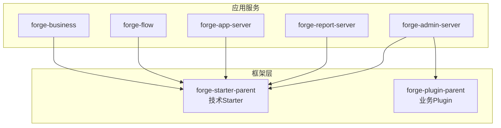
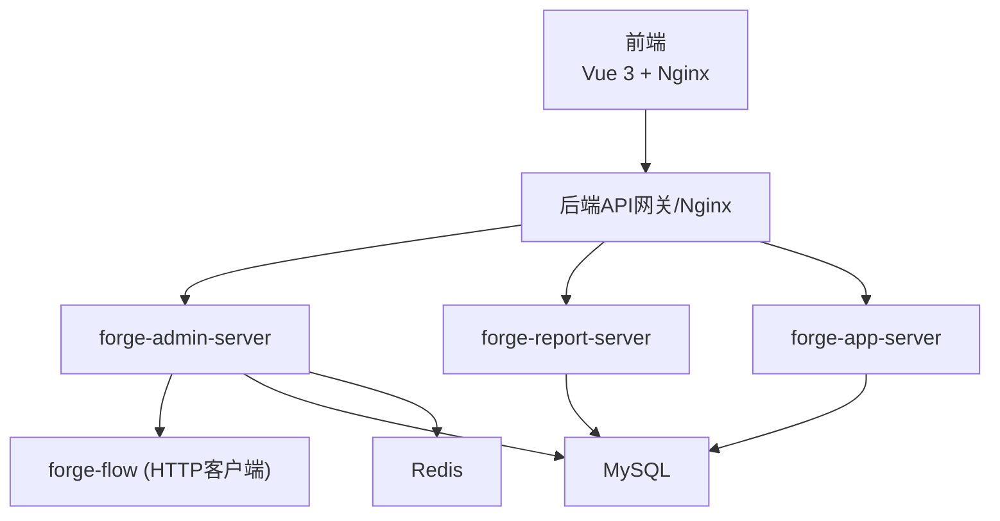
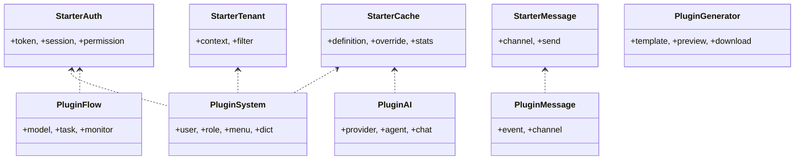
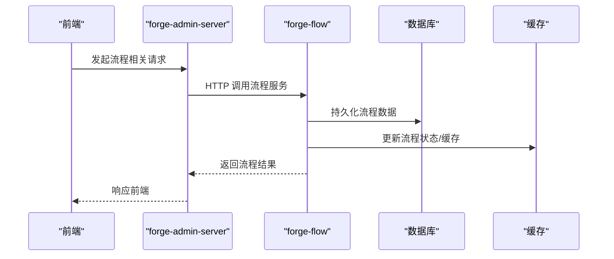
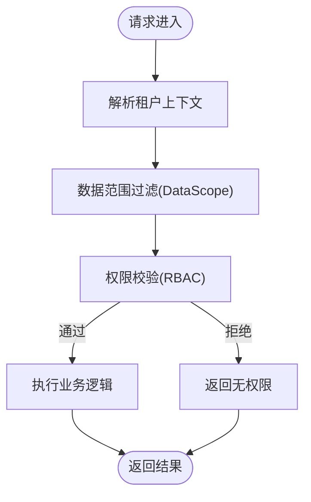
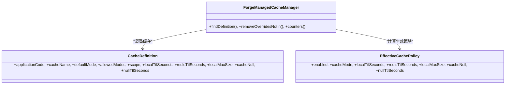
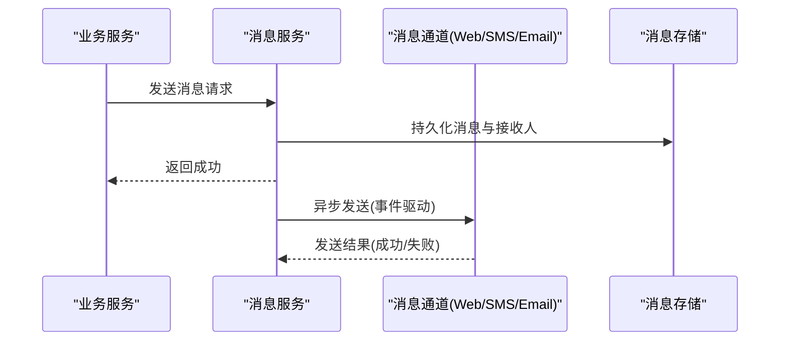
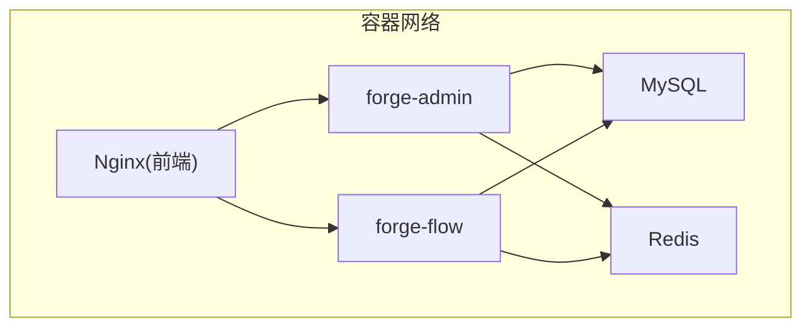
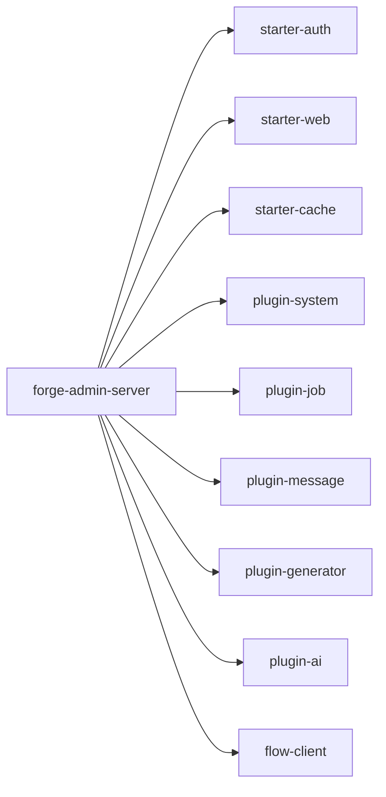

# 系统架构设计

<cite>
**本文引用的文件**
- [README.md](file://README.md)
- [forge-server/pom.xml](file://forge-server/pom.xml)
- [forge-server/forge-admin-server/pom.xml](file://forge-server/forge-admin-server/pom.xml)
- [forge-server/forge-framework/forge-plugin-parent/pom.xml](file://forge-server/forge-framework/forge-plugin-parent/pom.xml)
- [forge-server/forge-framework/forge-starter-parent/pom.xml](file://forge-server/forge-framework/forge-starter-parent/pom.xml)
- [forge-server/forge-framework/forge-starter-parent/forge-starter-cache/src/main/java/com/mdframe/forge/starter/cache/managed/ForgeManagedCacheManager.java](file://forge-server/forge-framework/forge-starter-parent/forge-starter-cache/src/main/java/com/mdframe/forge/starter/cache/managed/ForgeManagedCacheManager.java)
- [forge-server/forge-framework/forge-starter-parent/forge-starter-cache/src/main/java/com/mdframe/forge/starter/cache/managed/model/CacheDefinition.java](file://forge-server/forge-framework/forge-starter-parent/forge-starter-cache/src/main/java/com/mdframe/forge/starter/cache/managed/model/CacheDefinition.java)
- [forge-server/forge-framework/forge-starter-parent/forge-starter-cache/src/main/java/com/mdframe/forge/starter/cache/managed/model/EffectiveCachePolicy.java](file://forge-server/forge-framework/forge-starter-parent/forge-starter-cache/src/main/java/com/mdframe/forge/starter/cache/managed/model/EffectiveCachePolicy.java)
- [forge-server/forge-framework/forge-starter-parent/forge-starter-message/src/main/java/com/mdframe/forge/starter/message/channel/WebMessageChannel.java](file://forge-server/forge-framework/forge-starter-parent/forge-starter-message/src/main/java/com/mdframe/forge/starter/message/channel/WebMessageChannel.java)
- [forge-server/forge-framework/forge-plugin-parent/forge-plugin-message/src/main/java/com/mdframe/forge/plugin/message/event/MessageSendEvent.java](file://forge-server/forge-framework/forge-plugin-parent/forge-plugin-message/src/main/java/com/mdframe/forge/plugin/message/event/MessageSendEvent.java)
- [forge-server/forge-framework/forge-plugin-parent/forge-plugin-system/src/main/java/com/mdframe/forge/plugin/system/service/impl/SysFileStorageConfigServiceImpl.java](file://forge-server/forge-framework/forge-plugin-parent/forge-plugin-system/src/main/java/com/mdframe/forge/plugin/system/service/impl/SysFileStorageConfigServiceImpl.java)
- [forge-server/forge-framework/forge-plugin-parent/forge-plugin-system/src/main/java/com/mdframe/forge/plugin/system/controller/SysFileStorageConfigController.java](file://forge-server/forge-framework/forge-plugin-parent/forge-plugin-system/src/main/java/com/mdframe/forge/plugin/system/controller/SysFileStorageConfigController.java)
- [docker/docker-compose.yml](file://docker/docker-compose.yml)
- [NGINX_CONFIG.md](file://NGINX_CONFIG.md)
- [forge-admin-ui/package.json](file://forge-admin-ui/package.json)
- [docs/architecture.md](file://docs/architecture.md)
</cite>

## 目录
1. [引言](#引言)
2. [项目结构](#项目结构)
3. [核心组件](#核心组件)
4. [架构总览](#架构总览)
5. [详细组件分析](#详细组件分析)
6. [依赖关系分析](#依赖关系分析)
7. [性能与扩展性](#性能与扩展性)
8. [故障排查指南](#故障排查指南)
9. [结论](#结论)
10. [附录](#附录)

## 引言
本设计文档面向 Forge Admin 的系统级架构，围绕“微内核 + 插件化”的整体理念展开，解释 forge-framework、forge-plugin-parent、forge-starter-parent 的分层模式；梳理后端服务模块（forge-admin-server、forge-report-server、forge-app-server、forge-flow、forge-business）的职责边界与交互；说明前后端分离的通信机制；给出多租户隔离方案；并提供系统架构图、组件关系图与部署拓扑图；覆盖安全、缓存、消息、文件存储等横切关注点。

## 项目结构
- 后端采用 Maven 多模块聚合工程，根聚合在 forge-server/pom.xml，统一版本管理与模块编排。
- 框架层：
  - forge-starter-parent：技术型 Starter（认证、缓存、ORM、日志、配置、消息、租户、加解密、WebSocket、幂等、开放 API 安全等）。
  - forge-plugin-parent：业务型 Plugin（系统管理、代码生成、任务调度、消息中心、流程、AI、协作、外部接口代理、数据能力等）。
- 应用服务：
  - forge-admin-server：主后台入口，聚合系统管理、代码生成、任务、消息、协作、AI、能力平台等插件，对外提供管理端 API。
  - forge-report-server：AI 大屏报表服务。
  - forge-app-server：App 接口服务。
  - forge-flow：独立流程服务与客户端。
  - forge-business：业务模块（如业务核心能力）。
- 前端：
  - forge-admin-ui：Vue 3 + Naive UI 管理端前端。
  - forge-report-ui：AI 大屏前端。
  - forge-h5-ui：移动端 H5。

图表来源
- [forge-server/pom.xml:186-193](file://forge-server/pom.xml#L186-L193)
- [forge-server/forge-framework/forge-starter-parent/pom.xml:15-39](file://forge-server/forge-framework/forge-starter-parent/pom.xml#L15-L39)
- [forge-server/forge-framework/forge-plugin-parent/pom.xml:18-30](file://forge-server/forge-framework/forge-plugin-parent/pom.xml#L18-L30)

章节来源
- [forge-server/pom.xml:186-193](file://forge-server/pom.xml#L186-L193)
- [README.md:241-259](file://README.md#L241-L259)

## 核心组件
- 微内核与分层
  - Starter 层：封装通用技术能力（auth、cache、orm、tenant、crypto、excel、message、config、job、id、datascope、websocket、api-config、social、idempotent、openapi-security、outbound、collaboration），以 Spring Boot Starter 形式按需装配。
  - Plugin 层：封装业务能力（system、generator、job、message、flow、ai、collaboration、external、data、capability-*、mcp），通过插件方式组合到应用服务中。
  - 应用服务：按场景聚合 Starter 与 Plugin，暴露对外 API。
- 职责边界
  - forge-admin-server：聚合系统管理、代码生成、任务、消息、协作、AI、能力平台、外部接口代理、数据能力等，是管理端主入口。
  - forge-report-server：独立的大屏报表服务。
  - forge-app-server：面向 App 的接口服务。
  - forge-flow：独立工作流服务，提供流程建模、执行、监控等能力，其他服务通过 HTTP 客户端调用。
  - forge-business：承载具体业务领域能力。

章节来源
- [forge-server/forge-admin-server/pom.xml:14-138](file://forge-server/forge-admin-server/pom.xml#L14-L138)
- [forge-server/forge-framework/forge-starter-parent/pom.xml:15-39](file://forge-server/forge-framework/forge-starter-parent/pom.xml#L15-L39)
- [forge-server/forge-framework/forge-plugin-parent/pom.xml:18-30](file://forge-server/forge-framework/forge-plugin-parent/pom.xml#L18-L30)

## 架构总览
- 前后端分离
  - 前端：Vue 3 + Vite + Pinia + Vue Router + UnoCSS + Naive UI，构建产物由 Nginx 托管。
  - 后端：Spring Boot 3.x + Undertow，RESTful API 供前端调用。
  - 通信：HTTP/JSON，支持加密传输（SM4/AES）、鉴权（Sa-Token Token）、跨域与代理转发。
- 多租户隔离
  - 数据隔离：基于 tenant_id 的数据范围控制（DataScope），结合 ORM 拦截器实现 SQL 级过滤。
  - 权限控制：RBAC（用户-角色-资源），菜单/按钮/API 级别控制，租户维度可见性。
  - 配置管理：统一配置中心，支持运行时动态刷新。
- 服务拆分
  - 管理端、报表端、App 端、流程端解耦，便于独立扩缩容与发布。

图表来源
- [NGINX_CONFIG.md:7-48](file://NGINX_CONFIG.md#L7-L48)
- [docker/docker-compose.yml:11-149](file://docker/docker-compose.yml#L11-L149)

章节来源
- [README.md:68-73](file://README.md#L68-L73)
- [docs/architecture.md:569-601](file://docs/architecture.md#L569-L601)

## 详细组件分析

### 分层设计与插件体系
- Starter 层（技术能力）
  - 认证授权：forge-starter-auth（集成 Sa-Token，Token 生命周期、并发登录、前缀/名称可配）。
  - 缓存：forge-starter-cache（本地+Redis 双层缓存，策略定义、运行时覆盖、统计与失败记录）。
  - ORM：forge-starter-orm（MyBatis-Plus、分页、数据源）。
  - 租户：forge-starter-tenant（上下文注入、SQL 过滤）。
  - 加解密：forge-starter-crypto（敏感字段加解密、密钥轮换）。
  - 消息：forge-starter-message（消息通道抽象，Web/短信/邮件等）。
  - 其他：日志、事务、文件、Excel、配置、任务、ID 生成、数据权限、WebSocket、API 配置、社交登录、幂等、开放 API 安全、出站安全、协作等。
- Plugin 层（业务能力）
  - 系统管理：用户、角色、菜单、部门、岗位、租户、字典等。
  - 代码生成：AI 驱动 CRUD 生成、模板管理、预览下载。
  - 任务调度：定时任务、触发、日志。
  - 消息中心：站内信、通知、模板、发送事件。
  - 流程：Flowable 模型、审批、事件。
  - AI：供应商、模型、对话、生成。
  - 协作、外部接口代理、数据能力、MCP、能力平台与动作等。

图表来源
- [forge-server/forge-framework/forge-starter-parent/pom.xml:15-39](file://forge-server/forge-framework/forge-starter-parent/pom.xml#L15-L39)
- [forge-server/forge-framework/forge-plugin-parent/pom.xml:18-30](file://forge-server/forge-framework/forge-plugin-parent/pom.xml#L18-L30)

章节来源
- [forge-server/forge-framework/forge-starter-parent/pom.xml:15-39](file://forge-server/forge-framework/forge-starter-parent/pom.xml#L15-L39)
- [forge-server/forge-framework/forge-plugin-parent/pom.xml:18-30](file://forge-server/forge-framework/forge-plugin-parent/pom.xml#L18-L30)

### 后端服务模块职责与交互
- forge-admin-server
  - 聚合系统管理、代码生成、任务、消息、协作、AI、能力平台、外部接口代理、数据能力等插件。
  - 通过 HTTP 客户端调用 forge-flow 完成流程相关操作。
- forge-report-server
  - 独立的大屏报表服务，负责大屏编辑、发布与展示。
- forge-app-server
  - 面向 App 的接口服务，提供移动端所需 API。
- forge-flow
  - 独立流程服务，提供流程建模、执行、待办、监控等能力。
- forge-business
  - 承载业务领域能力，被 admin/app/report 等服务复用。

图表来源
- [forge-server/forge-admin-server/pom.xml:88-92](file://forge-server/forge-admin-server/pom.xml#L88-L92)
- [docker/docker-compose.yml:61-132](file://docker/docker-compose.yml#L61-L132)

章节来源
- [forge-server/forge-admin-server/pom.xml:14-138](file://forge-server/forge-admin-server/pom.xml#L14-L138)
- [README.md:241-259](file://README.md#L241-L259)

### 前后端分离与通信机制
- 前端技术栈：Vue 3、Vite、Pinia、Vue Router、UnoCSS、Naive UI、ECharts、BPMN.js、CodeMirror 等。
- 后端技术栈：Spring Boot 3.x、Undertow、MyBatis-Plus、Sa-Token、Flowable、Redis/Redisson、Quartz/SnailJob、Flyway。
- 通信机制：
  - RESTful JSON 接口，Nginx 反向代理将 /forge-api/* 转发至后端服务。
  - 认证：Sa-Token Token，支持超时、活动超时、并发登录、Token 前缀/名称可配。
  - 加密：接口支持 SM4/AES 加密传输。
  - 跨域与代理：开发环境通过 Vite 代理，生产环境通过 Nginx 统一入口。

章节来源
- [README.md:211-238](file://README.md#L211-L238)
- [NGINX_CONFIG.md:7-48](file://NGINX_CONFIG.md#L7-L48)
- [forge-admin-ui/package.json:19-73](file://forge-admin-ui/package.json#L19-L73)

### 多租户隔离方案
- 数据隔离
  - 基于 tenant_id 的数据范围控制（DataScope），通过 ORM 拦截器在 SQL 层自动追加租户条件，确保查询与写入均受租户约束。
  - 数据权限表结构与规则支持组织、区域、用户等多维数据范围。
- 权限控制
  - RBAC 模型：用户-角色-资源，支持菜单、按钮、API 级别控制。
  - 租户维度可见性：角色、用户、部门等实体与租户绑定，避免越权访问。
- 配置管理
  - 统一配置中心，支持运行时刷新，敏感配置加密存储。
  - 文件存储配置支持多后端（本地、OSS、MinIO 等），默认存储可切换。

图表来源
- [forge-server/forge-framework/forge-starter-parent/forge-starter-datascope/sql/datascope_tables.sql:13-25](file://forge-server/forge-framework/forge-starter-parent/forge-starter-datascope/sql/datascope_tables.sql#L13-L25)
- [forge-server/forge-framework/forge-plugin-parent/forge-plugin-generator/src/main/java/com/mdframe/forge/plugin/generator/service/businessapp/BusinessApplicationService.java:777-808](file://forge-server/forge-framework/forge-plugin-parent/forge-plugin-generator/src/main/java/com/mdframe/forge/plugin/generator/service/businessapp/BusinessApplicationService.java#L777-L808)

章节来源
- [docs/architecture.md:1-21](file://docs/architecture.md#L1-L21)
- [forge-server/forge-framework/forge-starter-parent/forge-starter-datascope/sql/datascope_tables.sql:13-25](file://forge-server/forge-framework/forge-starter-parent/forge-starter-datascope/sql/datascope_tables.sql#L13-L25)

### 安全架构
- 认证与会话
  - Sa-Token 管理 Token，支持超时、活动超时、并发登录、Token 前缀/名称可配。
  - 会话与在线用户管理，支持强制下线。
- 授权与数据权限
  - RBAC 与数据范围（DataScope）双重控制，细粒度到菜单、按钮、API。
- 数据安全
  - 敏感字段加解密（Crypto），密钥轮换与持久化策略。
  - 文件存储配置中的 AccessKey/SecretKey 脱敏显示与保存保护。
- 传输安全
  - 接口支持 SM4/AES 加密传输，HTTPS 由 Nginx 终止。

章节来源
- [forge-admin-ui/src/views/system/config-center.vue:242-313](file://forge-admin-ui/src/views/system/config-center.vue#L242-L313)
- [forge-server/forge-framework/forge-plugin-parent/forge-plugin-system/src/main/java/com/mdframe/forge/plugin/system/controller/SysFileStorageConfigController.java:17-164](file://forge-server/forge-framework/forge-plugin-parent/forge-plugin-system/src/main/java/com/mdframe/forge/plugin/system/controller/SysFileStorageConfigController.java#L17-L164)
- [README.md:583-599](file://README.md#L583-L599)

### 缓存策略
- 双层缓存
  - 本地缓存 + Redis 分布式缓存，支持 TTL、最大容量、空值缓存策略。
- 策略管理
  - CacheDefinition：定义缓存名、默认模式、允许模式、作用域、TTL、容量等。
  - EffectiveCachePolicy：合并定义与运行时覆盖，得到最终生效策略。
  - ForgeManagedCacheManager：加载定义、处理覆盖、统计命中/未命中/失败、清理过期覆盖。
- 运维与可观测
  - 计数器统计 hits/misses/puts/evictions/failures，便于定位问题与调优。

图表来源
- [forge-server/forge-framework/forge-starter-parent/forge-starter-cache/src/main/java/com/mdframe/forge/starter/cache/managed/model/CacheDefinition.java:9-31](file://forge-server/forge-framework/forge-starter-parent/forge-starter-cache/src/main/java/com/mdframe/forge/starter/cache/managed/model/CacheDefinition.java#L9-L31)
- [forge-server/forge-framework/forge-starter-parent/forge-starter-cache/src/main/java/com/mdframe/forge/starter/cache/managed/model/EffectiveCachePolicy.java:7-40](file://forge-server/forge-framework/forge-starter-parent/forge-starter-cache/src/main/java/com/mdframe/forge/starter/cache/managed/model/EffectiveCachePolicy.java#L7-L40)
- [forge-server/forge-framework/forge-starter-parent/forge-starter-cache/src/main/java/com/mdframe/forge/starter/cache/managed/ForgeManagedCacheManager.java:212-521](file://forge-server/forge-framework/forge-starter-parent/forge-starter-cache/src/main/java/com/mdframe/forge/starter/cache/managed/ForgeManagedCacheManager.java#L212-L521)

章节来源
- [forge-server/forge-framework/forge-starter-parent/forge-starter-cache/src/main/java/com/mdframe/forge/starter/cache/managed/ForgeManagedCacheManager.java:212-521](file://forge-server/forge-framework/forge-starter-parent/forge-starter-cache/src/main/java/com/mdframe/forge/starter/cache/managed/ForgeManagedCacheManager.java#L212-L521)

### 消息机制
- 通道抽象
  - WebMessageChannel：实现消息通道接口，当前为占位实现，实际发送由插件模块完成。
- 事件驱动
  - MessageSendEvent：在主记录与接收人落库事务提交后触发，执行实际渠道发送；发送失败仅标记状态，不回滚已落库的消息记录。
- 管理界面
  - 消息配置、测试面板、监控列表、用户消息页面，职责清晰划分。

图表来源
- [forge-server/forge-framework/forge-starter-parent/forge-starter-message/src/main/java/com/mdframe/forge/starter/message/channel/WebMessageChannel.java:1-17](file://forge-server/forge-framework/forge-starter-parent/forge-starter-message/src/main/java/com/mdframe/forge/starter/message/channel/WebMessageChannel.java#L1-L17)
- [forge-server/forge-framework/forge-plugin-parent/forge-plugin-message/src/main/java/com/mdframe/forge/plugin/message/event/MessageSendEvent.java:1-42](file://forge-server/forge-framework/forge-plugin-parent/forge-plugin-message/src/main/java/com/mdframe/forge/plugin/message/event/MessageSendEvent.java#L1-L42)

章节来源
- [forge-server/forge-framework/forge-starter-parent/forge-starter-message/src/main/java/com/mdframe/forge/starter/message/channel/WebMessageChannel.java:1-17](file://forge-server/forge-framework/forge-starter-parent/forge-starter-message/src/main/java/com/mdframe/forge/starter/message/channel/WebMessageChannel.java#L1-L17)
- [forge-server/forge-framework/forge-plugin-parent/forge-plugin-message/src/main/java/com/mdframe/forge/plugin/message/event/MessageSendEvent.java:1-42](file://forge-server/forge-framework/forge-plugin-parent/forge-plugin-message/src/main/java/com/mdframe/forge/plugin/message/event/MessageSendEvent.java#L1-L42)

### 文件存储
- 存储配置管理
  - SysFileStorageConfigController：提供分页查询、详情、新增、修改、启用/禁用、测试连接、创建桶、获取默认配置、选项列表等接口。
  - SysFileStorageConfigServiceImpl：转换配置、刷新缓存、测试连接、创建桶、获取默认配置、启用选项列表；支持敏感字段掩码与保留。
- 多后端支持
  - 支持本地、OSS、MinIO 等多种存储类型，默认存储可切换，上传组件使用默认配置。

章节来源
- [forge-server/forge-framework/forge-plugin-parent/forge-plugin-system/src/main/java/com/mdframe/forge/plugin/system/controller/SysFileStorageConfigController.java:17-164](file://forge-server/forge-framework/forge-plugin-parent/forge-plugin-system/src/main/java/com/mdframe/forge/plugin/system/controller/SysFileStorageConfigController.java#L17-L164)
- [forge-server/forge-framework/forge-plugin-parent/forge-plugin-system/src/main/java/com/mdframe/forge/plugin/system/service/impl/SysFileStorageConfigServiceImpl.java:104-250](file://forge-server/forge-framework/forge-plugin-parent/forge-plugin-system/src/main/java/com/mdframe/forge/plugin/system/service/impl/SysFileStorageConfigServiceImpl.java#L104-L250)

### 部署拓扑
- Docker Compose 编排
  - MySQL、Redis、forge-flow、forge-admin、Nginx（前端）五个服务，网络互通，健康检查保障启动顺序。
  - 环境变量注入数据库、缓存、流程服务地址、加密密钥等。
- Nginx 反向代理
  - 静态资源与 API 路由转发，支持流程服务与主服务的统一入口。

图表来源
- [docker/docker-compose.yml:11-149](file://docker/docker-compose.yml#L11-L149)
- [NGINX_CONFIG.md:7-48](file://NGINX_CONFIG.md#L7-L48)

章节来源
- [docker/docker-compose.yml:11-149](file://docker/docker-compose.yml#L11-L149)
- [NGINX_CONFIG.md:7-48](file://NGINX_CONFIG.md#L7-L48)

## 依赖关系分析
- 应用服务对 Starter 与 Plugin 的依赖
  - forge-admin-server 依赖多个 Starter（web、auth、excel、config、id、crypto、social、api-config）与多个 Plugin（system、job、message、collaboration、generator、ai、mcp、capability-platform/actions/high-risk-approval、external、data）。
  - 通过 HTTP 客户端依赖 forge-flow-client，实现与服务端的解耦调用。
- 版本与依赖管理
  - 根聚合统一管理 Spring Boot、Flowable、Redisson、Dynamic-Datasource、P6Spy、Hutool、OkHttp、MapStruct-Plus、Lombok、BouncyCastle、JustAuth、IP2Region、Undertow、AWS/Tencent SDK、SMS4J、Fastjson、AnyLine、Flyway、Spring AI/Alibaba 等版本。

图表来源
- [forge-server/forge-admin-server/pom.xml:14-138](file://forge-server/forge-admin-server/pom.xml#L14-L138)
- [forge-server/pom.xml:12-62](file://forge-server/pom.xml#L12-L62)

章节来源
- [forge-server/forge-admin-server/pom.xml:14-138](file://forge-server/forge-admin-server/pom.xml#L14-L138)
- [forge-server/pom.xml:12-62](file://forge-server/pom.xml#L12-L62)

## 性能与扩展性
- 性能优化
  - 双层缓存（本地+Redis）降低热点数据访问延迟；策略化管理支持不同缓存场景的 TTL 与容量控制。
  - 数据权限在 SQL 层过滤，减少无效数据传输。
  - 使用 Undertow 作为 Web 服务器，提升并发处理能力。
- 扩展性
  - 插件化架构使新能力以插件形式接入，不影响核心稳定性。
  - 服务拆分（admin/report/app/flow）支持独立扩缩容与灰度发布。
- 可观测性
  - 缓存命中率、失败计数、消息发送状态、任务执行日志等指标便于监控与排障。

[本节为通用指导，不直接分析具体文件]

## 故障排查指南
- 首次启动数据库或 Redis 连接错误
  - 检查 application-dev.yml 配置是否正确复制并修改。
- 前端请求后端失败
  - 确认后端端口是否启动，检查 .env.development 中的 VITE_HTTP_PROXY_TARGET 与 VITE_FLOW_PROXY_TARGET。
- 缓存策略异常
  - 查看 ForgeManagedCacheManager 的失败记录与计数器，核对 CacheDefinition 与运行时覆盖是否一致。
- 消息发送失败
  - 检查 MessageSendEvent 的事件触发与通道实现，确认消息记录状态与接收人列表。
- 文件存储配置不可用
  - 使用测试连接接口验证存储后端连通性，检查 AccessKey/SecretKey 是否被正确保存与解密。

章节来源
- [README.md:502-518](file://README.md#L502-L518)
- [forge-server/forge-framework/forge-starter-parent/forge-starter-cache/src/main/java/com/mdframe/forge/starter/cache/managed/ForgeManagedCacheManager.java:488-521](file://forge-server/forge-framework/forge-starter-parent/forge-starter-cache/src/main/java/com/mdframe/forge/starter/cache/managed/ForgeManagedCacheManager.java#L488-L521)
- [forge-server/forge-framework/forge-plugin-parent/forge-plugin-message/src/main/java/com/mdframe/forge/plugin/message/event/MessageSendEvent.java:1-42](file://forge-server/forge-framework/forge-plugin-parent/forge-plugin-message/src/main/java/com/mdframe/forge/plugin/message/event/MessageSendEvent.java#L1-L42)
- [forge-server/forge-framework/forge-plugin-parent/forge-plugin-system/src/main/java/com/mdframe/forge/plugin/system/controller/SysFileStorageConfigController.java:112-164](file://forge-server/forge-framework/forge-plugin-parent/forge-plugin-system/src/main/java/com/mdframe/forge/plugin/system/controller/SysFileStorageConfigController.java#L112-L164)

## 结论
Forge Admin 通过“微内核 + 插件化”的分层架构，实现了高内聚、低耦合、易扩展的企业级后台平台。Starter 层提供稳定可靠的技术底座，Plugin 层封装业务能力，应用服务按场景聚合，形成清晰的职责边界。前后端分离、多租户隔离、安全加固、缓存策略、消息机制与文件存储等横切关注点均有完善设计。部署层面通过 Docker Compose 与 Nginx 反向代理，提供一键部署与统一入口，满足单机与集群扩展需求。

[本节为总结性内容，不直接分析具体文件]

## 附录
- 快速开始与环境要求
  - JDK 17+、Node.js 20.19+、pnpm 8+、MySQL 8.0+、Redis 6.0+。
- 初始化与启动
  - 数据库初始化脚本与 Flyway 迁移；后端服务与前端项目的启动命令。
- 功能模块概览
  - 系统管理、AI 能力、运维监控、开发者工具、AI 大屏报表等。

章节来源
- [README.md:263-393](file://README.md#L263-L393)
- [README.md:431-486](file://README.md#L431-L486)