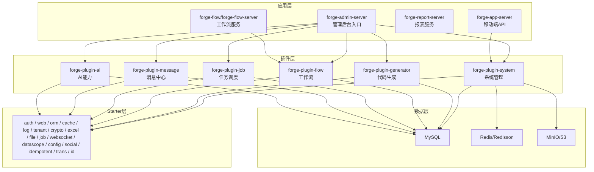
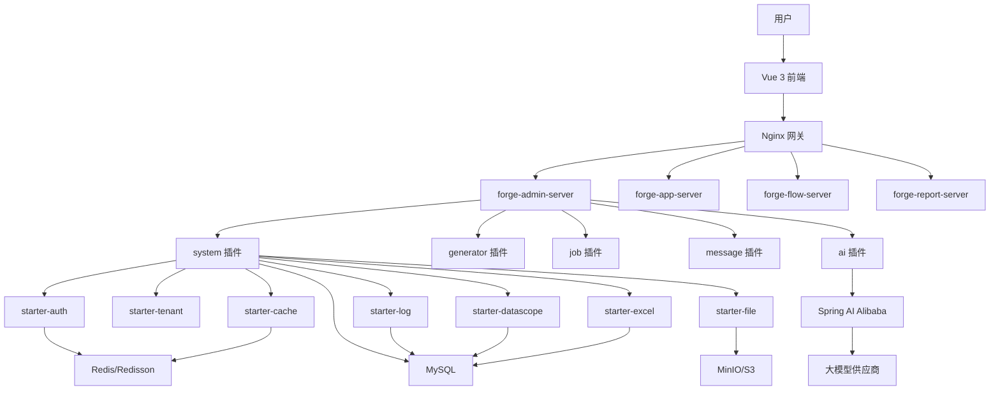
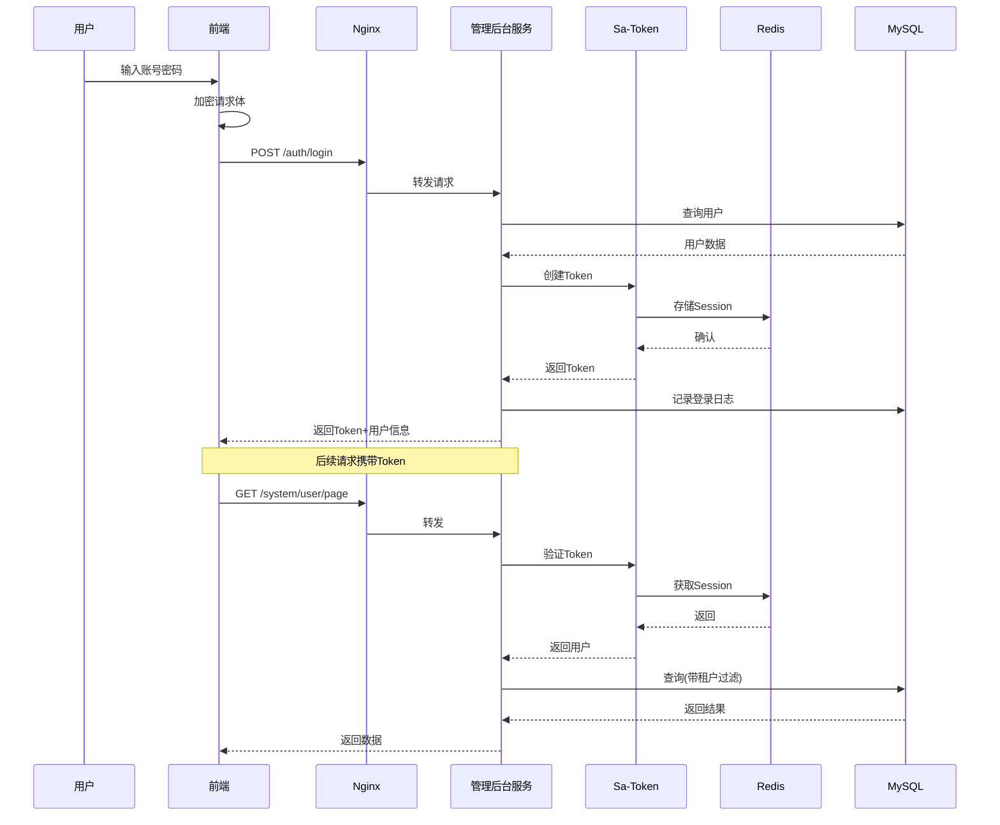
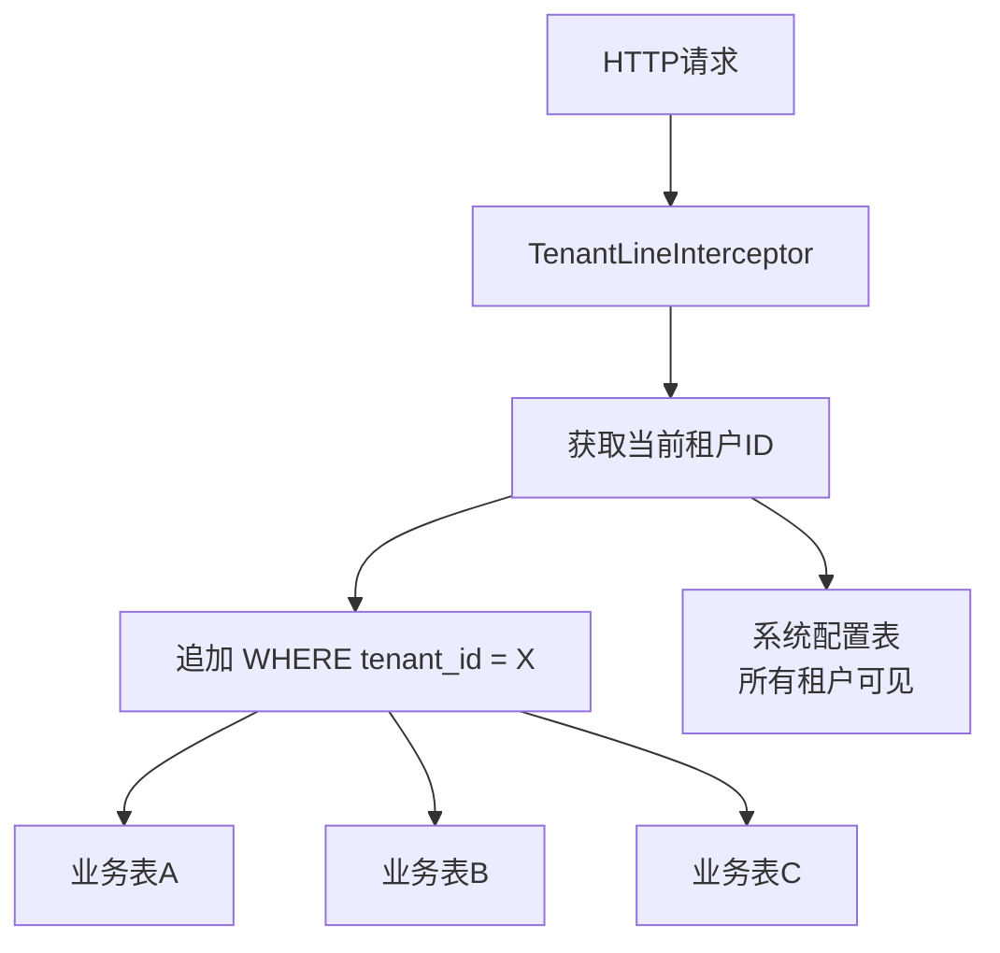
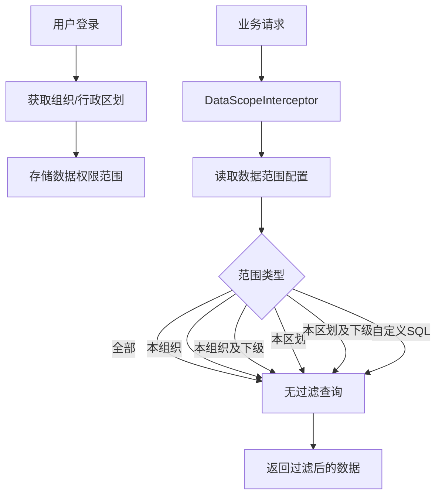
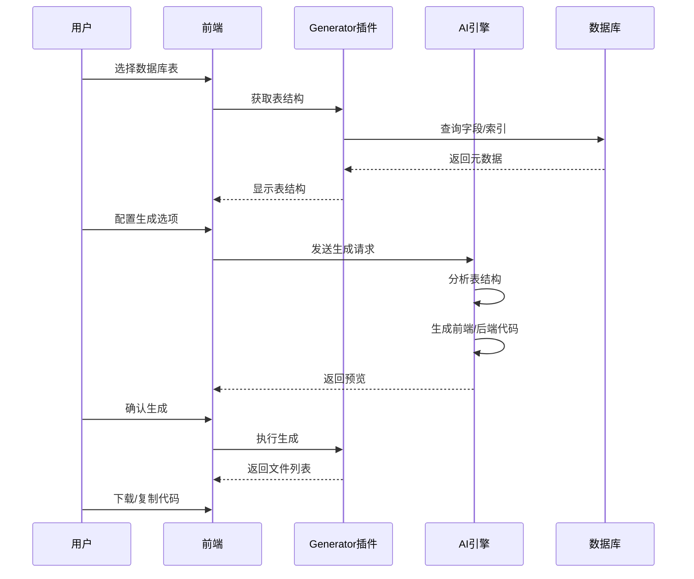
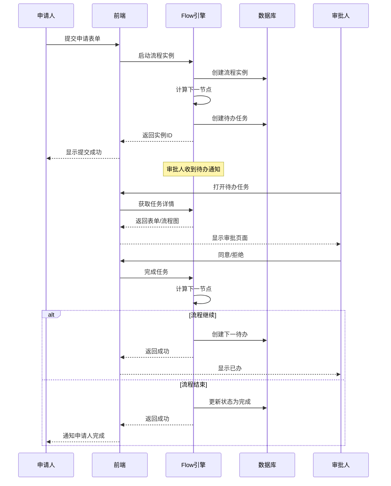
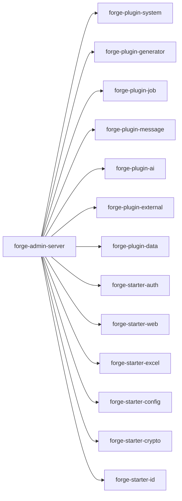

# 项目概述

<cite>
**本文引用的文件**
- [README.md](file://README.md)
- [docs/architecture.md](file://docs/architecture.md)
- [forge-server/forge-admin-server/pom.xml](file://forge-server/forge-admin-server/pom.xml)
- [forge-admin-ui/package.json](file://forge-admin-ui/package.json)
- [forge-server/forge-framework/forge-plugin-parent/forge-plugin-generator/src/main/java/com/mdframe/forge/plugin/generator/service/AiClientAdapter.java](file://forge-server/forge-framework/forge-plugin-parent/forge-plugin-generator/src/main/java/com/mdframe/forge/plugin/generator/service/AiClientAdapter.java)
- [forge-server/forge-app-server/src/main/java/com/mdframe/forge/app/server/bridge/AppAiClientAdapter.java](file://forge-server/forge-app-server/src/main/java/com/mdframe/forge/app/server/bridge/AppAiClientAdapter.java)
</cite>

## 目录
1. [简介](#简介)
2. [项目结构](#项目结构)
3. [核心组件](#核心组件)
4. [架构总览](#架构总览)
5. [详细组件分析](#详细组件分析)
6. [依赖关系分析](#依赖关系分析)
7. [性能与扩展性](#性能与扩展性)
8. [快速开始与环境要求](#快速开始与环境要求)
9. [在线演示与默认账号](#在线演示与默认账号)
10. [常见问题与排错](#常见问题与排错)
11. [结论](#结论)

## 简介
Forge Admin 是一套面向企业后台、SaaS 管理端、数据可视化平台与内部低代码工具的中后台框架。它围绕“更快交付业务页面、更稳承载企业复杂度、更容易扩展新能力”的目标，提供微内核插件化架构、AI 驱动的代码生成、Flowable 工作流、多租户隔离、RBAC 权限控制、统一配置中心、文件存储、Excel 导入导出等开箱即用的能力，并支持 PC、移动端 H5 等多端体验。

- 核心价值主张
  - 低代码与 AI：通过自然语言或表结构快速生成 CRUD、表单、流程与大屏，降低重复劳动，提升交付效率。
  - 企业级稳健：基于 RBAC 与数据权限的多维度安全模型，结合多租户隔离、操作日志、审计与监控，满足复杂企业场景。
  - 可插拔扩展：以 Starter 封装技术能力、以 Plugin 封装业务能力，应用服务按需聚合，便于演进与治理。

- 适用场景
  - 企业内部管理系统（组织、用户、角色、菜单、字典、文件、日志、通知等）
  - 多租户 SaaS 后台（租户隔离、客户独立配置、精细化权限）
  - 审批流业务系统（请假、采购、合同、报销、工单等）
  - 数据大屏与驾驶舱（AI 生成 + 真实 API 接入）
  - 低代码/代码生成平台（模板、设计器、AI 辅助沉淀研发资产）

**章节来源**
- [README.md:29-65](file://README.md#L29-L65)
- [docs/architecture.md:3-19](file://docs/architecture.md#L3-L19)

## 项目结构
后端采用分层工程组织：应用层聚合插件，插件层按领域拆分，Starter 层封装通用技术能力；前端包含管理端、H5、报表大屏等多个子工程。

**图表来源**
- [docs/architecture.md:64-131](file://docs/architecture.md#L64-L131)
- [forge-server/forge-admin-server/pom.xml:14-155](file://forge-server/forge-admin-server/pom.xml#L14-L155)

**章节来源**
- [README.md:241-259](file://README.md#L241-L259)
- [docs/architecture.md:64-131](file://docs/architecture.md#L64-L131)

## 核心组件
- 微内核与插件体系
  - 应用服务通过 Maven 依赖聚合所需插件与 Starter，实现“核心轻量、能力可插拔”。
  - 典型插件：系统管理、代码生成、工作流、任务调度、消息中心、AI 能力等。
- 认证与权限
  - 基于 Sa-Token 的 Token 会话与鉴权，结合 RBAC 与数据权限拦截器，实现菜单、按钮、API 多维控制。
- 多租户与数据隔离
  - 通过 TenantLineInterceptor 自动追加 tenant_id 条件，实现租户级数据隔离；部分系统表（如资源）不在拦截范围。
- AI 驱动的代码生成
  - 通过 AiClientAdapter 抽象 AI 客户端，屏蔽不同供应商差异；App 服务提供降级实现，避免引入不必要的 AI 管理插件。
- 工作流引擎
  - 集成 Flowable，覆盖建模、发起、待办、已办、时间轴追踪等全流程。
- 前端工程
  - Vue 3 + Naive UI + Vite + Pinia + UnoCSS，内置动态表单/表格、BPMN 设计器、ECharts 可视化等。

**章节来源**
- [docs/architecture.md:22-61](file://docs/architecture.md#L22-L61)
- [docs/architecture.md:366-465](file://docs/architecture.md#L366-L465)
- [forge-server/forge-framework/forge-plugin-parent/forge-plugin-generator/src/main/java/com/mdframe/forge/plugin/generator/service/AiClientAdapter.java:1-32](file://forge-server/forge-framework/forge-plugin-parent/forge-plugin-generator/src/main/java/com/mdframe/forge/plugin/generator/service/AiClientAdapter.java#L1-L32)
- [forge-server/forge-app-server/src/main/java/com/mdframe/forge/app/server/bridge/AppAiClientAdapter.java:1-41](file://forge-server/forge-app-server/src/main/java/com/mdframe/forge/app/server/bridge/AppAiClientAdapter.java#L1-L41)
- [forge-admin-ui/package.json:19-73](file://forge-admin-ui/package.json#L19-L73)

## 架构总览
整体采用前后端分离与微内核插件化架构：前端通过 Nginx 反向代理访问各后端服务；应用层聚合 Starter 与 Plugin；数据层由 MySQL、Redis、对象存储构成；AI 能力通过 Spring AI Alibaba 对接多家大模型供应商。

**图表来源**
- [docs/architecture.md:260-364](file://docs/architecture.md#L260-L364)
- [forge-server/forge-admin-server/pom.xml:14-155](file://forge-server/forge-admin-server/pom.xml#L14-L155)

## 详细组件分析

### 认证授权与安全通信
- 登录流程
  - 前端对密码进行加密后提交，后端解密校验，创建 Token 并写入 Redis 会话，记录登录日志，返回 Token 与用户信息。
  - 后续请求携带 Token，服务端验证会话、检查权限，并在查询时附加租户过滤条件。
- 加密通信
  - 接口支持 SM4/AES 加密传输，敏感字段与密钥集中管理。

**图表来源**
- [docs/architecture.md:366-408](file://docs/architecture.md#L366-L408)

**章节来源**
- [docs/architecture.md:366-408](file://docs/architecture.md#L366-L408)

### 多租户数据隔离
- 通过 TenantLineInterceptor 在 SQL 执行前自动追加 tenant_id 条件，实现租户级数据隔离。
- 系统配置类表通常对所有租户可见；菜单资源表不在拦截范围内，保证全局资源一致性。

**图表来源**
- [docs/architecture.md:410-433](file://docs/architecture.md#L410-L433)

**章节来源**
- [docs/architecture.md:410-433](file://docs/architecture.md#L410-L433)

### 数据权限控制
- 基于 DataScopeInterceptor 与 sys_data_scope_config 配置，动态追加数据范围条件，支持本组织、本区划及下级、自定义 SQL 等多种策略。

**图表来源**
- [docs/architecture.md:435-465](file://docs/architecture.md#L435-L465)

**章节来源**
- [docs/architecture.md:435-465](file://docs/architecture.md#L435-L465)

### AI 驱动的代码生成
- 通过 AiClientAdapter 抽象 AI 调用，屏蔽供应商差异；App 服务提供降级实现，避免引入 AI 管理插件。
- 生成流程：选择数据库表 → 获取元数据 → 配置字段映射 → AI 生成前后端代码 → 预览/下载。

**图表来源**
- [docs/architecture.md:496-527](file://docs/architecture.md#L496-L527)
- [forge-server/forge-framework/forge-plugin-parent/forge-plugin-generator/src/main/java/com/mdframe/forge/plugin/generator/service/AiClientAdapter.java:1-32](file://forge-server/forge-framework/forge-plugin-parent/forge-plugin-generator/src/main/java/com/mdframe/forge/plugin/generator/service/AiClientAdapter.java#L1-L32)
- [forge-server/forge-app-server/src/main/java/com/mdframe/forge/app/server/bridge/AppAiClientAdapter.java:1-41](file://forge-server/forge-app-server/src/main/java/com/mdframe/forge/app/server/bridge/AppAiClientAdapter.java#L1-L41)

**章节来源**
- [docs/architecture.md:496-527](file://docs/architecture.md#L496-L527)
- [forge-server/forge-framework/forge-plugin-parent/forge-plugin-generator/src/main/java/com/mdframe/forge/plugin/generator/service/AiClientAdapter.java:1-32](file://forge-server/forge-framework/forge-plugin-parent/forge-plugin-generator/src/main/java/com/mdframe/forge/plugin/generator/service/AiClientAdapter.java#L1-L32)
- [forge-server/forge-app-server/src/main/java/com/mdframe/forge/app/server/bridge/AppAiClientAdapter.java:1-41](file://forge-server/forge-app-server/src/main/java/com/mdframe/forge/app/server/bridge/AppAiClientAdapter.java#L1-L41)

### 工作流审批流程
- 集成 Flowable，支持流程建模、发起、待办、已办、时间轴追踪等。

**图表来源**
- [docs/architecture.md:529-565](file://docs/architecture.md#L529-L565)

**章节来源**
- [docs/architecture.md:529-565](file://docs/architecture.md#L529-L565)

## 依赖关系分析
- 应用服务依赖
  - forge-admin-server 聚合 system、generator、job、message、ai、external、data 等插件以及 auth、web、excel、config、crypto、id 等 Starter。
- 前端依赖
  - Vue 3、Naive UI、Vite、Pinia、bpmn-js、echarts、codemirror、sm-crypto 等。

**图表来源**
- [forge-server/forge-admin-server/pom.xml:14-155](file://forge-server/forge-admin-server/pom.xml#L14-L155)

**章节来源**
- [forge-server/forge-admin-server/pom.xml:14-155](file://forge-server/forge-admin-server/pom.xml#L14-L155)
- [forge-admin-ui/package.json:19-73](file://forge-admin-ui/package.json#L19-L73)

## 性能与扩展性
- 高性能 Web 服务器：Undertow 替代传统 Tomcat，提升并发处理能力。
- 缓存与分布式锁：Redis + Redisson 提供缓存与会话能力，Lock4j 提供分布式锁。
- 多数据源与动态切换：Dynamic Datasource 支持多数据源场景。
- 可扩展性：Starter 与 Plugin 解耦清晰，可按需装配；新增业务模块只需新增插件并注册菜单与权限。

[本节为通用性能与扩展性讨论，不直接分析具体文件]

## 快速开始与环境要求
- 环境要求
  - JDK 17+、Node.js 20.19+、pnpm 8+、MySQL 8.0+、Redis 6.0+
- 初始化数据库
  - 使用脚本执行历史初始化 SQL、迁移脚本与必需种子数据，可选导入演示数据。
- 本地配置
  - 复制 application-dev.example.yml 为 application-dev.yml，配置 MySQL、Redis、文件存储、AI 供应商等。
- 启动服务
  - 后端：主后台服务、报表服务、独立流程服务分别启动。
  - 前端：管理端与报表前端分别安装依赖并启动开发服务器。
- 构建生产包
  - 前端构建静态资源，后端全量构建打包。

**章节来源**
- [README.md:263-427](file://README.md#L263-L427)

## 在线演示与默认账号
- 在线入口
  - 后台管理、移动端 H5、项目文档、大屏设计器等入口地址见 README。
- 默认体验账号
  - 后台：admin / 123456
  - H5：h5_admin / 123456

**章节来源**
- [README.md:76-88](file://README.md#L76-L88)

## 常见问题与排错
- 首次启动报数据库或 Redis 连接错误
  - 原因：未复制并修改 application-dev.yml
  - 处理：复制示例配置并填写本地连接信息
- 前端请求后端失败
  - 原因：后端端口未启动或前端代理目标配置不正确
  - 处理：检查 .env.development 中的代理目标是否指向本地服务
- 新增配置项注意事项
  - 本地敏感配置不要提交；通用配置同步到示例配置文件并使用占位符

**章节来源**
- [README.md:502-518](file://README.md#L502-L518)

## 结论
Forge Admin 以微内核插件化架构为基础，将 AI 能力、工作流、多租户、权限、报表与低代码工具整合为企业级中后台平台。其清晰的分层与模块化设计，既适合初学者快速上手，也为有经验的开发者提供了深度定制与扩展空间。借助 AI 驱动的代码生成与可视化大屏能力，团队可以显著缩短交付周期，同时保持系统的稳定性与可维护性。

[本节为总结性内容，不直接分析具体文件]