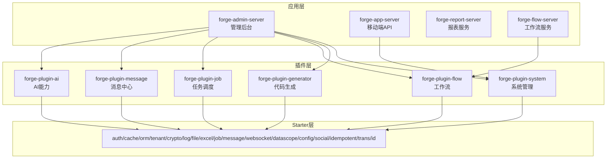
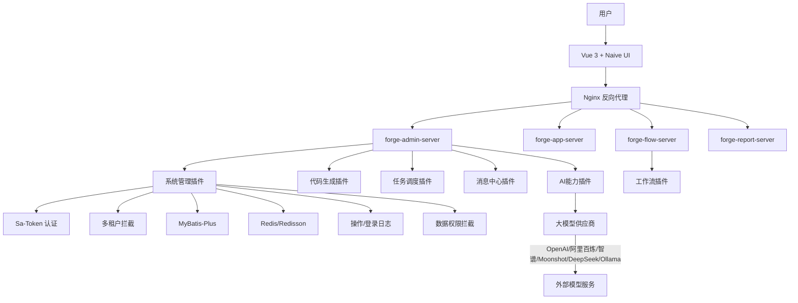
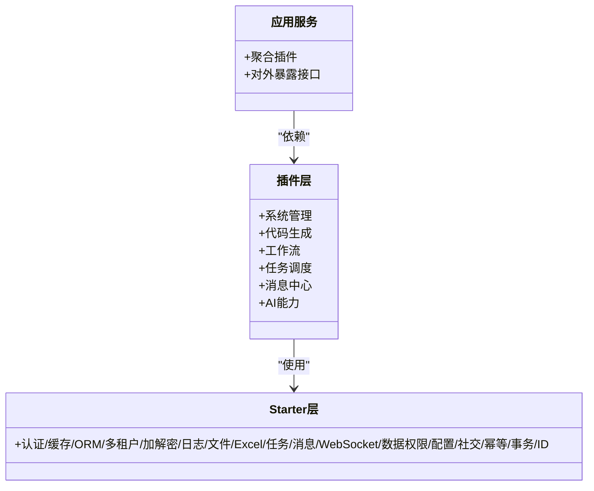
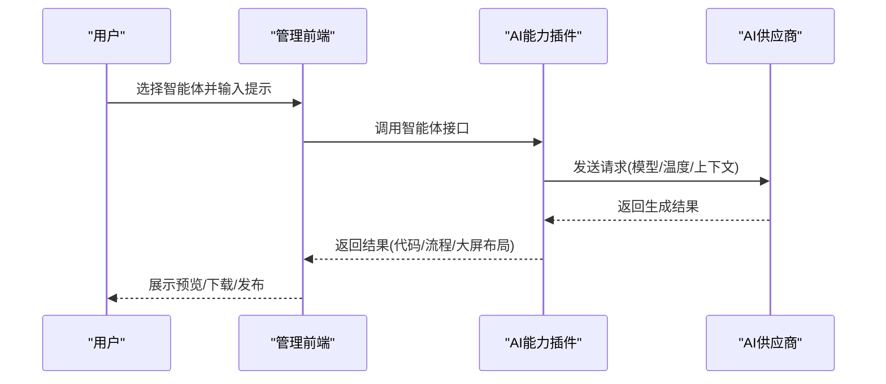
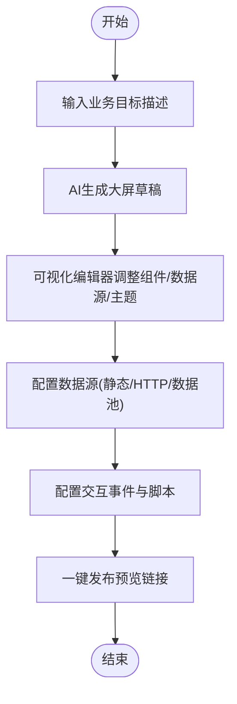
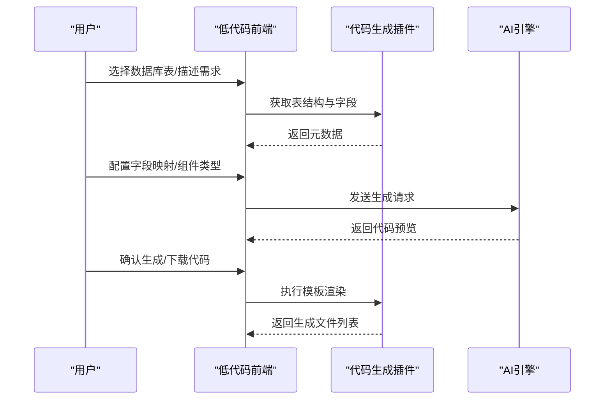
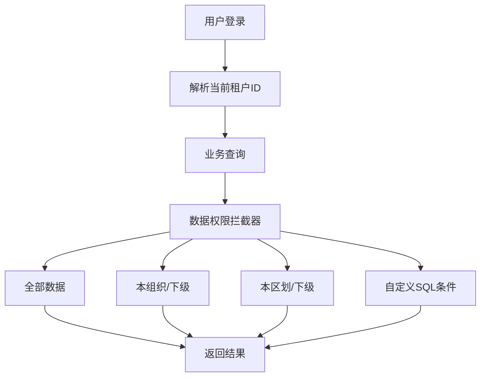
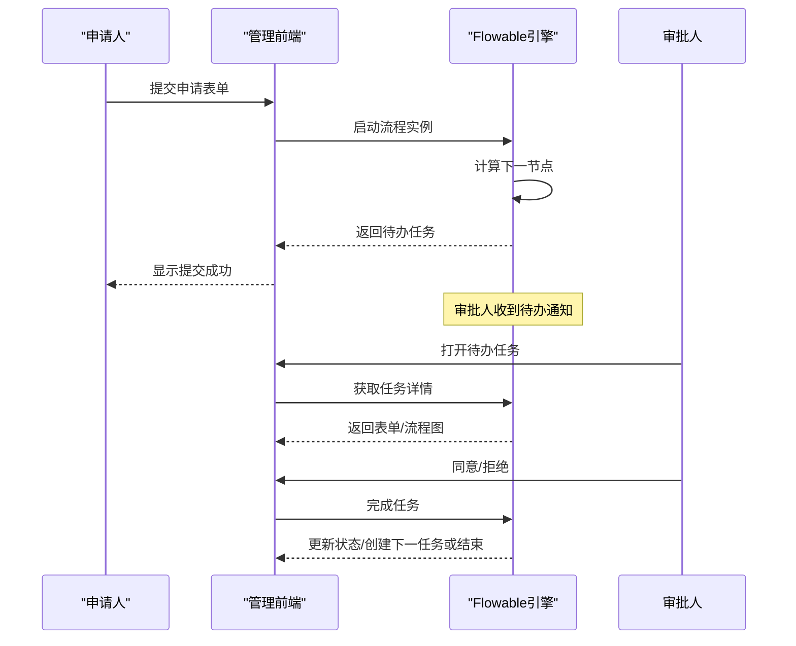
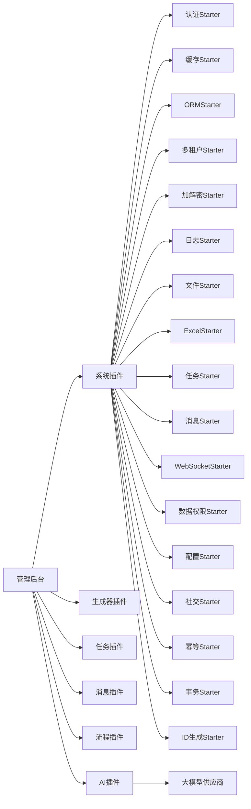

# 项目简介与特性

<cite>
**本文引用的文件**
- [README.md](file://README.md)
- [docs/architecture.md](file://docs/architecture.md)
- [code-copilot/changes/archive/unified-lowcode-app-codegen/deprecation-plan.md](file://code-copilot/changes/archive/unified-lowcode-app-codegen/deprecation-plan.md)
- [forge-server/forge-framework/forge-plugin-parent/forge-plugin-ai/src/main/java/com/mdframe/forge/plugin/ai/provider/controller/AiProviderController.java](file://forge-server/forge-framework/forge-plugin-parent/forge-plugin-ai/src/main/java/com/mdframe/forge/plugin/ai/provider/controller/AiProviderController.java)
- [forge-server/forge-framework/forge-plugin-parent/forge-plugin-flow/src/main/java/com/mdframe/forge/starter/flow/template/FlowTemplateFactory.java](file://forge-server/forge-framework/forge-plugin-parent/forge-plugin-flow/src/main/java/com/mdframe/forge/starter/flow/template/FlowTemplateFactory.java)
- [forge-admin-ui/src/components/business-process-designer/BusinessProcessDesigner.vue](file://forge-admin-ui/src/components/business-process-designer/BusinessProcessDesigner.vue)
- [forge-server/db/migration/V1.0.99__add_role_module_data_scopes.sql](file://forge-server/db/migration/V1.0.99__add_role_module_data_scopes.sql)
- [forge-server/db/backup/V1.0.65__harden_user_type_permission_boundaries.sql](file://forge-server/db/backup/V1.0.65__harden_user_type_permission_boundaries.sql)
- [forge-server/forge-admin-server/src/main/java/com/mdframe/forge/admin/bridge/ApplicationPermissionAdapterImpl.java](file://forge-server/forge-admin-server/src/main/java/com/mdframe/forge/admin/bridge/ApplicationPermissionAdapterImpl.java)
</cite>

## 目录
1. [引言](#引言)
2. [项目结构](#项目结构)
3. [核心组件](#核心组件)
4. [架构总览](#架构总览)
5. [详细组件分析](#详细组件分析)
6. [依赖关系分析](#依赖关系分析)
7. [性能考量](#性能考量)
8. [故障排查指南](#故障排查指南)
9. [结论](#结论)
10. [附录](#附录)

## 引言
Forge Admin 是一套面向企业后台、SaaS 管理端、数据可视化平台和内部低代码工具的中后台框架。它不只提供用户、角色、菜单、字典、文件、日志等基础能力，还把 AI 代码生成、AI 数据大屏、AI 智能体管理、Flowable 工作流、多租户隔离做成可持续扩展的工程体系，帮助团队更快交付业务页面、更稳承载企业复杂度、更容易扩展新能力。

适用场景
- 企业内部管理系统：组织、用户、角色、菜单、配置、文件、日志、通知等通用后台能力。
- 多租户 SaaS 后台：租户隔离、数据权限、客户独立配置、权限精细化控制。
- 审批流业务系统：请假、采购、合同、报销、工单等需要流程编排的业务。
- 数据大屏与驾驶舱：用 AI 快速生成可视化大屏，再接入真实业务 API。
- 低代码/代码生成平台：通过模板、表单设计器和 AI 生成能力沉淀研发资产。

在线演示与体验
- 后台管理入口：http://www.dlforgelab.com:8084/forge/login
- 移动端 H5：http://www.dlforgelab.com:8084/forge-h5/
- 项目文档：http://www.dlforgelab.com:8084/forge-docs/
- 大屏设计器：http://www.dlforgelab.com:8084/forge-report/
- 默认体验账号：admin / 123456；H5 体验账号：h5_admin / 123456

章节来源
- [README.md:29-65](file://README.md#L29-L65)
- [README.md:76-88](file://README.md#L76-L88)

## 项目结构
后端采用分层与插件化组织：应用服务聚合 Starter 与 Plugin，对外暴露接口；Starter 封装认证、缓存、ORM、多租户、加解密、日志、文件、Excel 等技术能力；Plugin 实现系统管理、代码生成、任务调度、消息中心、流程和 AI 等业务能力。前端包含后台管理、报表大屏、移动端 H5 等多个子工程。

图表来源
- [docs/architecture.md:64-130](file://docs/architecture.md#L64-L130)

章节来源
- [docs/architecture.md:64-130](file://docs/architecture.md#L64-L130)
- [README.md:241-259](file://README.md#L241-L259)

## 核心组件
- 微内核 + 插件化架构：核心框架轻量，系统、生成器、任务、消息、流程、AI 等能力以插件方式组合，按需装配，降低耦合度与升级成本。
- AI 智能体管理：内置智能体引擎，支持创建/管理 AI 智能体，覆盖代码生成、流程设计、大屏生成等场景，具备草稿/发布/下线生命周期与提示词模板管理。
- AI 数据大屏：自然语言生成大屏，支持组件拖拽、主题定制、真实 API 数据接入和发布，内置多种图表与信息组件。
- AI 代码生成：面向表单和 CRUD 场景，支持 0 代码配置，也支持下载代码包二次开发；提供模型设计与页面搭建一体化能力。
- 多租户 + RBAC：租户级数据隔离、菜单权限、按钮权限、角色资源绑定与企业后台基础能力；支持按模块覆盖数据范围。
- Flowable 工作流引擎：集成 Flowable，覆盖模型设计、流程发起、待办审批、时间轴追踪；提供流程模板与可视化设计器。

章节来源
- [README.md:43-54](file://README.md#L43-L54)
- [README.md:108-132](file://README.md#L108-L132)
- [README.md:135-172](file://README.md#L135-L172)
- [README.md:191-209](file://README.md#L191-L209)
- [docs/architecture.md:6-19](file://docs/architecture.md#L6-L19)

## 架构总览
整体采用前后端分离与微内核插件化架构，前端基于 Vue 3 + Naive UI + UnoCSS，后端基于 Spring Boot 3 + MyBatis-Plus + Sa-Token + Flowable + Redis/Redisson + Undertow，并通过 Starter 与 Plugin 解耦技术能力与业务能力。

图表来源
- [docs/architecture.md:262-364](file://docs/architecture.md#L262-L364)
- [docs/architecture.md:469-565](file://docs/architecture.md#L469-L565)

## 详细组件分析

### 微内核插件化架构
- 分层清晰：应用层聚合 Starter 与 Plugin；Starter 封装通用技术能力（认证、缓存、ORM、多租户、加解密、日志、文件、Excel、任务调度、消息、WebSocket、数据权限、配置、社交登录、幂等、分布式事务、ID 生成）；Plugin 实现系统管理、代码生成、工作流、任务调度、消息中心、AI 能力。
- 扩展友好：新增业务模块或技术能力时，通过新增 Starter/Plugin 即可接入，不侵入核心逻辑。
- 部署灵活：可按需启用插件，减少运行时负担。

图表来源
- [docs/architecture.md:64-130](file://docs/architecture.md#L64-L130)

章节来源
- [docs/architecture.md:64-130](file://docs/architecture.md#L64-L130)

### AI 智能体管理
- 内置智能体引擎：支持创建/管理 AI 智能体，覆盖代码生成、流程设计、大屏生成等场景。
- 生命周期管理：草稿 → 已发布 → 下线，完整管理流程；支持配置模型、温度等参数；每个智能体独立管理会话和提示词模板。
- 多供应商支持：内置阿里百炼、OpenAI、智谱、Moonshot、DeepSeek、Ollama 等预设模板，兼容 OpenAI API 格式自定义服务。

图表来源
- [README.md:108-132](file://README.md#L108-L132)
- [forge-server/forge-framework/forge-plugin-parent/forge-plugin-ai/src/main/java/com/mdframe/forge/plugin/ai/provider/controller/AiProviderController.java:36-58](file://forge-server/forge-framework/forge-plugin-parent/forge-plugin-ai/src/main/java/com/mdframe/forge/plugin/ai/provider/controller/AiProviderController.java#L36-L58)

章节来源
- [README.md:108-132](file://README.md#L108-L132)
- [forge-server/forge-framework/forge-plugin-parent/forge-plugin-ai/src/main/java/com/mdframe/forge/plugin/ai/provider/controller/AiProviderController.java:36-58](file://forge-server/forge-framework/forge-plugin-parent/forge-plugin-ai/src/main/java/com/mdframe/forge/plugin/ai/provider/controller/AiProviderController.java#L36-L58)

### AI 数据大屏
- 自然语言生成：接入大模型后，可通过对话生成大屏结构、组件布局和基础配置。
- 组件与主题：内置图表、文字、图片、视频、滚动表格、装饰边框、数字翻牌等组件；支持深浅主题、背景、全局滤镜、画布尺寸和自适应方式。
- 数据接入与交互：支持静态数据、动态 HTTP 请求和数据池；支持点击、双击、鼠标进入/移出、生命周期事件和自定义 JavaScript。
- 一键发布：编辑完成即可发布预览链接，便于分享、嵌入和交付。

图表来源
- [README.md:135-172](file://README.md#L135-L172)

章节来源
- [README.md:135-172](file://README.md#L135-L172)

### AI 代码生成与低代码平台
- 低代码应用中心：智能创建/模板/Excel/空白四种方式建应用，进入页面管理拖字段即可完成表单、列表页面设计，再经业务流程画布编排审批与自动化，一键发布到独立门户。
- 代码生成：表导入、字段配置、模板管理、代码预览与下载；支持前后端一体化生成，复杂业务可下载源码继续二次开发。
- 迁移策略：旧入口逐步隐藏，新功能集中在统一入口，保留历史接口兼容。

图表来源
- [docs/architecture.md:496-527](file://docs/architecture.md#L496-L527)
- [code-copilot/changes/archive/unified-lowcode-app-codegen/deprecation-plan.md:1-21](file://code-copilot/changes/archive/unified-lowcode-app-codegen/deprecation-plan.md#L1-L21)

章节来源
- [README.md:191-209](file://README.md#L191-L209)
- [code-copilot/changes/archive/unified-lowcode-app-codegen/deprecation-plan.md:1-21](file://code-copilot/changes/archive/unified-lowcode-app-codegen/deprecation-plan.md#L1-L21)

### 多租户 + RBAC 权限控制
- 多租户隔离：所有业务表包含 tenant_id，通过拦截器自动追加租户过滤；系统配置等资源可设置可见范围。
- RBAC 权限模型：用户-角色-资源三级权限，支持菜单/按钮/API级别控制；客户端编码隔离不同端菜单。
- 数据权限：支持按组织、行政区划、自定义 SQL 等维度控制数据范围；支持按业务模块覆盖数据范围。

图表来源
- [docs/architecture.md:410-465](file://docs/architecture.md#L410-L465)
- [forge-server/db/migration/V1.0.99__add_role_module_data_scopes.sql:1-32](file://forge-server/db/migration/V1.0.99__add_role_module_data_scopes.sql#L1-L32)
- [forge-server/db/backup/V1.0.65__harden_user_type_permission_boundaries.sql:40-67](file://forge-server/db/backup/V1.0.65__harden_user_type_permission_boundaries.sql#L40-L67)
- [forge-server/forge-admin-server/src/main/java/com/mdframe/forge/admin/bridge/ApplicationPermissionAdapterImpl.java:85-122](file://forge-server/forge-admin-server/src/main/java/com/mdframe/forge/admin/bridge/ApplicationPermissionAdapterImpl.java#L85-L122)

章节来源
- [docs/architecture.md:410-465](file://docs/architecture.md#L410-L465)
- [forge-server/db/migration/V1.0.99__add_role_module_data_scopes.sql:1-32](file://forge-server/db/migration/V1.0.99__add_role_module_data_scopes.sql#L1-L32)
- [forge-server/db/backup/V1.0.65__harden_user_type_permission_boundaries.sql:40-67](file://forge-server/db/backup/V1.0.65__harden_user_type_permission_boundaries.sql#L40-L67)
- [forge-server/forge-admin-server/src/main/java/com/mdframe/forge/admin/bridge/ApplicationPermissionAdapterImpl.java:85-122](file://forge-server/forge-admin-server/src/main/java/com/mdframe/forge/admin/bridge/ApplicationPermissionAdapterImpl.java#L85-L122)

### Flowable 工作流引擎
- 流程建模与执行：集成 Flowable，支持流程定义、实例管理、审批记录；提供流程模板与可视化设计器。
- 设计器优化：前端采用卡片式纵向流程设计器，节点间自动连线，提升非技术人员易用性；后端零改动，内部 JSON↔BPMN XML 转换。
- 模板与示例：内置请假、通用审批、采购等流程模板，便于快速复用。

图表来源
- [docs/architecture.md:529-565](file://docs/architecture.md#L529-L565)
- [forge-admin-ui/src/components/business-process-designer/BusinessProcessDesigner.vue:536-575](file://forge-admin-ui/src/components/business-process-designer/BusinessProcessDesigner.vue#L536-L575)
- [forge-server/forge-framework/forge-plugin-parent/forge-plugin-flow/src/main/java/com/mdframe/forge/starter/flow/template/FlowTemplateFactory.java:87-206](file://forge-server/forge-framework/forge-plugin-parent/forge-plugin-flow/src/main/java/com/mdframe/forge/starter/flow/template/FlowTemplateFactory.java#L87-L206)

章节来源
- [docs/architecture.md:529-565](file://docs/architecture.md#L529-L565)
- [forge-admin-ui/src/components/business-process-designer/BusinessProcessDesigner.vue:536-575](file://forge-admin-ui/src/components/business-process-designer/BusinessProcessDesigner.vue#L536-L575)
- [forge-server/forge-framework/forge-plugin-parent/forge-plugin-flow/src/main/java/com/mdframe/forge/starter/flow/template/FlowTemplateFactory.java:87-206](file://forge-server/forge-framework/forge-plugin-parent/forge-plugin-flow/src/main/java/com/mdframe/forge/starter/flow/template/FlowTemplateFactory.java#L87-L206)

## 依赖关系分析
- 应用服务依赖插件：管理后台聚合系统、生成器、任务、消息、流程、AI 等插件；移动端 API 与服务端流程服务分别依赖对应插件。
- 插件依赖 Starter：各插件通过 Starter 引入认证、缓存、ORM、多租户、加解密、日志、文件、Excel、任务调度、消息、WebSocket、数据权限、配置、社交登录、幂等、分布式事务、ID 生成等能力。
- 外部依赖：大模型供应商（OpenAI、阿里百炼、智谱、Moonshot、DeepSeek、Ollama）、数据库 MySQL、缓存 Redis、对象存储 MinIO/S3。

图表来源
- [docs/architecture.md:64-130](file://docs/architecture.md#L64-L130)
- [docs/architecture.md:262-364](file://docs/architecture.md#L262-L364)

章节来源
- [docs/architecture.md:64-130](file://docs/architecture.md#L64-L130)
- [docs/architecture.md:262-364](file://docs/architecture.md#L262-L364)

## 性能考量
- 认证与会话：使用 Sa-Token + Redis 进行 Token 管理与 Session 存储，减少数据库压力。
- 缓存与锁：Redis/Redisson 提供缓存与分布式锁，避免热点数据重复计算与并发冲突。
- 数据访问：MyBatis-Plus 分页与拦截器优化查询；P6Spy 监控 SQL 性能。
- Web 服务器：Undertow 替代传统 Tomcat，提升吞吐与内存效率。
- 多租户与数据权限：通过拦截器在 SQL 层追加条件，避免应用层过滤带来的性能损耗。
- 构建与部署：Vite 构建前端，生产环境建议 Nginx 静态资源托管与反向代理。

[本节为通用性能讨论，无需具体文件引用]

## 故障排查指南
- 首次启动报数据库或 Redis 连接错误：检查 application-dev.yml 是否复制并修改本地连接信息。
- 前端请求后端失败：确认后端端口是否启动，检查 .env.development 中的 VITE_HTTP_PROXY_TARGET 与 VITE_FLOW_PROXY_TARGET 是否指向本地服务。
- 新增配置项注意事项：本地敏感配置不要提交；通用配置请同步到 application-dev.example.yml，密码、密钥、AK/SK 等统一使用占位符。
- 不小心提交了敏感配置：立即更换相关密码或密钥，清理仓库历史与索引中的敏感文件，补充 .gitignore 规则。

章节来源
- [README.md:502-519](file://README.md#L502-L519)

## 结论
Forge Admin 以微内核插件化架构为基础，结合 AI 智能体管理、AI 数据大屏、AI 代码生成、多租户 + RBAC 权限控制与 Flowable 工作流引擎，为企业提供了开箱即用且可扩展的企业级中后台解决方案。它既能加速长尾系统的天级交付，又能承载复杂业务的稳定运行，同时通过低代码与代码生成沉淀研发资产，降低维护成本。对于初学者，它提供了清晰的入门路径与丰富的演示入口；对于有经验的开发者，它提供了深入的技术栈与扩展点，便于二次开发与定制化。

[本节为总结性内容，无需具体文件引用]

## 附录
- 技术栈概览：后端 Spring Boot 3 + MyBatis-Plus + Sa-Token + Flowable + Redis/Redisson + Undertow；前端 Vue 3 + Naive UI + UnoCSS + ECharts。
- 部署参考：单机与集群部署架构图；Nginx 配置参考 NGINX_CONFIG.md。
- 快速开始：克隆项目、初始化数据库、准备本地配置、启动后端与前端、社区数据库同步、构建生产包。

章节来源
- [docs/architecture.md:22-61](file://docs/architecture.md#L22-L61)
- [docs/architecture.md:569-649](file://docs/architecture.md#L569-L649)
- [README.md:263-428](file://README.md#L263-L428)