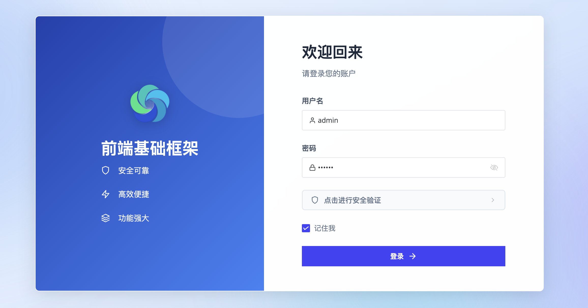

[](https://gitee.com/ForgeLab/forge-admin/stargazers)
[](https://gitee.com/ForgeLab/forge-admin/blob/master/LICENSE)

# Forge Admin

🚀 基于 Vue3 + TypeScript 的开箱即用企业级中后台管理框架，帮助开发者快速搭建项目。

## 目录

- [项目概述](#项目概述)
- [核心特性](#核心特性)
- [系统截图](#系统截图)
- [技术栈](#技术栈)
- [模块说明](#模块说明)
- [快速开始](#快速开始)
- [功能模块](#功能模块)
- [插件说明](#插件说明)
- [常见问题](#常见问题)
- [更新日志](#更新日志)
- [贡献指南](#贡献指南)
- [联系作者](#联系作者)
- [许可证](#许可证)

## 项目概述

Forge Admin 是一个现代化的企业级 admin 系统，旨在为企业提供快速开发、业务扩展的中后台基础框架。系统采用微内核 + 插件化架构，核心功能以插件形式存在，便于按需引入和扩展。

### 核心特性

- **微内核架构**：核心框架轻量级，功能通过插件扩展
- **多租户支持**：完善的多租户体系，支持数据隔离
- **权限管理**：基于 RBAC 的细粒度权限控制
- **代码生成**：可视化代码生成，快速构建业务模块
- **动态 API**：运行时 API 配置管理，支持动态调整接口行为
- **任务调度**：分布式任务调度，支持 Cron 表达式
- **流程管理**：基于FlowAble自研的轻量级流程管理模块，流程驱动业务流程，配置简单
- **消息中心**：统一消息管理，支持多种通知渠道
- **系统监控**：实时系统监控，掌握服务器状态
- **数据加解密**：支持接口数据加解密，字段加解密，字段脱敏等常见数据安全控制

## 系统截图

### 登录页面



系统提供安全的登录认证，支持验证码校验，保障系统安全。

### 首页仪表盘


直观的数据展示面板，实时掌握系统运行状态和关键业务指标。

### 菜单管理


灵活的菜单配置，支持动态路由、权限绑定，轻松构建系统导航结构。

### 配置管理


可视化配置管理，支持系统参数、字典数据的动态维护。

### 消息管理


统一消息中心，管理系统通知、站内消息，支持消息模板配置。

### 流程管理


统一的流程管理模块，轻量集成flowable工作流引擎，业务一键触发，统一管控

### 我的待办


### 文件管理


统一的文件管理，支持RustFS,本地存储

### 数据权限配置


灵活的数据权限配置

### excel导出配置


导入导出可配置，省去多余的注解配置，动态调整模版

### 服务监控


实时监控服务器状态，包括 CPU、内存、磁盘等关键指标，保障系统稳定运行。

## 技术栈

### 后端技术

| 技术 | 说明 |
|------|------|
| Spring Boot | 应用开发框架 |
| Spring Cloud | 微服务框架（可选） |
| MyBatis-Plus | ORM 框架 |
| Sa-Token | 认证授权框架 |
| Redisson | 分布式缓存 |
| Quartz | 任务调度 |
| Spring Cloud Gateway | 网关（可选） |

### 前端技术

| 技术 | 说明 |
|------|------|
| Vue 3 | 渐进式前端框架 |
| Naive UI | Vue 3 组件库 |
| Pinia | 状态管理 |
| Vue Router | 路由管理 |
| Vite | 构建工具 |
| UnoCSS | 原子化 CSS |

## 模块说明

### 后端模块

```
forge/
├── forge-admin/                 # 主应用模块
├── forge-framework/            # 框架核心
│   ├── forge-plugin-parent/    # 插件父模块
│   │   ├── forge-plugin-system/     # 系统管理插件
│   │   ├── forge-plugin-generator/  # 代码生成插件
│   │   ├── forge-plugin-job/        # 任务调度插件
│   │   └── forge-plugin-message/    # 消息插件
│   └── forge-starter-parent/   # 启动器父模块
│       ├── forge-starter-auth/      # 认证授权
│       ├── forge-starter-cache/     # 缓存管理
│       ├── forge-starter-config/    # 配置中心
│       └── forge-starter-api-config/# API配置
```

### 前端项目

```
forge-admin-ui/
├── src/
│   ├── api/            # API 接口
│   ├── assets/         # 静态资源
│   ├── components/     # 公共组件
│   ├── composables/    # 组合式 API
│   ├── layouts/       # 布局组件
│   ├── router/        # 路由配置
│   ├── store/         # 状态管理
│   ├── styles/        # 全局样式
│   ├── utils/         # 工具函数
│   └── views/         # 页面视图
└── ...
```

## 快速开始

### 环境要求

- JDK 17+
- Node.js 18+
- pnpm 8+
- MySQL 8.0+
- Redis 6.0+

### 后端部署

#### 1. 克隆项目

```bash
git clone https://gitee.com/ForgeLab/forge-admin.git
cd forge-admin
```

#### 2. 导入数据库

执行 `forge/forge-admin/sql/初始化脚本.sql` 创建基础数据库表

#### 3. 本地环境配置

##### 复制配置模板

首次克隆项目后，需要复制配置模板文件到本地配置：

```bash
# 复制admin模块配置
cp forge/forge-admin/src/main/resources/application-dev.example.yml forge/forge-admin/src/main/resources/application-dev.yml

# 复制flow模块配置
cp forge/forge-flow/src/main/resources/application-dev.example.yml forge/forge-flow/src/main/resources/application-dev.yml
```

##### 修改配置信息

编辑 `application-dev.yml` 文件，修改以下配置：

**数据库配置**

```yaml
spring:
  datasource:
    dynamic:
      datasource:
        master:
          url: jdbc:mysql://localhost:3306/your_database?useUnicode=true&characterEncoding=utf8&zeroDateTimeBehavior=convertToNull&useSSL=true&serverTimezone=GMT%2B8&autoReconnect=true&rewriteBatchedStatements=true&allowPublicKeyRetrieval=true&nullCatalogMeansCurrent=true
          username: your_username
          password: 'your_password'
```

**Redis配置**

```yaml
spring.data:
  redis:
    host: localhost
    port: 6379
    database: 0
    password: 'your_redis_password'
    redisson:
      config: |
        singleServerConfig:
          address: "redis://localhost:6379"
          database: 0
          password: 'your_redis_password'
```

##### 配置说明

- `application-dev.yml` 属于本地配置文件，已经加入 `.gitignore`，不会提交到Git仓库
- `application-dev.example.yml` 是配置模板，提交到Git仓库，供其他开发者参考
- 其他配置项根据需要自行修改，不需要提交到仓库

##### 注意事项

❗️ **禁止将包含敏感信息的配置文件提交到Git仓库**
- 数据库密码、Redis密码、密钥等敏感信息不得提交
- 新增配置项需要添加到 `application-dev.example.yml` 模板中，并替换敏感信息
- 生产环境配置使用单独的 `application-prod.yml`，同样不提交到仓库

##### 其他配置

- 前端配置请参考 `forge-admin-ui/.env.example` 文件，复制为 `.env.local` 进行修改

#### 4. 启动服务

```bash
cd forge/forge-admin
mvn spring-boot:run
```

服务默认启动在 `http://localhost:8080`

### 前端部署

1. 安装依赖

```bash
cd forge-admin-ui
pnpm install
```

2. 启动开发服务器

```bash
pnpm dev
```

系统用户名: admin/123456

3. 构建生产版本

```bash
pnpm build
```

## 功能模块

### 系统管理

| 模块 | 说明 |
|------|------|
| 用户管理 | 用户的增删改查、角色绑定、组织关联 |
| 角色管理 | 角色权限配置、资源绑定 |
| 菜单管理 | 动态菜单配置、页面路由管理 |
| 部门管理 | 组织架构管理、树形结构 |
| 岗位管理 | 岗位配置、用户岗位关联 |
| 租户管理 | 多租户配置、租户隔离 |

### 系统监控

| 模块 | 说明 |
|------|------|
| 在线用户 | 查看当前在线用户、强制下线 |
| 定时任务 | 任务配置、动态调度 |
| 系统日志 | 操作日志、登录日志查询 |
| 系统监控 | CPU、内存、磁盘监控 |

### 运维工具

| 模块 | 说明 |
|------|------|
| 缓存管理 | Redis 缓存可视化操作 |
| 文件管理 | 文件上传、存储配置 |
| 字典管理 | 静态字典维护 |
| 通知公告 | 通知发布、阅读状态跟踪 |

### 开发者工具

| 模块 | 说明 |
|------|------|
| 代码生成 | 可视化配置、代码生成 |
| API 配置 | 接口行为动态配置 |
| 数据源管理 | 多数据源配置 |

## 插件说明

### 系统管理插件 (forge-plugin-system)

提供完整的系统管理功能，包括用户、角色、菜单、部门、岗位、租户等管理。

### 代码生成插件 (forge-plugin-generator)

可视化代码生成工具，支持：
- 数据库表导入
- 字段配置
- 模板管理
- 代码预览与下载

### 任务调度插件 (forge-plugin-job)

基于 Quartz 的分布式任务调度，支持：
- Cron 表达式配置
- 手动触发执行
- 任务执行日志

### 消息插件 (forge-plugin-message)

统一消息中心，支持：
- 系统通知
- 站内消息
- 消息模板

## 常见问题

### Q: 为什么我拉取代码后启动报错？
A: 首次拉取代码需要复制配置模板并修改为本地环境的数据库和Redis配置。

### Q: 新增配置项需要注意什么？
A: 如果新增的配置项是通用的，请同步更新到 `application-dev.example.yml` 模板中，敏感信息用占位符代替。

### Q: 不小心提交了敏感配置怎么办？
A:
1. 立即修改密码
2. 执行 `git rm --cached <file>` 从仓库中移除文件
3. 将文件加入 `.gitignore`
4. 提交并推送到仓库

## 更新日志

查看 [CHANGELOG.md](CHANGELOG.md) 了解项目的版本更新历史。

## 贡献指南

欢迎提交 Issue 和 Pull Request。

## 联系作者


## 许可证

本项目基于 [MIT](LICENSE) 许可证开源。
