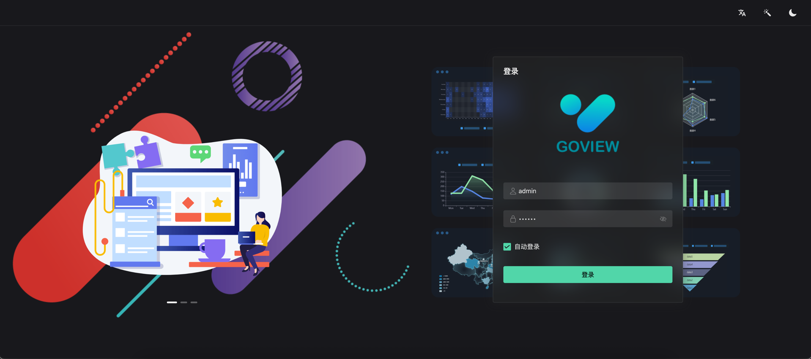
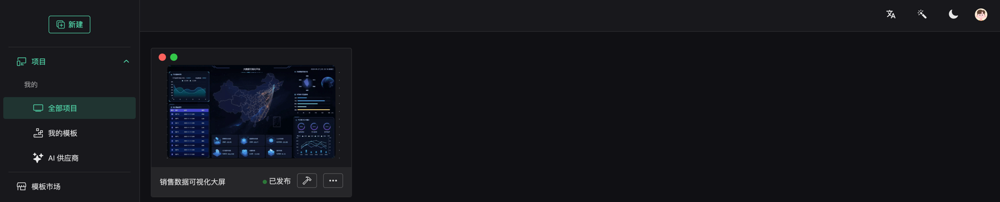

<center></center>

<p align="center">
  🚀 基于 Vue 3 + Spring Boot 3 的企业级中后台管理框架<br>
  ✨ 插件化架构、AI 代码生成、Flowable 工作流与 AI 数据可视化大屏一体化开箱
</p>

<p align="center">
  <a href="https://gitee.com/ForgeLab/forge-admin/stargazers"></a>
  
  
  
  
</p>

<p align="center">
  <a href="#-在线演示">在线演示</a> ·
  <a href="#-项目亮点">项目亮点</a> ·
  <a href="#-系统截图">系统截图</a> ·
  <a href="#-ai-数据可视化大屏">AI 大屏</a> ·
  <a href="#-快速开始">快速开始</a> ·
  <a href="CHANGELOG.md">更新日志</a>
</p>

---

## ✨ 项目简介

**Forge Admin** 是一套面向企业后台、SaaS 管理端、数据可视化平台和内部低代码工具的中后台框架。它不只提供常见的用户、角色、菜单、字典、文件、日志等基础能力，还把 **AI 代码生成**、**AI 数据大屏**、**AI 智能体管理**、**Flowable 工作流**、**多租户隔离** 做成可持续扩展的工程体系。

如果你正在搭建一个长期演进的后台系统，Forge Admin 更关注三件事：

| 目标 | Forge Admin 提供什么 |
|------|----------------------|
| 更快交付业务页面 | AI 表单生成、CRUD 页面配置、代码生成插件、可下载代码包 |
| 更稳承载企业复杂度 | RBAC、多租户、数据权限、操作日志、动态配置、文件存储、Excel 导入导出 |
| 更容易扩展新能力 | 微内核 + 插件化架构，业务插件和技术 Starter 分层清晰 |

---

## 🌟 项目亮点

| 能力 | 说明 |
|------|------|
| 🏗️ **微内核插件化** | 核心框架轻量，系统、生成器、任务、消息、流程、AI 等能力以插件方式组合 |
| 🤖 **AI 智能体管理** | 内置智能体引擎，支持创建/管理 AI 智能体，覆盖代码生成、流程设计、大屏生成等场景 |
| 📊 **AI 数据大屏** | 通过自然语言生成大屏，支持组件拖拽、主题定制、真实 API 数据接入和发布 |
| ⚡ **AI 代码生成** | 面向表单和 CRUD 场景，支持 0 代码配置，也支持下载代码包二次开发 |
| 🔐 **多租户 + RBAC** | 租户级数据隔离、菜单权限、按钮权限、角色资源绑定等企业后台基础能力 |
| 🔄 **工作流引擎** | 集成 Flowable，覆盖模型设计、流程发起、待办审批、时间轴追踪 |
| 🧩 **组件化前端** | Vue 3 + Naive UI + UnoCSS，内置字典、区域、上传、图标选择、AI 表单等组件 |
| 🔌 **多 AI 供应商** | 支持阿里百炼、OpenAI、DeepSeek、Ollama、智谱、Moonshot 等模型服务 |

---

## 🧭 适合场景

- 企业内部管理系统：组织、用户、角色、菜单、配置、文件、日志、通知等通用后台能力。
- 多租户 SaaS 后台：租户隔离、数据权限、客户独立配置、权限精细化控制。
- 审批流业务系统：请假、采购、合同、报销、工单等需要流程编排的业务。
- 数据大屏与驾驶舱：用 AI 快速生成可视化大屏，再接入真实业务 API。
- 低代码/代码生成平台：通过模板、表单设计器和 AI 生成能力沉淀研发资产。

---

## 🏛️ 系统架构


后端采用 `forge-framework` + `forge-plugin-parent` + `forge-starter-parent` 的分层方式：Starter 负责认证、缓存、ORM、多租户、数据权限、加解密、日志、文件、Excel 等底层能力；Plugin 负责系统管理、代码生成、任务调度、消息中心、流程和 AI 等业务能力；应用服务按场景聚合插件并对外提供接口。

---

## 📺 在线演示

| 入口     | 地址 |
|--------|------|
| 后台管理   | http://www.dlforgelab.com:8084/forge/login |
| 移动端 H5  | http://www.dlforgelab.com:8084/forge-h5/ |
| 项目文档   | http://www.dlforgelab.com:8084/forge-docs/ |
| 大屏设计器  | http://www.dlforgelab.com:8084/forge-report/|
| Gitee  | https://gitee.com/ForgeLab/forge-admin |
| GitHub | https://github.com/yaomindong1996/forge-admin |

默认体验账号：`admin` / `123456` ｜ H5 体验账号：`h5_admin` / `123456`

---

## 🖼️ 系统截图

### 后台管理系统

| 登录页 | 工作台首页 | 用户管理 |
|:---:|:---:|:---:|
|  |  |  |
| **登录页**<br>账号密码 + 验证码统一认证入口 | **工作台首页**<br>待办任务、审批中心、快捷入口与公告 | **用户管理**<br>组织架构树 + 用户列表联动、批量授权 |
|  |  |  |
| **菜单管理**<br>动态路由、按钮权限、资源绑定 | **统一配置中心**<br>登录 / 水印 / 安全 / 加解密 / 认证 / 日志 | **消息管理**<br>站内信、系统通知、消息模板 |
|  |  |  |
| **流程设计**<br>Flowable 在线建模、AI 生成、发布部署 | **我的待办**<br>待办 / 已办 / 我发起的 / 抄送我集中审批 | **服务监控**<br>CPU / 内存 / JVM / 磁盘运行指标 |

> 更多截图：流程模型、流程时间轴、文件管理、数据权限配置、Excel 导出配置等见 `images/` 目录。

---

## 🤖 AI 智能体管理

Forge Admin 内置 **AI 智能体引擎**，提供开箱即用的 AI 能力。你可以通过智能体管理页面创建、配置和发布 AI 智能体，覆盖从代码生成到流程设计的多种场景。


### 内置智能体

| 智能体 | 功能 |
|--------|------|
| 🧠 **低代码业务系统生成 Agent** | 根据业务需求自动划分领域、生成数据模型和低代码应用草稿 |
| 📋 **流程 BPMN 生成助手** | 自然语言描述 → 自动生成 Flowable BPMN XML 流程配置 |
| 🗄️ **CRUD 配置生成器** | 自然语言描述或数据库表结构 → CRUD 配置 JSON |
| 📊 **大屏生成助手** | 根据用户需求自动生成数据可视化大屏布局 |
| 💬 **智能客服** | 内置 AI 对话能力 |
| 🔧 **代码生成字段顾问** | 根据数据库字段信息推荐 Java 类型、表单组件、字典类型、验证规则 |
| 🏗️ **代码生成 Schema 构建器** | 根据自然语言描述推断数据模型 Schema |

### 智能体生命周期

- **草稿** → **已发布** → **下线**，完整管理流程
- 支持配置模型、温度等参数
- 支持 MCP 工具扩展
- 每个智能体独立管理会话和提示词模板

---

## 🤖 AI 数据可视化大屏

**Forge AI** 是项目内置的 AI 数据可视化低代码平台。你可以先用自然语言描述业务目标，让 AI 生成大屏草稿，再通过可视化编辑器调整组件、数据源、主题和交互，最后发布为可访问页面。

### 核心特性

| 特性 | 说明 |
|------|------|
| 🤖 AI 智能生成 | 接入大模型后，可通过对话生成大屏结构、组件布局和基础配置 |
| 🧩 组件素材库 | 内置图表、文字、图片、视频、滚动表格、装饰边框、数字翻牌等组件 |
| 🎨 主题定制 | 支持深浅主题、背景、全局滤镜、画布尺寸和自适应方式 |
| 📊 数据接入 | 支持静态数据、动态 HTTP 请求和数据池，方便接入后端业务 API |
| ⚡ 事件交互 | 支持点击、双击、鼠标进入/移出、生命周期事件和自定义 JavaScript |
| 🚀 一键发布 | 编辑完成即可发布预览链接，便于分享、嵌入和交付 |

### 界面预览

| 页面 | 截图 |
|------|------|
| **登录页** |  |
| **项目列表** |  |
| **画布编辑器** |  |
| **AI 供应商配置** |  |

### 内置组件

| 分类 | 组件 |
|------|------|
| 图表 | 柱状图、横向柱状图、折线图、面积图、饼图、环形图、雷达图、散点图、热力图、漏斗图、水球图、中国地图 |
| 信息 | 文字、渐变文字、词云、图片、视频、嵌套网页 |
| 表格 | 滚动排名列表、滚动表格 |
| 装饰 | 边框 01~13、装饰 01~05、数字翻牌、时钟、倒计时、数字计数 |

### AI 供应商

支持阿里百炼（通义千问）、OpenAI（GPT）、智谱 AI（GLM）、Moonshot（Kimi）、DeepSeek、Ollama 等主流 AI 服务，也支持兼容 OpenAI API 格式的自定义服务。

---

## 📱 移动端 H5

Forge Admin 提供独立的移动端 H5 入口，基于 **uni-app 3 + Vue 3** 跨端开发框架，一套代码同时支持 H5 网页、微信小程序、支付宝小程序等多平台发布。业务表单在手机端和 PC 端体验一致，审批流程、待办提醒、消息通知在手机上即可完成闭环。

| 模块 | 说明 |
|------|------|
| 首页工作台 | 服务概览、菜单/未读/权限统计、快捷入口、今日工作台 |
| 消息中心 | 站内信列表、未读/已读筛选、详情查看、标记已读 |
| 流程待办 | 流程待办列表、审批详情、通过/驳回操作 |
| 个人中心 | 个人信息、修改密码、切换租户、安全中心、退出登录 |

> 体验账号：`h5_admin` / `123456`


---

## 🧠 AI 驱动的代码生成

Forge Admin 的代码生成能力面向真实后台研发流程：可以通过 AI 辅助生成表单和 CRUD 页面，也可以通过模板市场进行个性化配置。简单业务可以 0 代码上线，复杂业务可以下载代码包继续二次开发。

### AI 数据模型设计


### 低代码应用中心


应用中心是低代码的统一入口：智能创建 / 模板 / Excel / 空白四种方式建应用，进入页面管理拖字段即可完成表单、列表页面设计，再经业务流程画布编排审批与自动化，一键发布到独立门户。

### 低代码页面管理


---

## 💻 技术栈

### 后端

| 技术 | 用途 |
|------|------|
| Java 17 | 后端运行环境 |
| Spring Boot 3.5.13 | 应用开发框架 |
| MyBatis-Plus 3.5 | ORM 与分页能力 |
| Sa-Token 1.38 | 登录认证、权限校验、Token 管理 |
| Flowable 7.0 | 工作流建模与执行 |
| Redis / Redisson | 缓存、分布式锁、会话能力 |
| Quartz / SnailJob | 任务调度 |
| Maven | 后端多模块构建 |

### 前端

| 技术 | 用途 |
|------|------|
| Vue 3.5 | 前端框架 |
| Naive UI 2.42 | 管理端组件库 |
| Vite 7 | 开发服务器与构建工具 |
| Pinia 3 | 状态管理 |
| Vue Router 4.5 | 动态路由与权限路由 |
| UnoCSS 66 | 原子化样式 |
| ECharts / VChart | 图表与大屏可视化 |
| BPMN.js / CodeMirror | 流程设计与代码编辑 |

---

## 📁 项目结构

```text
forge-server/                    # 后端根目录
├── forge-admin-server/          # 主应用入口，聚合后台管理能力
├── forge-report-server/         # AI 大屏报表服务
├── forge-app-server/            # App / H5 接口服务
├── forge-flow/                  # 独立流程服务与流程客户端
│   ├── forge-flow-server/
│   └── forge-flow-client/
├── forge-business/              # 业务模块
├── forge-framework/
│   ├── forge-dependencies/      # 统一依赖版本管理
│   ├── forge-plugin-parent/     # system / generator / job / message / flow / ai 等业务插件
│   └── forge-starter-parent/    # auth / cache / orm / tenant / crypto / excel / file 等技术 Starter
├── db/                          # Flyway 迁移、seed、全量初始化 SQL
└── scripts/                     # 数据库初始化与社区导出脚本

forge-admin-ui/                  # 后台管理系统前端
forge-report-ui/                 # AI 数据可视化大屏前端
forge-h5-ui/                     # 移动端 H5
forge-docs/                      # VitePress 文档站
code-copilot/                    # AI 编程规则与变更管理
```

---

## 🚀 快速开始

### 环境要求

| 环境 | 推荐版本 |
|------|----------|
| JDK | 17+ |
| Node.js | 20.19+ |
| pnpm | 8+ |
| MySQL | 8.0+ |
| Redis | 6.0+ |

### 1. 克隆项目

```bash
git clone https://gitee.com/ForgeLab/forge-admin.git
cd forge-admin
```

#### 基于模版项目构建

```bash
npx --yes \     
    --package git+https://gitee.com/ForgeLab/forge-create-cli \
    forge-create 项目存储目录/项目名称 \
    --template-git https://gitee.com/ForgeLab/forge-admin \
    --template-ref main
```

### 2. 初始化数据库

推荐使用统一初始化脚本，它会按顺序执行 `forge-server/db/全量初始化SQL.sql` 和 `forge-server/db/seed/required` 必需初始化数据，并可按需导入 demo/optional 数据。表结构增量变更由主后台服务启动时的 Flyway 执行 `forge-server/db/migration`。

```bash
bash forge-server/scripts/db/init-db.sh \
  --host 127.0.0.1 \
  --port 3306 \
  --database forge_admin \
  --user root \
  --password your_password
```

如需导入演示数据：

```bash
bash forge-server/scripts/db/init-db.sh \
  --database forge_admin \
  --user root \
  --password your_password \
  --with-demo
```

数据库变更规范：

- 表结构、字段、索引、系统资源等正式变更统一新增到 `forge-server/db/migration/`。
- Flyway 版本脚本命名为 `V<版本号>__<lower_snake_case_description>.sql`，例如 `V1.0.2__add_dashboard_version_table.sql`。
- `V1.0.0__baseline.sql` 是历史基线，新脚本版本必须大于 `1.0.0`，且版本号单调递增。
- 已写入 `forge_schema_history` 的脚本禁止修改；需要修正时新增下一个版本脚本。
- 系统必需基础数据放入 `forge-server/db/seed/required/R__*.sql`。
- 演示数据放入 `forge-server/db/seed/demo/D__*.sql`，默认不导入。
- 可选模块数据放入 `forge-server/db/seed/optional/O__*.sql`。
- SQL 必须幂等或有防重复保护：`CREATE TABLE IF NOT EXISTS`、`INSERT ... SELECT ... WHERE NOT EXISTS`、新增列/索引前查 `information_schema`。
- `INSERT` 必须显式列名；业务内置数据 `tenant_id` 使用 `1`，禁止写 `0`。
- 权限资源类脚本（如 `sys_resource`、`sys_role_resource`）必须做 `NOT EXISTS` 防重复。
- 禁止提交真实密码、Token、AK/SK、API Key 或生产业务数据。
- 涉及数据修复、状态流转、资金、权限放开的 SQL，必须在变更说明中写清影响范围和回滚方式。

Flyway 启动说明：

- 主后台服务 `forge-admin-server` 启动时执行 `forge-server/db/migration`；单独启动 `forge-report-server` 不会执行这些迁移。
- 默认扫描位置兼容不同启动目录：`filesystem:./db/migration,filesystem:../db/migration,filesystem:forge-server/db/migration`。
- 如果设置了 `FORGE_FLYWAY_LOCATIONS` 或 `FORGE_FLYWAY_ENABLED`，环境变量会覆盖默认配置；迁移未执行时先检查这两个变量。
- 可通过以下 SQL 查看执行状态：

```sql
SELECT installed_rank, version, description, success
FROM forge_schema_history
ORDER BY installed_rank DESC;
```

### 3. 准备本地配置

```bash
# 后台管理服务
cp forge-server/forge-admin-server/src/main/resources/application-dev.example.yml \
   forge-server/forge-admin-server/src/main/resources/application-dev.yml

# 独立流程服务
cp forge-server/forge-flow/forge-flow-server/src/main/resources/application-dev.example.yml \
   forge-server/forge-flow/forge-flow-server/src/main/resources/application-dev.yml

# App / H5 接口服务（可选）
cp forge-server/forge-app-server/src/main/resources/application-dev.example.yml \
   forge-server/forge-app-server/src/main/resources/application-dev.yml

# AI 大屏报表服务（可选）
cp forge-server/forge-report-server/src/main/resources/application-dev.example.yml \
   forge-server/forge-report-server/src/main/resources/application-dev.yml
```

然后按本地环境修改 MySQL、Redis、文件存储、AI 供应商等配置。`application-dev.yml` 属于本地配置，敏感信息不要提交到仓库；新增通用配置时，请同步更新 `application-dev.example.yml` 并使用占位符。

### 4. 启动后端

```bash
# 主后台服务，默认 http://localhost:8580
cd forge-server/forge-admin-server
mvn spring-boot:run
```

可选服务：

```bash
# AI 大屏报表服务，默认 http://localhost:8581
cd forge-server/forge-report-server
mvn spring-boot:run

# 独立流程服务，默认 http://localhost:8081
cd forge-server/forge-flow/forge-flow-server
mvn spring-boot:run

# App / H5 接口服务，默认 http://localhost:8583（移动端 H5 需要）
cd forge-server/forge-app-server
mvn spring-boot:run
```

### 5. 启动前端

```bash
# 后台管理前端，默认 http://localhost:3000
cd forge-admin-ui
pnpm install
pnpm dev
```

```bash
# AI 大屏前端，默认 http://localhost:3021/forge-report
cd forge-report-ui
pnpm install
pnpm dev
```

```bash
# 移动端 H5，默认 http://localhost:3009（需先启动 forge-app-server）
cd forge-h5-ui
pnpm install
pnpm dev:h5
```

默认登录账号：`admin` / `123456` ｜ H5 体验账号：`h5_admin` / `123456`

### 6. 社区数据库同步

需要同步开源社区数据库脚本时，先执行 dry-run 查看本次导出范围：

```bash
bash forge-server/scripts/db/export-community-db.sh --dry-run
```

确认无误后执行导出：

```bash
bash forge-server/scripts/db/export-community-db.sh
```

导出结果位于 `forge-server/db/community-export/`，流程会校验 migration 命名、复制 seed 脚本、扫描敏感字段并生成摘要。白名单、黑名单和敏感字段规则维护在 `forge-server/scripts/db/community-db.config.json`。

### 7. 构建生产包

```bash
# 后台管理前端
cd forge-admin-ui
pnpm build

# AI 大屏前端
cd forge-report-ui
pnpm build

# 后端全量构建
cd forge-server
mvn clean install -DskipTests
```

生产环境 Nginx 配置参考 [NGINX_CONFIG.md](NGINX_CONFIG.md)。

---

## 📋 功能模块

### 系统管理

| 模块 | 说明 |
|------|------|
| 用户管理 | 用户增删改查、角色绑定、组织关联 |
| 角色管理 | 角色权限配置、资源绑定、数据范围 |
| 菜单管理 | 动态菜单、页面路由、按钮权限 |
| 部门管理 | 组织架构、树形结构、上下级关系 |
| 岗位管理 | 岗位配置、用户岗位关联 |
| 租户管理 | 多租户配置、租户隔离 |

### AI 能力

| 模块 | 说明 |
|------|------|
| 智能体管理 | 创建/管理 AI 智能体，支持发布、下线全生命周期 |
| 供应商管理 | AI 模型供应商配置与切换 |
| 会话管理 | AI 对话记录管理 |
| 提示词模板库 | 可复用的 Prompt 模板 |
| 大屏生成记录 | AI 生成的大屏历史 |

### 运维与监控

| 模块 | 说明 |
|------|------|
| 在线用户 | 查看在线会话、强制下线 |
| 定时任务 | 任务配置、动态调度、执行日志 |
| 系统日志 | 操作日志、登录日志、异常排查 |
| 服务监控 | CPU、内存、磁盘等指标 |
| 缓存管理 | Redis 缓存可视化操作 |
| 文件管理 | 文件上传、下载、存储配置 |

### 开发者工具

| 模块 | 说明 |
|------|------|
| 代码生成 | 表导入、字段配置、模板管理、代码预览与下载 |
| API 配置 | 接口行为动态配置 |
| 数据源管理 | 多数据源配置 |
| Excel 配置 | 导入导出模板动态配置 |
| 字典管理 | 字典类型、字典数据、状态标签 |
| 通知公告 | 公告发布、阅读状态、消息模板 |

### AI 大屏报表

| 模块 | 说明 |
|------|------|
| 大屏编辑器 | 拖拽式画布、图层管理、组件配置 |
| AI 生成 | 自然语言生成大屏页面 |
| AI 供应商 | 多模型供应商配置与切换 |
| 数据源配置 | 静态数据、动态 HTTP、数据池 |
| 项目管理 | 大屏项目保存、发布、预览 |
| 模板市场 | 行业模板复用与二次编辑 |

---

## 🔌 插件体系

| 插件 | 说明 |
|------|------|
| `forge-plugin-system` | 用户、角色、菜单、部门、岗位、租户、字典等系统管理能力 |
| `forge-plugin-generator` | AI 驱动代码生成、模板配置、代码预览与下载 |
| `forge-plugin-job` | 定时任务、任务触发、执行日志 |
| `forge-plugin-message` | 站内信、系统通知、消息模板 |
| `forge-plugin-flow` | Flowable 流程模型、审批任务、流程事件 |
| `forge-plugin-ai` | AI 供应商、模型配置、对话与生成能力 |

---

## ❓ 常见问题

### Q: 为什么首次启动报数据库或 Redis 连接错误？

A: 需要先复制 `application-dev.example.yml` 为 `application-dev.yml`，并改成本地 MySQL、Redis 连接信息。

### Q: 前端请求后端失败怎么排查？

A: 先确认后端端口是否启动，再检查 `forge-admin-ui/.env.development` 中的 `VITE_HTTP_PROXY_TARGET` 和 `VITE_FLOW_PROXY_TARGET` 是否指向本地服务。

### Q: 新增配置项需要注意什么？

A: 本地敏感配置不要提交；通用配置请同步到 `application-dev.example.yml`，密码、密钥、AK/SK 等统一使用占位符。

### Q: 不小心提交了敏感配置怎么办？

A: 立即更换相关密码或密钥，然后从仓库历史和当前索引中清理敏感文件，并补充 `.gitignore` 规则。

---

## 📝 更新日志

查看 [CHANGELOG.md](CHANGELOG.md) 了解项目版本变化。

## 🤝 贡献指南

欢迎提交 Issue 和 Pull Request。建议提交前先说明问题背景、复现步骤或功能目标，便于更快讨论和合并。

---

## 📮 联系作者

项目合作、技术交流、功能建议欢迎联系。


---

## 💖 开源赞助支持

感谢每一位朋友对项目持续迭代、维护和开源分享的支持。所有赞助不分金额，都会记录在 README 中。

### 赞助规则

- 微信转账/赞赏均可。
- 赞助后可提供：**微信昵称、自定义备注、个人诉求、GitHub/Gitee 主页**。
- 赞助名单长期展示在本项目 README 中。

### 🏆 赞助名单

| 序号 |        微信昵称        |  赞助金额   |    赞助时间    | 个人诉求 / 备注            |
|:--:|:------------------:|:-------:|:----------:|:---------------------|
| 1  |     Jacstybao      | ¥30.00  | 2025-05-12 | 希望升级 springBoot4     |
| 2  |         白哥         | ¥200.00 | 2025-05-12 | 开源赞助                 |
| 3  |         *超         | ¥30.00  | 2025-05-12 | 开源赞助                 |
| 4  |         薛礼         | ¥100.00 | 2025-05-18 | 开源赞助                 |
| 5  |       Wenju        | ¥100.00 | 2025-06-04 | 开源赞助                 |
| 6  |         *升         | ¥100.00 | 2025-06-09 | 希望添加本体建模，Neo4j做图数据存储 |
| 7  | 曹人鹏-同享数字化eHR人力资源系统 | ¥200.00 | 2025-06-14 | 开源赞助                 |
| 8  |        丛海波         | ¥200.00 | 2025-06-25 | 开源赞助                 |
| 9  |        Wenju         | ¥100.00 | 2025-07-03 | 开源赞助                 |
| 10 |        Wenju         | ¥100.00 | 2025-07-06 | 开源赞助                 |
| 11 |        零落成泥碾作尘         | ¥10.00  | 2025-07-13 | 开源赞助                 |
| 12 |        苏宣宁         | ¥100.00 | 2025-08-03 | 开源赞助                 |
| 13 |        Wenju         | ¥100.00 | 2025-08-05 | 开源赞助                 |
| 14 |        脚本小猫²º²⁶         | ¥300.00 | 2025-08-24 | 开源赞助                 |

### 赞助方式

扫码微信即可赞助，备注「开源赞助」，我会及时录入名单更新 README。


---

## 🎉 开源致谢

项目得以顺利完成，离不开开源社区各位开发者的无私奉献。谨向所有优秀开源项目及开发者致以最诚挚的感谢！

### 后端核心框架

- **Spring Boot 3.5.13** - 核心框架支撑，简化企业级应用开发
- **MyBatis-Plus 3.5** - ORM 框架增强，高效数据持久化
- **Sa-Token 1.38** - 轻量级权限认证，JWT 会话管理
- **Flowable 7.0** - BPMN 工作流引擎，业务流程自动化
- **Undertow** - 高性能 Web 服务器，替代传统 Tomcat

### 后端基础设施

- **Redisson 3.34** - Redis 客户端，分布式锁与缓存
- **Dynamic-Datasource** - 多数据源动态切换
- **Hutool 5.8** - Java 工具类库，简化日常开发
- **EasyExcel 4.0** - 阿里巴巴 Excel 处理组件
- **Mapstruct-Plus 1.4** - 对象映射转换工具
- **P6Spy** - SQL 性能分析与监控

### 前端核心框架

- **Vue 3.5** - 渐进式 JavaScript 框架
- **Naive UI 2.42** - Vue 3 组件库，优雅交互体验
- **Vite 7** - 下一代前端构建工具
- **Pinia 3** - Vue 3 状态管理
- **Vue Router 4.5** - 官方路由管理器

### 前端界面组件

- **UnoCSS 66** - 即时原子化 CSS 引擎
- **ECharts 6** - 数据可视化图表库
- **BPMN.js 17** - BPMN 流程设计器渲染引擎
- **CodeMirror 6** - 代码编辑器组件
- **Element Plus 2.14** - 表单设计器依赖组件
- **Leafer Editor 2.1** - 图形编辑渲染引擎
- **vue-echarts 7** - ECharts Vue 封装组件

### 工具类封装

- **Axios 1.11** - HTTP 请求客户端
- **dayjs 1.11** - 轻量级日期处理库
- **lodash-es 4.17** - JavaScript 工具函数库
- **xlsx 0.18** - Excel 文件解析与生成
- **crypto-js 4.2** - JavaScript 加密库
- **VueUse 13** - Vue Composition API 工具集
- **marked 18** - Markdown 解析器

### 开发工具

- **ESLint 9** - 代码质量检查
- **VitePress 2.0** - 文档站点生成器
- **Taze 19** - 依赖版本更新工具

---

## 开源协议说明
Forge Admin 采用 Apache 2.0 开源协议，允许商业使用，但使用过程中必须完整保留原作者版权与 Copyright 相关信息。
个人、企业直接使用或二次开发后商用，需严格遵守以下规范：
1. 项目根目录完整保留 Apache LICENSE 协议文件；
2. 若对源码进行修改，必须在改动文件内标注修改说明；
3. 修改后的文件、衍生代码需携带原始代码协议、项目相关商标声明；
4. 二次开发并对外商用发布的产品，若集成多款开源组件，需新增 NOTICE 文件，文件内附带完整 Apache LICENSE；可在 NOTICE 中补充自有授权说明，不得篡改、覆盖原 Apache 2.0 协议条款。
