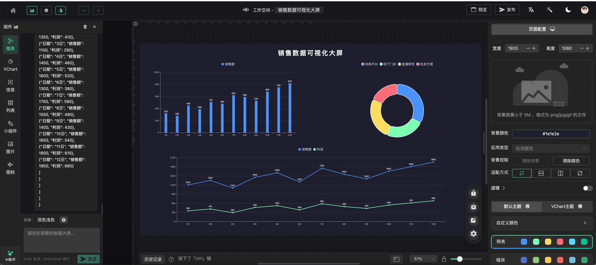
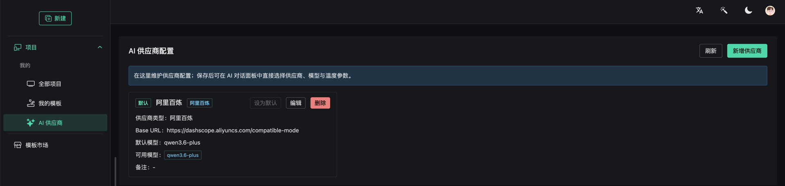
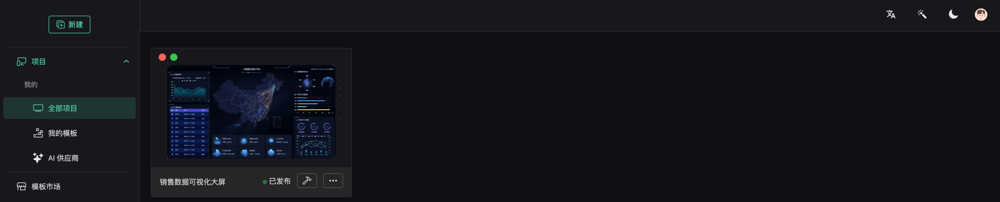
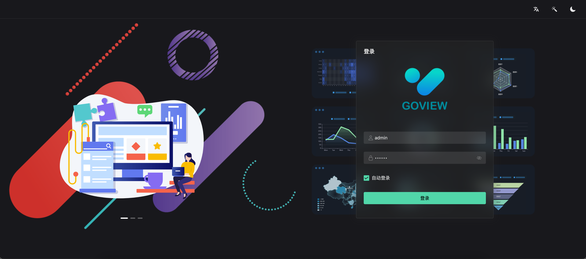

# ForgeAdmin 新成员：AI 赋能的数据可视化大屏平台

> 基于 GoView 二次开发，集成 AI 智能生成能力，对接真实后台接口，让数据大屏开发效率提升 10 倍。

## 一、项目背景

在数字化转型的浪潮中，数据可视化大屏已经成为企业展示运营数据、监控业务指标的核心工具。然而，传统的大屏开发往往需要前端工程师花费大量时间进行图表配置、布局调整和数据对接，开发周期长、成本高。

[GoView](https://gitee.com/dromara/go-view) 作为 Dromara 开源社区的一款优秀数据可视化低代码平台，基于 **Vue3 + TypeScript + ECharts + VChart** 技术栈，提供了拖拽式的大屏设计能力，极大降低了大屏开发的门槛。

在此基础上，**ForgeAdmin** 团队对 GoView 进行了深度二次开发，不仅对接了真实的后台管理接口，还创新性地集成了 **AI 智能生成**能力，让用户只需用自然语言描述需求，即可一键生成完整的数据大屏。

## 二、核心亮点

### 2.1 AI 一键生成大屏

这是本次开发最核心的功能创新。我们在 GoView 的编辑器中集成了 AI 对话面板（`AIChatPanel`），支持两种工作模式：

- **生成大屏模式**：用户输入需求描述，AI 自动分析需求并生成包含图表组件、布局配置、数据结构的大屏方案
- **自由对话模式**：用户可以与 AI 自由交流，获取大屏设计建议和优化方案



*图：大屏编辑器画布，左侧为组件库与 AI 助手入口，中间为可视化画布，右侧为配置面板*

系统内置了 4 个快捷提示词模板，覆盖最常见的业务场景：

| 快捷提示词 | 适用场景 |
|-----------|---------|
| 电商销售数据监控大屏 | 电商平台运营数据监控 |
| 智慧城市运营中心大屏 | 城市级数据汇聚展示 |
| 工厂生产数据监控大屏 | 工业制造实时监控 |
| 财务数据分析大屏 | 企业财务指标分析 |

### 2.2 多供应商 AI 接入

不同于市面上绑定单一 AI 服务的方案，我们设计了灵活的 **多供应商架构**，支持用户自行配置和管理 AI 服务：



*图：AI 供应商配置页面，支持新增、编辑、删除供应商，以及连接测试和默认设置*

系统内置了丰富的供应商预设模板，一键填充配置：

- **阿里百炼（DashScope）**：接入通义千问系列模型
- **OpenAI**：支持 GPT 系列模型
- **智谱 AI**：接入 GLM 系列模型
- **Moonshot**：接入 Kimi 系列模型
- **DeepSeek**：接入 DeepSeek 系列模型
- **Ollama**：支持本地部署的开源模型
- **自定义**：兼容 OpenAI API 格式的任意服务

每个供应商支持配置多个可用模型，用户可以在 AI 对话面板中实时切换供应商、模型，并调节温度参数和最大 Token 数，灵活控制生成效果。

### 2.3 对接真实后台接口

原版 GoView 主要面向纯前端使用场景，数据大多通过 Mock 或静态 JSON 配置。我们在 ForgeAdmin 中对数据层进行了全面改造：

1. **统一认证体系**：大屏平台与 ForgeAdmin 后台管理系统共享 Sa-Token 认证，登录即可使用
2. **项目持久化**：大屏项目数据通过 API 存储到后端数据库，支持多端同步
3. **动态数据源**：支持配置真实的后端 API 接口，图表数据实时刷新
4. **AI 服务后端化**：AI 供应商配置、会话管理、流式对话等全部通过后端 API 实现，保障 API Key 安全



*图：项目列表页面，展示已创建的大屏项目，支持发布状态管理*

### 2.4 智能布局引擎

AI 生成的组件可能不包含精确的位置信息，为此我们实现了自动布局算法（`layoutAlgorithm`）：

```
策略：网格划分，将画布划分为 N 列，依次填入组件
- 组件数 <= 4：2 列布局
- 组件数 5-9：3 列布局
- 组件数 > 9：4 列布局
- 顶部预留 80px 标题区域
- 自动计算行高，均匀分布
```

同时，AI 引擎（`aiEngine`）支持智能合并图表配置：
- **ECharts 组件**：自动覆盖 dataset，根据数据维度调整 series 数量
- **VChart 组件**：智能合并 dataset 配置
- **通用组件**：保留原有配置，仅更新必要字段

## 三、技术架构

### 3.1 整体架构

```
┌─────────────────────────────────────────────────────────┐
│                    ForgeAdmin 平台                        │
├──────────────────────┬──────────────────────────────────┤
│   forge-admin-ui     │       forge-report-ui             │
│   (后台管理系统)       │    (AI 数据可视化大屏)              │
│   Vue3 + Naive UI    │    Vue3 + GoView + AI             │
├──────────────────────┴──────────────────────────────────┤
│              Spring Boot 3 后端服务                        │
│         Sa-Token · MyBatis-Plus · Flowable               │
└─────────────────────────────────────────────────────────┘
```

### 3.2 AI 模块技术实现

AI 功能的前端实现包含以下核心模块：

| 模块 | 文件 | 职责 |
|------|------|------|
| AI 对话面板 | `AIChatPanel.vue` | 用户交互入口，支持流式对话、快捷提示词 |
| AI 生成对话框 | `AIGenerateDialog.vue` | 模态弹窗形式的大屏生成入口 |
| AI 引擎 | `aiEngine.ts` | 解析 AI 响应 JSON，将组件应用到画布 |
| LLM 客户端 | `llmClient.ts` | 从流式输出中提取 JSON 响应 |
| 组件注册表 | `componentRegistry.ts` | 构建组件目录，供 AI 参考可用组件 |
| 布局算法 | `layoutAlgorithm.ts` | 网格划分自动布局 |
| AI Store | `aiStore.ts` | Pinia 状态管理 |
| AI API | `api/ai/index.ts` | 接口定义，SSE 流式通信 |

### 3.3 流式通信

AI 对话采用 **SSE（Server-Sent Events）** 流式通信，实时展示 AI 生成过程：

```typescript
// 核心流程
const consumeAiSse = async (url, data, onChunk, onDone, onError) => {
  const response = await fetch(url, {
    method: 'POST',
    headers: {
      'Content-Type': 'application/json',
      'Authorization': `Bearer ${token}`,
    },
    body: JSON.stringify(data),
  })

  const reader = response.body?.getReader()
  // 逐块读取 SSE 事件流，解析 data 字段
  // 支持 event: message / done / error 三种事件类型
}
```

生成过程中，界面会展示进度提示：

```
🧠 正在理解你的大屏需求...
🧩 正在规划页面布局与组件组合...
📊 正在生成图表数据结构与画布配置...
✨ 正在整理最终结果...
```

### 3.4 组件目录系统

为了让 AI 了解平台支持哪些可视化组件，我们构建了完整的组件注册表（`componentRegistry`），涵盖 7 大类组件：

| 分类 | 说明 | 示例组件 |
|------|------|---------|
| Charts（ECharts） | ECharts 图表 | 柱状图、折线图、饼图、雷达图、散点图、地图 |
| VChart | 字节 VChart 图表 | 高级统计图表 |
| Informations | 信息展示 | 文字、图片、视频、词云、嵌套网页 |
| Tables | 数据列表 | 滚动排名列表、滚动表格 |
| Decorates | 装饰组件 | 边框 01~13、装饰 01~06 |
| Photos | 图片组件 | 图片展示 |
| Icons | 图标组件 | 图标展示 |

AI 生成大屏时，会将组件目录文本附在请求中，确保 AI 只使用平台支持的组件类型。

## 四、功能展示

### 4.1 登录页面



*图：GoView 大屏平台登录页，与 ForgeAdmin 共享认证体系*

### 4.2 可视化编辑器


*图：大屏编辑器核心界面，包含组件库（左侧）、画布（中间）、配置面板（右侧）*

编辑器支持丰富的操作能力：
- **拖拽布局**：从组件库拖拽图表到画布，自由调整位置和大小
- **数据配置**：支持 HTTP 请求、SQL 请求等多种数据源方式
- **主题切换**：内置多种行业主题（金融、政务、医疗、汽车等），支持自定义配色
- **动画配置**：为组件添加入场动画效果
- **事件编辑**：配置组件交互事件
- **历史记录**：支持撤销/重做操作

### 4.3 数据源配置


*图：数据请求配置面板，支持配置后端 API 地址、请求方式、刷新间隔等*

### 4.4 VChart 图表集成


*图：集成字节跳动 VChart 图表框架，提供更丰富的可视化效果*

### 4.5 3D 可视化


*图：支持 Three.js 3D 地球等高级可视化组件*

## 五、AI 功能使用流程

### 5.1 配置 AI 供应商

1. 进入 **项目 → AI 供应商** 配置页面
2. 点击 **新增供应商**，选择预设模板（如阿里百炼）
3. 填写 API Key 和 Base URL
4. 点击 **测试连接**，验证配置是否正确
5. 设为默认供应商

### 5.2 AI 生成大屏

1. 进入大屏编辑器，在左侧面板找到 **AI 助手**
2. 选择 **生成大屏** 模式
3. 输入需求描述，例如："生成一个电商销售数据监控大屏，包含月度销售趋势、品类占比、地区分布"
4. 选择深色/浅色风格
5. 点击发送，等待 AI 生成
6. 生成完成后，点击 **应用到画布** 即可看到完整的大屏布局

### 5.3 二次编辑

AI 生成的大屏是一个高质量的起点，用户可以在此基础上：
- 拖拽调整组件位置和大小
- 修改图表数据和样式
- 替换数据源为真实 API 接口
- 添加装饰组件增强视觉效果
- 配置动画和交互事件

## 六、与原版 GoView 的对比

| 特性 | 原版 GoView | ForgeAdmin 大屏 |
|------|------------|----------------|
| 数据存储 | 浏览器本地存储 | 后端数据库持久化 |
| 用户认证 | 无 | Sa-Token 统一认证 |
| AI 生成 | 不支持 | 支持自然语言生成大屏 |
| AI 供应商 | 不支持 | 多供应商管理与切换 |
| 数据源 | Mock / 静态 JSON | 真实后端 API 接口 |
| 会话管理 | 无 | AI 对话历史记录 |
| 模板市场 | 有 | 有（可扩展） |
| 主题系统 | 有 | 有 + 自定义配色 |
| 图表框架 | ECharts + VChart | ECharts + VChart |
| 部署方式 | 纯前端 / Docker | Docker + Nginx |

## 七、快速开始

### 环境要求

- Node.js >= 18.x
- Java >= 17（后端服务）
- MySQL >= 8.0
- Redis >= 6.0

### 启动大屏服务

```bash
# 1. 克隆项目
git clone https://gitee.com/ForgeLab/forge-admin.git

# 2. 进入大屏前端目录
cd forge-report-ui

# 3. 安装依赖
npm install

# 4. 启动开发服务
npm run dev
```

### 配置 AI 供应商

1. 启动服务后，登录系统
2. 进入 **项目 → AI 供应商** 页面
3. 新增供应商并配置 API Key
4. 返回编辑器，即可使用 AI 生成功能

## 八、总结

ForgeAdmin 的 AI 数据可视化大屏项目，在 GoView 这个优秀的开源基础上，实现了三个关键突破：

1. **AI 赋能**：通过自然语言交互，将大屏开发从"拖拽配置"升级为"描述即生成"，大幅降低使用门槛
2. **真实数据**：对接后台管理系统的真实接口，让大屏不再是静态 Demo，而是可用的业务工具
3. **灵活开放**：多供应商架构让用户不被绑定到特定 AI 服务，本地部署选项满足数据安全需求

未来，我们计划进一步增强 AI 能力，包括：
- 支持上传数据文件（Excel/CSV），AI 自动分析并推荐最佳可视化方案
- 智能数据洞察，自动发现数据中的趋势和异常
- 多轮对话优化，支持对已生成大屏的迭代修改

---

> **项目地址**：[https://gitee.com/ForgeLab/forge-admin](https://gitee.com/ForgeLab/forge-admin)
>
> **技术栈**：Vue3 + TypeScript + Vite + NaiveUI + ECharts + VChart + Pinia + Spring Boot 3
>
> **开源协议**：MIT License
