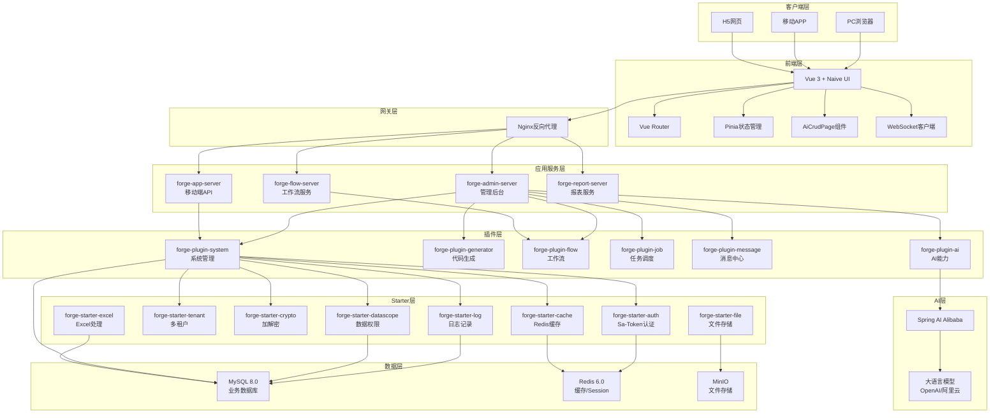
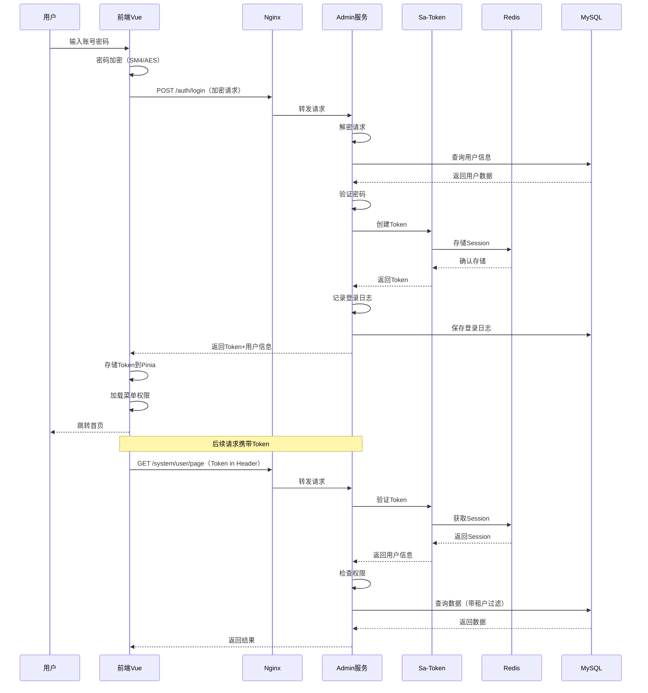
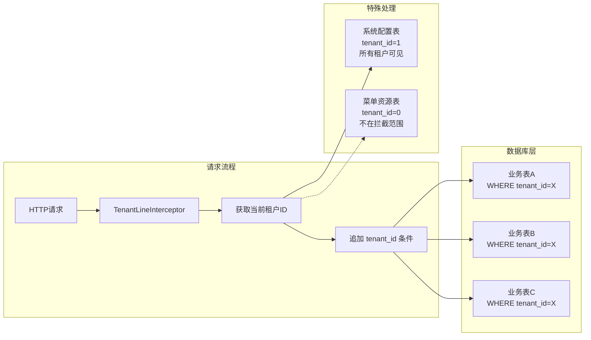
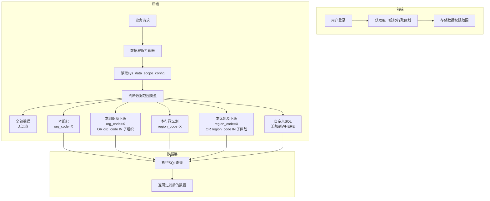
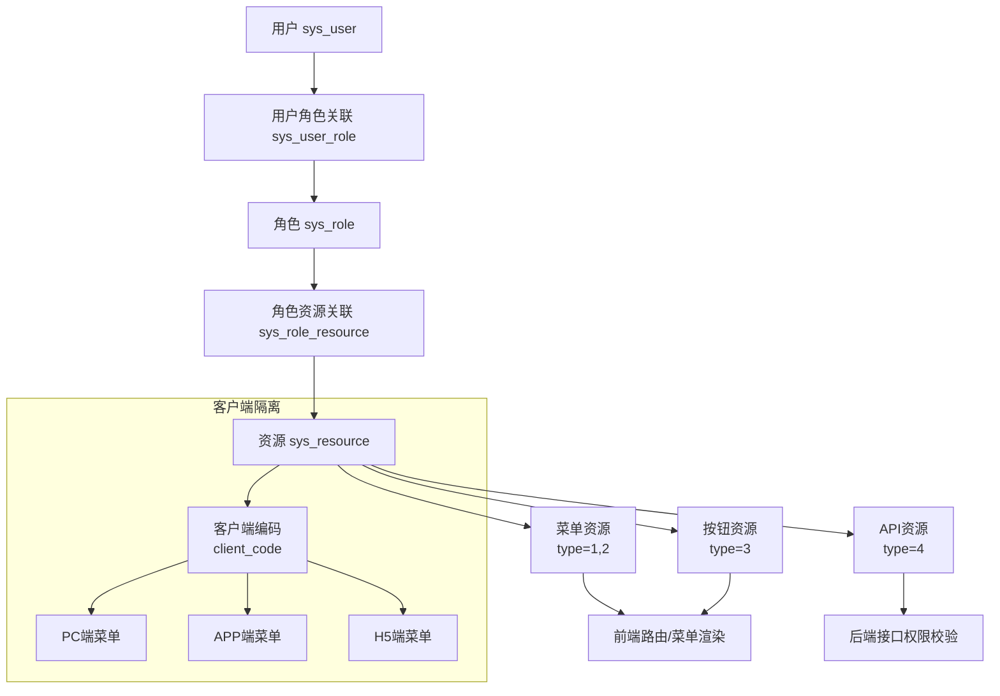
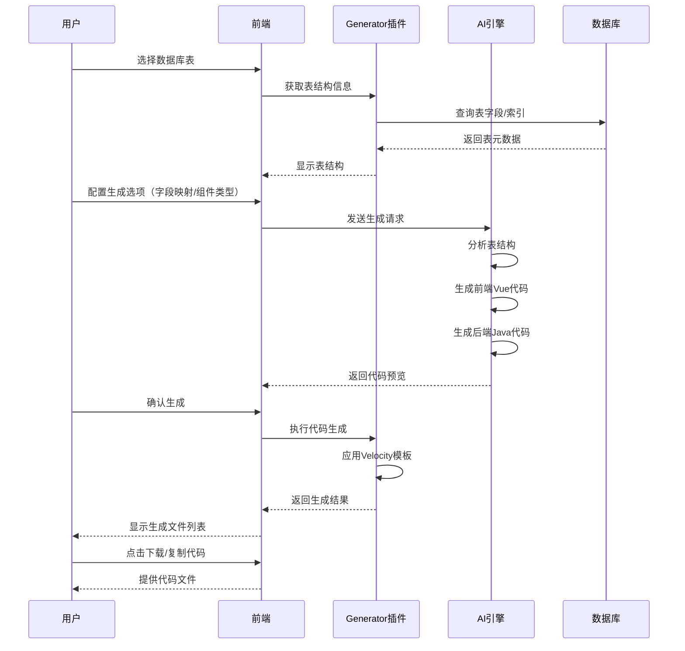
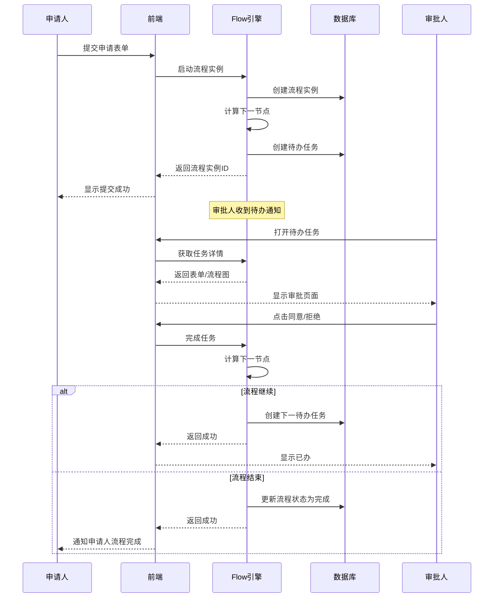
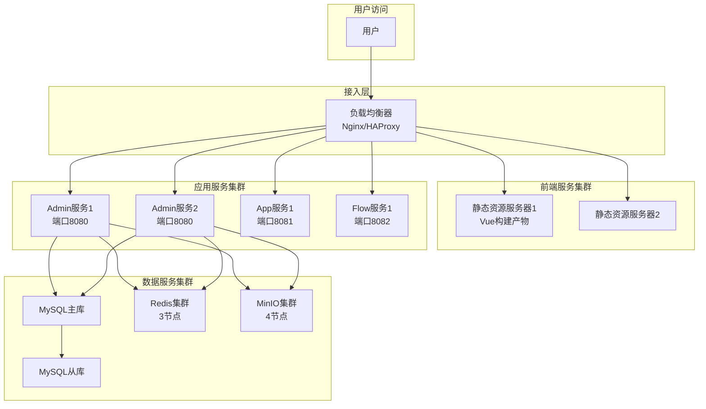

# Forge Admin 系统架构文档

## 一、项目概述

**Forge Admin** 是一款基于微内核插件架构的企业级后台管理框架，采用前后端分离开发模式，支持多租户、RBAC权限控制、代码生成、工作流引擎等核心功能。

### 核心特性

| 特性 | 说明 |
|------|------|
| 微内核插件架构 | 核心框架 + 可插拔业务模块，灵活扩展 |
| 多租户支持 | 基于 tenant_id 的数据隔离，支持租户级别配置 |
| RBAC 权限模型 | 用户-角色-资源三级权限，支持菜单/按钮/API级别控制 |
| 数据权限 | 基于行政区划/组织的动态数据范围控制 |
| 代码生成器 | AI驱动的CRUD代码生成，支持前后端一体化生成 |
| 工作流引擎 | 集成 Flowable，支持流程设计、审批流转 |
| 多端适配 | 支持 PC/APP/H5 三端客户端，菜单按端隔离 |
| 加密通信 | 接口支持 SM4/AES 加密传输 |

---

## 二、技术栈

### 后端技术栈

| 层级 | 技术 | 版本 | 说明 |
|------|------|------|------|
| **核心框架** | Spring Boot | 3.5.13 | 基础框架 |
| | Spring AI Alibaba | 1.1.2 | AI能力集成 |
| **安全认证** | Sa-Token | 1.38.0 | 权限认证框架 |
| **数据访问** | MyBatis-Plus | 3.5.7 | ORM框架 |
| | Dynamic Datasource | 4.3.1 | 多数据源支持 |
| | P6Spy | 3.9.1 | SQL监控 |
| **缓存** | Redis + Redisson | 6.0+ / 3.34.1 | 分布式缓存 |
| | Lock4j | 2.2.7 | 分布式锁 |
| **工作流** | Flowable | 7.0.1 | BPMN工作流引擎 |
| **任务调度** | Snail Job | 1.1.2 | 分布式任务调度 |
| **文件存储** | MinIO/S3 | AWS SDK 2.25.15 | OSS对象存储 |
| **工具库** | Hutool | 5.8.31 | Java工具集 |
| | MapStruct Plus | 1.4.4 | 对象映射 |
| | EasyExcel | 4.0.2 | Excel处理 |
| **加密** | Bouncy Castle | 1.76 | 国密算法支持 |
| **容器** | Undertow | 2.3.15 | Web服务器 |

### 前端技术栈

| 层级 | 技术 | 版本 | 说明 |
|------|------|------|------|
| **核心框架** | Vue | 3.5.20 | 前端框架 |
| | Vue Router | 4.5.1 | 路由管理 |
| | Pinia | 3.0.3 | 状态管理 |
| **UI组件** | Naive UI | 2.42.0 | 组件库 |
| **样式** | UnoCSS | 66.4.2 |原子化CSS |
| **构建工具** | Vite | 7.1.3 | 构建打包 |
| **图表** | ECharts | 6.0.0 | 数据可视化 |
| **工作流设计** | bpmn-js | 17.11.1 | 流程设计器 |
| **代码编辑** | CodeMirror | 6.0.1 | 代码编辑器 |
| **加密** | JSEncrypt/SM-Crypto | 2.1.2 / 0.3.13 | 加密库 |
| **工具库** | Lodash-es | 4.17.21 | 工具函数 |
| | Day.js | 1.11.13 | 日期处理 |

---

## 三、后端模块架构

### 3.1 模块层级结构

```
forge/                           # 后端根工程
├── forge-admin-server/          # 【应用层】管理后台服务入口
│   ├── application.yml          # 主配置文件
│   └── AdminApplication.java    # 启动类
│
├── forge-app-server/            # 【应用层】移动端API服务
├── forge-report-server/         # 【应用层】报表服务
├── forge-flow/                  # 【应用层】工作流独立服务（可选）
│   ├── forge-flow-client/       # 流程客户端API
│   └── forge-flow-server/       # 流程引擎服务
│
├── forge-business/              # 【业务层】业务扩展模块
│   └── forge-business-core/     # 业务核心模块
│
├── forge-framework/             # 【框架层】核心框架
│   ├── forge-dependencies/      # 依赖版本管理
│   ├── forge-plugin-parent/     # 插件父工程
│   │   ├── forge-plugin-system/     # 系统管理插件（用户/角色/菜单/租户）
│   │   ├── forge-plugin-generator/  # 代码生成器插件
│   │   ├── forge-plugin-flow/       # 工作流插件
│   │   ├── forge-plugin-job/        # 任务调度插件
│   │   ├── forge-plugin-message/    # 消息中心插件
│   │   ├── forge-plugin-ai/         # AI能力插件
│   │
│   └── forge-starter-parent/    # Starter父工程
│       ├── forge-starter-core/      # 核心工具（RespInfo/SessionHelper）
│       ├── forge-starter-web/       # Web配置（全局异常/跨域）
│       ├── forge-starter-auth/      # 认证授权（Sa-Token集成）
│       ├── forge-starter-orm/       # ORM配置（MyBatis-Plus/数据权限）
│       ├── forge-starter-cache/     # 缓存配置（Redis）
│       ├── forge-starter-log/       # 日志记录（操作日志/登录日志）
│       ├── forge-starter-crypto/    # 加解密（SM4/AES）
│       ├── forge-starter-tenant/    # 多租户拦截
│       ├── forge-starter-file/      # 文件上传/下载
│       ├── forge-starter-excel/     # Excel导入导出
│       ├── forge-starter-job/       # 任务调度集成
│       ├── forge-starter-message/   # 消息推送集成
│       ├── forge-starter-websocket/ # WebSocket支持
│       ├── forge-starter-datascope/ # 数据权限拦截器
│       ├── forge-starter-config/    # 配置中心客户端
│       ├── forge-starter-social/    # 第三方登录
│       ├── forge-starter-idempotent/# 接口幂等性
│       ├── forge-starter-trans/     # 分布式事务
│       └── forge-starter-id/        # ID生成器
```

### 3.2 模块职责说明

| 模块类型 | 模块名 | 核心职责 |
|----------|--------|----------|
| **应用层** | forge-admin-server | Web管理后台入口，聚合所有插件 |
| | forge-app-server | 移动端API服务，按clientCode隔离 |
| | forge-report-server | 报表导出服务 |
| | forge-flow-server | 独立工作流引擎服务 |
| **业务层** | forge-business-core | 具体业务扩展模块（如请假审批等） |
| **插件层** | forge-plugin-system | 系统管理：用户/角色/菜单/租户/组织/字典 |
| | forge-plugin-generator | 代码生成：表管理/模板管理/生成配置 |
| | forge-plugin-flow | 工作流：流程定义/实例管理/审批记录 |
| | forge-plugin-job | 任务调度：任务配置/执行日志 |
| | forge-plugin-message | 消息中心：站内信/邮件/短信模板 |
| | forge-plugin-ai | AI能力：模型管理/上下文配置/会话管理 |
| **Starter层** | forge-starter-* | 技术组件封装，按需引入 |

---

## 四、前端模块架构

### 4.1 目录结构

```
forge-admin-ui/
├── src/
│   ├── api/                # API接口模块
│   │   ├── system.js       # 系统管理API
│   │   ├── generator.js    # 代码生成API
│   │   ├── flow.js         # 工作流API
│   │   ├── message.js      # 消息中心API
│   │   └── ai.js           # AI能力API
│   │
│   ├── components/         # 公共组件
│   │   ├── ai-form/        # AI表单组件（AiCrudPage/AiForm/AiTable）
│   │   ├── common/         # 通用组件（图标选择器/上传组件等）
│   │   ├── image-upload/   # 图片上传组件
│   │   └── RegionTreeSelect.vue # 行政区划树选择
│   │
│   ├── views/              # 页面视图
│   │   ├── system/         # 系统管理页面
│   │   │   ├── user.vue        # 用户管理
│   │   │   ├── role.vue        # 角色管理
│   │   │   ├── menu.vue        # 菜单管理
│   │   │   ├── org.vue         # 组织管理
│   │   │   ├── tenant.vue      # 租户管理
│   │   │   ├── dictType.vue    # 字典类型
│   │   │   ├── dictData.vue    # 字典数据
│   │   │   ├── config.vue      # 系统配置
│   │   │   ├── login-log.vue   # 登录日志
│   │   │   ├── operation-log.vue # 操作日志
│   │   │   ├── online/index.vue # 在线用户
│   │   │   ├── client.vue      # 客户端管理
│   │   │   ├── region.vue      # 行政区划
│   │   │   ├── post.vue        # 岗位管理
│   │   │   ├── cache.vue       # 缓存管理
│   │   │   ├── monitor.vue     # 系统监控
│   │   │   └── job-config.vue  # 任务配置
│   │   │
│   │   ├── generator/      # 代码生成页面
│   │   │   ├── table.vue       # 表管理
│   │   │   ├── template.vue    # 模板管理
│   │   │   ├── datasource.vue  # 数据源管理
│   │   │
│   │   ├── flow/           # 工作流页面
│   │   │   ├── model.vue       # 流程模型
│   │   │   ├── design.vue      # 流程设计器
│   │   │   ├── template.vue    # 流程模板
│   │   │   ├── form.vue        # 表单设计
│   │   │   ├── todo.vue        # 待办任务
│   │   │   ├── done.vue        # 已办任务
│   │   │   ├── started.vue     # 我的申请
│   │   │   ├── monitor.vue     # 流程监控
│   │   │   ├── category.vue    # 流程分类
│   │   │   └── conditionRule.vue # 条件规则
│   │   │
│   │   ├── ai/             # AI能力页面
│   │   │   ├── crud-generator.vue  # CRUD生成器
│   │   │   ├── crud-config.vue     # CRUD配置
│   │   │   ├── crud-page.vue       # CRUD页面预览
│   │   │   ├── page-template.vue   # 页面模板
│   │   │   ├── session.vue         # AI会话
│   │   │   ├── provider.vue        # AI提供商管理
│   │   │   ├── provider-model.vue  # AI模型管理
│   │   │   ├── model.vue           # 模型配置
│   │   │   └── context-config.vue  # 上下文配置
│   │   │
│   │   ├── message/        # 消息中心页面
│   │   │   ├── message-list.vue    # 消息列表
│   │   │   ├── template-list.vue   # 消息模板
│   │   │   ├── biz-type.vue        # 业务类型
│   │   │   └── messageConfig/      # 消息配置
│   │   │
│   │   ├── login/          # 登录页面
│   │   │   ├── index.vue        # 登录页
│   │   │   └── callback.vue     # 第三方登录回调
│   │   │
│   │   ├── home/           # 首页
│   │   └── leave/          # 请假审批示例业务
│   │
│   ├── store/              # Pinia状态管理
│   │   ├── modules/
│   │   │   ├── app.js          # 应用状态（主题/语言）
│   │   │   ├── user.js         # 用户信息
│   │   │   ├── auth.js         # 认证状态
│   │   │   ├── permission.js   # 权限/菜单数据
│   │   │   ├── router.js       # 路由状态
│   │   │   ├── tab.js          # 标签页状态
│   │   │   └── tenant.js       # 租户配置
│   │
│   ├── router/             # 路由配置
│   │   ├── guards/             # 路由守卫
│   │   │   ├── permission-guard.js # 权限守卫
│   │   │   └── index.js         # 守卫入口
│   │   └── static-routes.js    # 静态路由
│   │
│   ├── utils/              # 工具函数
│   │   ├── request.js          # Axios请求封装
│   │   ├── encrypt-request.js  # 加密请求封装
│   │   ├── auth.js             # 认证工具
│   │   ├── common.js           # 通用工具
│   │
│   ├── directives/         # 自定义指令
│   │   ├── modules/
│   │   │   ├── hasPermi.js      # 权限指令
│   │   │   ├── loading.js       # 加载指令
│   │   │   ├── watermark.js     # 水印指令
│   │
│   └── themes/             # 主题样式
│       └── settings.js        # 主题配置
```

### 4.2 核心组件说明

| 组件 | 路径 | 说明 |
|------|------|------|
| **AiCrudPage** | `components/ai-form/AiCrudPage.vue` | 通用CRUD页面组件，集成搜索/表格/新增/编辑/删除/导入导出 |
| **AiForm** | `components/ai-form/AiForm.vue` | JSON配置驱动的动态表单组件 |
| **AiTable** | `components/ai-form/AiTable.vue` | JSON配置驱动的动态表格组件 |
| **IconSelector** | `components/IconSelector.vue` | 图标选择器，支持字体图标/图片图标 |
| **RegionTreeSelect** | `components/RegionTreeSelect.vue` | 行政区划树选择，支持数据权限过滤 |
| **ImageUpload** | `components/image-upload/index.vue` | 图片上传组件，支持OSS存储 |

---

## 五、系统架构图

### 5.1 整体架构图（Mermaid）



### 5.2 认证授权流程图



### 5.3 多租户数据隔离架构



### 5.4 数据权限控制架构



---

## 六、核心业务流程

### 6.1 RBAC 权限模型



### 6.2 代码生成流程



### 6.3 工作流审批流程



---

## 七、部署架构

### 7.1 单机部署

```
┌─────────────────────────────────────────────────────┐
│                    物理服务器                        │
│  ┌─────────────────────────────────────────────────┐│
│  │               Nginx（端口80/443）                ││
│  │  /admin/* → localhost:8080                      ││
│  │  /api/*  → localhost:8080                       ││
│  │  /static/* → 静态资源目录                        ││
│  └─────────────────────────────────────────────────┘│
│  ┌─────────────────────────────────────────────────┐│
│  │          forge-admin-server（端口8080）          ││
│  │  - Spring Boot应用                               ││
│  │  - Undertow容器                                  ││
│  └─────────────────────────────────────────────────┘│
│  ┌─────────────────────────────────────────────────┐│
│  │          MySQL（端口3306）                       ││
│  │  - 业务数据库                                    ││
│  └─────────────────────────────────────────────────┘│
│  ┌─────────────────────────────────────────────────┐│
│  │          Redis（端口6379）                       ││
│  │  - Session存储                                   ││
│  │  - 缓存数据                                      ││
│  └─────────────────────────────────────────────────┘│
│  ┌─────────────────────────────────────────────────┐│
│  │          MinIO（端口9000）                       ││
│  │  - 文件存储                                      ││
│  └─────────────────────────────────────────────────┘│
└─────────────────────────────────────────────────────┘
```

### 7.2 集群部署



---

## 八、扩展开发指南

### 8.1 新增业务模块

1. **后端**：在 `forge-business/` 下新建模块，依赖 `forge-plugin-system`
2. **前端**：在 `views/` 下新建页面目录
3. **菜单**：通过菜单管理添加新菜单项，配置路由和组件路径
4. **权限**：通过角色管理分配新模块的访问权限

### 8.2 新增 Starter 组件

1. 在 `forge-starter-parent/` 下新建模块
2. 定义 `AutoConfiguration` 类
3. 在 `spring.factories` 或 `AutoConfiguration.imports` 注册
4. 在 `forge-dependencies` 管理版本

### 8.3 前端组件扩展

1. 在 `components/` 下新建组件
2. 遵循 Vue 3 Composition API 规范
3. 使用 UnoCSS 进行样式开发
4. 通过 AiCrudPage 集成 CRUD 功能

---

## 九、关键技术点

### 9.1 加密通信

- **请求加密**：前端使用 SM4/AES 加密请求体
- **注解标识**：后端使用 `@ApiEncrypt`/`@ApiDecrypt` 标注敏感接口
- **密钥管理**：密钥存储在 Redis，定期轮换

### 9.2 数据权限实现

- **拦截器**：`DataScopeInterceptor` 基于 MyBatis-Plus 拦截器
- **SQL改写**：根据配置动态追加数据范围条件
- **配置表**：`sys_data_scope_config` 定义各表的数据权限规则

### 9.3 多租户隔离

- **字段隔离**：所有业务表包含 `tenant_id` 字段
- **拦截器**：`TenantLineInterceptor` 自动追加租户过滤
- **例外配置**：菜单资源表不在租户拦截范围

---

## 十、环境配置

| 配置项 | 说明 | 配置文件 |
|--------|------|----------|
| 数据库连接 | MySQL连接信息 | `application-dev.yml` |
| Redis连接 | Redis/Redisson配置 | `application-dev.yml` |
| OSS存储 | MinIO/S3配置 | `application-dev.yml` |
| AI模型 | Spring AI配置 | `application-dev.yml` |
| 加密密钥 | SM4/AES密钥 | `application-dev.yml` |
| 多租户 | 租户拦截配置 | `application.yml` |

---

**文档版本**: v1.0.0  
**更新日期**: 2025-04-29  
**适用版本**: Forge Admin 1.0.0