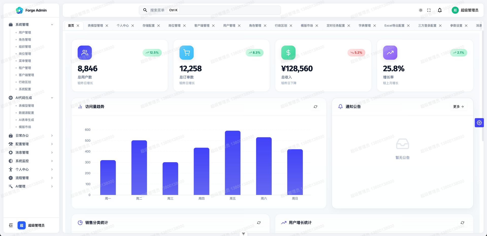
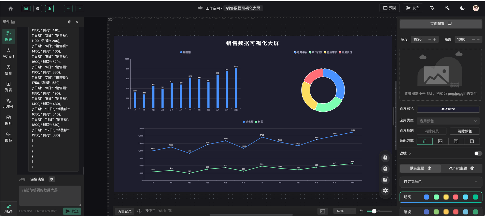
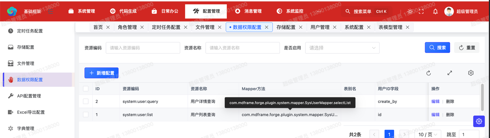
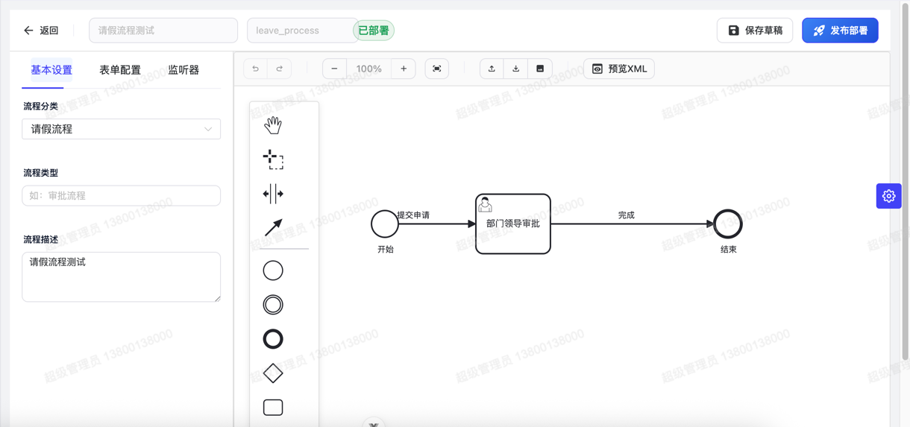

# 当 90% 的中后台还在重复造轮子，我把这个"搭积木"的框架开源了

> 一个做了七八年后台开发的程序员，把"每次都要重新来一遍"的能力，全部沉淀到了一个框架里。

---

## 写在前面：企业后台的"重复陷阱"

如果你是一家企业的技术负责人，下面这些场景你一定不陌生：

- **每接一个项目，都在搭同一套底座**——用户、角色、菜单、字典、文件、操作日志。换一个项目又来一遍。
- **要加 AI 能力时，发现要重写一半系统**——AI 智能体怎么管理、模型怎么切换、生成的大屏怎么发布，每个项目从零摸索。
- **审批流从 Flowable 接到能跑通，要 2 周**——光是流程设计器、表单绑定、待办集成、回调处理就够新人喝一壶。
- **多租户改着改着，数据就串了**——`WHERE tenant_id = ?` 总是漏写，最后上线才发现某张表没隔离。
- **大屏项目永远在赶 deadline**——Figma 出图 → 切图 → 写 ECharts → 接 API → 调样式，每个项目都在重复这套。

做了七八年后台之后，我意识到一件事：**企业后台 90% 的复杂度，是可抽象、可复用的。** 那些"多租户、RBAC、Flowable、AI 大屏"不是业务，而是基建。

于是我把它们做成了**一个微内核 + 插件化的企业级框架**，并把它完整地开源了出来。

它叫 **Forge Admin**。

> GitHub：<https://github.com/yaomindong1996/forge-admin>
> Gitee：<https://gitee.com/ForgeLab/forge-admin>
> 在线演示：<http://www.dlforgelab.com:8084/forge/login> （账号 `admin` / `123456`）


*▲ 后台工作台：系统状态、业务指标、常用入口集中展示*

---

## 一、它不是又一个"脚手架"——它想回答三个真问题

市面上的中后台框架已经很多了：RuoYi、JeecgBoot、芋道、Cloud Platform……它们都解决了"从 0 到能跑"的问题，但**真正让企业长期痛苦的是下面三件事**：

| 痛点 | 多数框架的现状 | Forge Admin 的解法 |
|------|----------------|------------------|
| **业务页面越改越乱** | 一键生成代码 → 改业务 → 字段一改就要动五六处文件 | **协议驱动**：页面是 JSON Schema，运行时渲染，改配置不改代码 |
| **AI 能力接入成本高** | 自己接 OpenAI / 通义千问 / DeepSeek，提示词、上下文、工具调用全自己写 | **AI 智能体引擎**：内置 7+ 开箱即用的 Agent，覆盖代码、流程、大屏 |
| **多端体验割裂** | PC 端一套、H5 一套、大屏又一套，组件和接口反复对齐 | **多端统一**：Admin UI + H5 + Report UI + App Server 共用一套后端 |

如果用一句话总结 Forge 和其他框架的区别：

> **Forge 不是"后台管理脚手架"，而是"AI 时代的企业数据应用生成平台"**。

它把"AI 智能体管理"和"AI 数据大屏"做成了和"用户管理、角色管理"一样的基础能力——不是 Demo，而是生产可用。

---

## 二、微内核 + 插件化：让框架像乐高一样可拆可装

这是我最引以为豪的设计。

### 2.1 后端的三层分层

很多框架把功能堆在一个 Spring Boot 项目里，加一个新功能要改十几处。Forge 的做法是把后端拆成**三个清晰的层**：

```
forge-server/
├── forge-framework/                    # 框架层：只提供能力，不涉及业务
│   ├── forge-dependencies/             # 统一依赖版本管理（BOM）
│   ├── forge-starter-parent/           # 技术 Starter（20+ 个，零侵入）
│   └── forge-plugin-parent/            # 业务插件（system/generator/job/flow/ai/mcp …）
│
├── forge-admin-server/                 # 主应用：聚合插件，对外提供后台 API
├── forge-report-server/                # 大屏服务：可独立部署的 AI 大屏后端
├── forge-flow/                         # 流程服务：可独立部署的 Flowable 服务
└── forge-business/                     # 业务模块：你自己写业务的容器
```

- **Starter** 提供底层能力（认证、缓存、ORM、多租户、数据权限、加解密、Excel、文件、幂等、分布式 ID……）。它们不依赖任何业务，开箱即用。
- **Plugin** 提供业务能力（系统管理、代码生成、任务调度、消息中心、流程、AI）。它们可以按需启用/卸载。
- **Server** 是应用的入口，按场景聚合不同的 Plugin，对外暴露接口。

### 2.2 启动器即插即用

以多租户为例，市面多数框架要你自己在每个表加 `tenant_id` 字段、每个查询手动拼 `WHERE tenant_id = ?`。在 Forge 里，只要引入 `forge-starter-tenant`，框架会通过 `TenantLineInnerInterceptor` **自动**给所有 SQL 追加租户条件。

数据权限也一样——`forge-starter-datascope` 会按 `mapperMethod` 精确匹配 XML SQL，自动改写为"按部门、按角色、按业务规则"的数据范围。

加解密、幂等、分布式锁、WebSocket、社交登录……**全部是 Starter 形态**，要哪个就引哪个，不耦合。

### 2.3 业务插件按需启用

要做审批流？引 `forge-plugin-flow`，内置 Flowable 模型、流程设计、待办集成、流程时间轴。
要做 AI？引 `forge-plugin-ai`，内置智能体管理、模型供应商、Prompt 模板。
要做代码生成？引 `forge-plugin-generator`，内置模型设计、表单生成、模板下载。
要做消息？引 `forge-plugin-message`，站内信、邮件、短信都有。

> **新项目 = 选插件 + 写业务。框架只在你需要时出现。**

---

## 三、AI 能力不是 Demo，是生产可用

这是我最想重点讲的能力，也是 Forge 和"普通后台框架"拉开差距的地方。

### 3.1 AI 智能体引擎：把"AI 应用开发"变成"配置"

Forge 内置了一个完整的**AI 智能体管理引擎**。你可以在后台**创建、配置、发布、下线**自己的 AI 智能体，而不用写一行集成代码。


*▲ AI 智能体管理：模型、温度、MCP 工具、会话、模板一站式管理*

**开箱即用的智能体：**

| 智能体 | 干啥的 | 适用场景 |
|--------|--------|---------|
| **低代码业务系统生成 Agent** | 一句话 → 划分领域 → 生成数据模型 + 应用草稿 | 快速原型、PoC |
| **流程 BPMN 生成助手** | 自然语言描述 → 自动生成 Flowable BPMN XML | 审批流快速搭建 |
| **CRUD 配置生成器** | 描述需求或表结构 → 生成 CRUD JSON 配置 | 标准化后台页面 |
| **大屏生成助手** | 业务目标 → 自动生成数据可视化大屏布局 | 数据驾驶舱 |
| **代码生成字段顾问** | 字段信息 → 推荐 Java 类型、表单组件、字典、校验 | 提效建表后的页面配置 |
| **Schema 构建器** | 自然语言 → 推断数据模型 Schema | 数据建模助手 |
| **智能客服** | 通用对话能力 | 接入站内客服 |

**关键能力：**
- **多模型供应商**：阿里百炼（通义千问）、OpenAI、智谱、Moonshot、DeepSeek、Ollama 全支持；兼容 OpenAI API 格式的自定义服务也行。
- **完整生命周期**：草稿 → 已发布 → 下线，发布可控制、会话可审计。
- **MCP 工具扩展**：智能体可挂载 MCP 工具，让模型调用业务 API。
- **提示词模板库**：可复用的 Prompt 模板沉淀为团队资产。

> 换句话说：你不需要"接入 AI"，Forge 已经把 AI 当成"系统能力"在做。

### 3.2 AI 数据大屏：用自然语言生成驾驶舱

这是 Forge 第二个杀手锏。

过去做一个数据大屏，Figma 出图 → 切图 → 写 ECharts → 接 API → 调样式 → 适配分辨率 → 适配暗色主题…… 至少 2 周。

在 Forge 里，流程变成这样：

1. **AI 对话生成**——"我要一个销售数据驾驶舱，要有 GMV 趋势、Top10 客户、品类占比"
2. **画布编辑器微调**——拖一拖、调一调


*▲ AI 大屏画布编辑器：组件库、图层、画布、配置面板四联动*

3. **配置数据源**——支持静态数据、动态 HTTP、数据池，接入真实业务 API
4. **一键发布**——生成预览链接，可分享、可嵌入、可发布到生产

**内置组件库够用：**

| 分类 | 组件 |
|------|------|
| 图表 | 柱状图、横向柱状图、折线图、面积图、饼图、环形图、雷达图、散点图、热力图、漏斗图、水球图、中国地图 |
| 信息 | 文字、渐变文字、词云、图片、视频、嵌入网页 |
| 表格 | 滚动排名列表、滚动表格 |
| 装饰 | 13 种边框、5 种装饰、数字翻牌、时钟、倒计时、数字计数 |

**主题与交互：**
- 深浅主题、背景、全局滤镜、画布尺寸、自适应方式全可配
- 点击、双击、鼠标进入/移出、生命周期事件全支持
- 自定义 JavaScript 接入，实现复杂交互

> 一个原本要 2 周的大屏项目，**半天能交付**。

### 3.3 AI 驱动的代码生成：低代码的三层递进

Forge 把低代码拆成**三个递进层级**，让你按场景灵活选择：

```
┌─────────────────────────────────────────────────┐
│  层级三：AI 对话生成                              │
│  "帮我做一个客户管理系统" → 自动生成全部代码       │
│  适合：快速原型、简单业务系统                      │
├─────────────────────────────────────────────────┤
│  层级二：JSON 协议驱动                             │
│  一份 JSON 配出完整 CRUD 页面 + 表单              │
│  适合：标准增删改查、数据管理页面                   │
├─────────────────────────────────────────────────┤
│  层级一：插件化架构 + 代码生成器                    │
│  AI 生成骨架代码 → 下载代码包 → 自由二次开发       │
│  适合：复杂业务逻辑、定制化需求                     │
└─────────────────────────────────────────────────┘
```

**JSON 协议驱动**是 Forge 低代码体系的基础层，核心组件叫 `AiCrudPage`：

- `modelSchema` 定义数据模型（字段、类型、约束）
- `pageSchema` 定义页面编排（表格列、搜索项、表单、按钮、接口）

页面由运行时引擎按协议动态渲染——**改配置，页面直接变**。不存在"改了再生成要合并冲突"这回事。

实际开发中，一个标准的 CRUD 页面（搜索 + 分页 + 表单 + 增删改查接口），过去要写 Controller、Service、Mapper、Vue 页面两天；用 `AiCrudPage` 配一份 `api-config` + schema，**10 分钟跑起来**。

复杂业务呢？AI 生成配置 JSON（AiCrudConfig）→ Velocity 模板渲染成规范代码包 → **下载二次开发**。简单业务 0 代码，复杂业务有退路。

> **你不需要在"低代码"和"写代码"之间二选一**。同一个项目里，简单页面用配置生成，复杂页面下载代码包继续开发，两部分无缝共存。

---

## 四、企业级能力：稳，才能撑得住长期演进

光有 AI 不够。一个真正的企业级框架，必须把"基础但容易出错"的能力做得扎实。Forge 在这块没偷懒。

### 4.1 权限与多租户：基础但不能错

- **RBAC**：用户、角色、菜单、按钮权限四级控制，资源绑定到角色
- **多租户**：自动 SQL 改写 + 字段隔离 + 租户切换 + 租户级数据源
- **数据权限**：按部门、按角色、按业务规则配置数据范围，`DataScopeInterceptor` 自动改写 SQL


*▲ 数据权限配置：按组织、角色、业务规则精确控制可见数据*

### 4.2 Flowable 工作流：从发起到时间轴全闭环

不是 Demo 级的工作流，而是**真正能扛业务**的：


*▲ 流程设计器：BPMN.js + AI 生成助手，画完直接发布*

- 流程模型 → 在线设计 → 节点配置 → 审批人（动态算）→ 流程发起 → 待办集成 → 流程时间轴 → 回调
- 流程和业务数据通过注解绑定，零侵入
- 流程服务可独立部署，适合业务量大的场景

### 4.3 加解密、幂等、监控：企业级标配

- **API 加解密**：`@ApiEncrypt` / `@ApiDecrypt` 注解，敏感字段透明加解密
- **幂等控制**：`@Idempotent` 注解 + Redisson 分布式锁，防止重复提交
- **操作日志**：`@OperationLog` 注解，自动记录操作人与时间
- **服务监控**：CPU、内存、磁盘、Redis 一站式监控
- **Excel 导入导出**：EasyExcel 封装，模板可配置
- **动态配置**：`@RefreshScope` 注解，配置变更实时生效

### 4.4 多端统一


*▲ H5 移动端：基于 uni-app 3 + Vue 3，一套代码覆盖 H5、微信小程序、支付宝小程序*

- **后台 UI（forge-admin-ui）**：Vue 3.5 + Naive UI 2.42 + Vite 7 + Pinia 3 + UnoCSS 66
- **H5（forge-h5）**：uni-app 3 + Vue 3，一套代码跨 H5/小程序
- **AI 大屏（forge-report-ui）**：自研画布引擎 + ECharts + VChart
- **流程设计器**：BPMN.js + CodeMirror
- **App 接口服务（forge-app-server）**：独立部署的移动端 API

> **共用一套后端 API**，业务数据完全打通。

---

## 五、完整技术栈：现代、稳定、有取舍

### 5.1 后端

| 技术 | 用途 | 选型理由 |
|------|------|---------|
| Java 17 | 运行环境 | LTS、性能更好、语法更现代 |
| Spring Boot 3.2 | 应用框架 | Jakarta EE 9、虚拟线程、原生镜像支持 |
| MyBatis-Plus 3.5 | ORM | 国产、口碑好、分页和动态 SQL 强 |
| Sa-Token 1.38 | 鉴权 | 比 Spring Security 轻、注解友好 |
| Flowable 7.0 | 工作流 | BPMN 2.0 标准、企业级稳定 |
| Redis / Redisson | 缓存 / 分布式锁 | 标配 |
| Undertow | Web 容器 | 性能优于 Tomcat |
| Quartz / SnailJob | 任务调度 | 两种可选，看场景 |

### 5.2 前端

| 技术 | 用途 |
|------|------|
| Vue 3.5 | 主框架 |
| Naive UI 2.42 | 后台组件库（比 Element Plus 更现代、TypeScript 友好） |
| Vite 7 | 构建工具 |
| Pinia 3 | 状态管理 |
| Vue Router 4.5 | 动态路由 + 权限路由 |
| UnoCSS 66 | 原子化 CSS（启动比 Tailwind 快一个数量级） |
| ECharts / VChart | 图表与大屏 |
| BPMN.js 17 | 流程设计器 |
| CodeMirror 6 | 代码编辑器 |

### 5.3 工程化

- **多模块 Maven**：后端清晰分层
- **pnpm workspace**：前端多项目管理
- **Flyway**：数据库迁移版本化
- **VitePress**：项目文档站
- **Apache 2.0 协议**：可商用

---

## 六、它适合谁？

下面这些场景，Forge Admin 应该能帮上忙：

| 场景 | 你的痛点 | Forge 的解法 |
|------|---------|------------|
| **企业内部管理系统** | 每次都搭一套用户/角色/菜单 | 系统插件开箱即用 |
| **多租户 SaaS** | 改着改着数据就串了 | 自动 SQL 改写 + 字段隔离 |
| **审批流业务** | Flowable 集成要 2 周 | 注解化 + 流程设计器 + 模板 |
| **数据大屏** | 2 周才能交付一个 | AI 生成 + 画布微调 + 一键发布 |
| **快速接 AI** | 自己对接 OpenAI/通义千问 | 智能体引擎 + 多模型支持 + MCP |
| **多端应用** | PC/H5/小程序分开做 | 统一后端 + 跨端前端 |

如果你的团队有 3 个以上项目在用类似技术栈重复造轮子，**Forge 至少能帮你省下每个项目 30%~50% 的脚手架时间**。

---

## 七、未来路线：成为"AI 驱动的企业数据应用生成平台"

Forge 的下一步，不是堆砌业务系统，而是**继续深耕"AI + 数据应用生成"**。

- **短期（1-2 月）**：补齐 AI 大屏生成闭环（生成记录、版本管理、失败重试、局部修复、模板市场）
- **中期（3-6 月）**：扩展 AI CRUD 生成、AI 报表生成、AI 问数、多租户私有化交付
- **长期（6 月+）**：形成 Forge CLI，让新项目用 `forge create my-project` 初始化；形成插件市场和模板市场，让能力可复用、可交付

一句话总结未来定位：

> **Forge = AI 驱动的企业数据应用生成平台**——不是交付固定业务系统，而是成为快速生成业务系统、数据大屏、分析报表和管理后台的底座。

---

## 八、写在最后

开源这件事，我是认真的。

过去一年，Forge 已经被不少企业用在了生产环境。从个人开发者到中型团队，从内部 OA 到 SaaS 平台，从政府项目到出海业务——它扛住了不同场景的考验。

如果你也受够了：

- 每次接项目都重复搭底座
- 写一半发现权限串了
- AI 接入要重写一半系统
- 审批流一集成就崩
- 多端对齐要开三个会

**欢迎试试 Forge Admin**。

- GitHub：<https://github.com/yaomindong1996/forge-admin>
- Gitee：<https://gitee.com/ForgeLab/forge-admin>
- 在线演示：<http://www.dlforgelab.com:8084/forge/login>（`admin` / `123456`）
- 项目文档：<http://www.dlforgelab.com:8084/forge-docs/>

如果觉得不错，**点个 Star** 是对我最大的支持。Issue、PR、合作意向都欢迎。

> 让搭页面更快、让流程能闭环、让 AI 真正长进开发链路——这是 Forge 想做的事，也是我作为一个程序员的私心。

---

**附录：项目速览**

- **后端**：Spring Boot 3.2 + MyBatis-Plus 3.5 + Sa-Token 1.38 + Flowable 7.0
- **前端**：Vue 3.5 + Naive UI 2.42 + Vite 7 + Pinia 3 + UnoCSS 66
- **多端**：Admin UI / H5 / AI 大屏 / App 接口
- **协议**：Apache 2.0（可商用）
- **插件**：system、generator、job、message、flow、ai、data、mcp、capability …
- **启动器**：auth、cache、orm、tenant、crypto、excel、file、log、idempotent …
