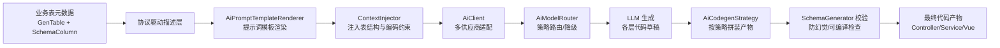

# 我用 LLM 把后台 CRUD 效率提升 10 倍：AI 代码生成器的架构与落地实践

> 每个后端都写过无数遍的 CRUD：建表、写 Entity、Mapper、Service、Controller，再到前端页面和表单。这套样板代码占掉了我们多少真正做业务的时间？
>
> 我是 Forge Admin（一个 Vue3 + Spring Boot3 企业级中后台框架）的作者。这篇文章不聊概念，只聊我们是怎么把一个**协议驱动 + LLM 增强**的代码生成器真正跑在生产里的——包括提示词怎么写、怎么防 LLM 幻觉、以及哪些活儿它至今还干不了。

---

## 一、为什么不直接"无代码"？

先说结论：**纯自然语言生成代码，目前不靠谱**。我们踩过的最大的坑，是让 LLM 直接"根据一句话生成整个模块"，结果它自由发挥出来的字段名、分层、命名规范全对不上项目既有约定，生成即返工。

所以我们选了**协议驱动（Schema First）+ LLM 增强**的路线：

- **确定性部分**（分层结构、命名规范、框架约定）由代码模板和策略保证，不依赖 LLM；
- **创造性部分**（字段语义理解、默认值推断、简单业务逻辑、前端表单组合）交给 LLM。

分工清晰，LLM 只在我们划好的框里发挥，幻觉成本被压到最低。

---

## 二、整体架构



核心链路对应我们 generator 插件里的真实类：

- `CrudGeneratorController` 接收 `AiCrudGenerateRequest`
- `AiCrudCodegenService` 编排生成流程
- `AiPromptTemplateRenderer`（在 ai 插件里）负责把元数据渲染成提示词
- `AiClient` 做多供应商（OpenAI 兼容 / 通义 DashScope 等）适配
- `AiModelRouter` 做模型策略路由与降级
- `AiCodegenStrategy` 继承 `CodegenStrategy`，把 LLM 输出拼装成最终文件
- `SchemaGenerator` 做生成后的结构与编译校验

---

## 三、核心设计①：协议驱动，不让 LLM 决定结构

代码生成的"地基"是元数据，而不是自然语言。在我们的设计里，一张业务表被抽象成：

```java
// 表的元数据
public class GenTable {
    private String tableName;        // 物理表名
    private String moduleName;       // 业务模块
    private String packageName;      // 生成包路径
    private List<SchemaColumn> columns;
}

// 字段的元数据（这就是喂给 LLM 的"事实"）
public class SchemaColumn {
    private String columnName;       // 字段名
    private String columnType;       // 数据库类型
    private String javaType;         // 映射的 Java 类型
    private String comment;          // 注释（最关键的语义来源）
    private boolean pk;              // 是否主键
    private boolean required;        // 是否必填
}
```

**关键认知**：`comment`（字段注释）是连接"数据库"和"业务语义"的桥。LLM 不需要猜 `status` 是什么，注释里写了"订单状态：0待支付 1已支付 2已取消"，它就能源生正确的枚举和下拉项。

这部分完全是确定性的，LLM 不参与结构决策——它只消费这些事实。

---

## 四、核心设计②：提示词工程（这是干货核心）

很多人用 LLM 生成代码效果差，问题不在模型，在提示词。我们的 `AiPromptTemplateRenderer` + `ContextInjector` 做了一件事：**把"项目约束"变成 LLM 必须遵守的硬规则**。

一个真实的提示词模板长这样（精简示意）：

```
你是一个资深 Java + Vue 工程师，基于以下【表结构事实】生成代码。
严格遵守：
1. 技术栈固定：Spring Boot 3 + MyBatis-Plus；前端 Vue3 + Naive UI
2. 分层固定：Controller -> Service -> Mapper，禁止跨层调用
3. 统一响应：所有接口返回 RespInfo<T>，禁止使用 Map 兜底
4. 命名规范：Entity 用表名去下划线首字母大写；变量用驼峰
5. 仅输出代码，不要解释；每个文件用 ===文件名=== 分隔

【表结构事实】
{{#each columns}}
- 字段: {{columnName}} / 类型: {{javaType}} / 注释: {{comment}} / 必填: {{required}}
{{/each}}

【需要生成的文件】
- XxxController.java
- XxxService.java + XxxServiceImpl.java
- XxxMapper.java + XxxMapper.xml
- Xxx.vue（列表+表单，使用 AiCrudPage 组件）
```

`ContextInjector` 还会额外注入"项目已有的公共类清单"（比如 `RespInfo`、`PageQuery`），让 LLM 复用而不是重新发明。这一步直接决定了生成代码能不能**直接编译通过**。

> 提示词的本质不是"施法咒语"，而是**把团队规范固化成机器可读的约束**。这也是为什么同样用 GPT，有人生成一堆玩具代码，有人能生成能上生产的代码。

---

## 五、核心设计③：生成校验与兜底，防幻觉

LLM 再强也会偶尔抽风。我们不信任它的输出，必须用确定性逻辑兜底：

```java
// AiCodegenStrategy：策略模式拼装产物
public class AiCodegenStrategy implements CodegenStrategy {
    @Override
    public List<GeneratedFile> generate(GenTable table, LlmDraft draft) {
        // 1. 校验 LLM 输出是否包含约定的所有文件
        SchemaGenerator.assertFilesComplete(draft, table);
        // 2. 用模板占位符回填，覆盖 LLM 可能写错的分层骨架
        return assembleByTemplate(table, draft);
    }
}
```

兜底策略有三层：

1. **结构校验**：`SchemaGenerator` 检查产物是否包含 Controller/Service/Mapper/Vue 四个文件，缺哪个由模板补齐；
2. **关键骨架模板化**：分层基类、统一响应、分页查询这些"不能出错"的部分，永远用代码模板生成，LLM 只填"业务字段"那一层；
3. **模型路由降级**：`AiModelRouter` 在主模型超时/限流时，自动切到备选模型，保证生成任务不中断。

这就是为什么我说"LLM 只在我们划好的框里发挥"——框外的事，框架自己兜。

---

## 六、实战 Demo：一张表到一套代码

假设我们有一张 `t_order`（订单表），包含 id、order_no、user_id、amount、status、create_time。

前端在生成器页面选好表，点"AI 生成"，背后发生的是：

```
POST /api/generator/crud/ai/generate
{
  "tableName": "t_order",
  "moduleName": "order",
  "packageName": "com.mdframe.forge.order"
}
```

`AiCrudCodegenService` 返回 `AiCrudGenerateResult`，里面直接带着：

- `OrderController.java` —— 标准 CRUD + 分页接口，返回 `RespInfo`
- `OrderService` / `OrderServiceImpl` —— 业务层骨架
- `OrderMapper.java` + `OrderMapper.xml` —— MyBatis-Plus 查询
- `Order.vue` —— 列表页 + 弹窗表单，字段按 `SchemaColumn` 自动渲染，status 字段自动变成带"待支付/已支付/已取消"的下拉

从"建表"到"能跑的模块"，人工只需确认字段语义和少量业务逻辑。**样板代码占比 80% 的部分，被彻底省掉了。**

（文中为示意，真实控制台截图和完整生成产物我整理在文末资料包里。）

---

## 七、客观说不足：它不是银弹

写框架的不能只吹，这几类活儿目前还是要人：

1. **复杂业务逻辑**：跨境订单的清结算、风控规则，LLM 给的只是草稿，必须人工Review；
2. **跨表关联与聚合**：多表 JOIN、统计报表，生成质量不稳定，建议手写；
3. **前端交互细节**：复杂表单联动、自定义组件，AI 生成的偏"标准答案"，业务特色要补；
4. **模型不确定性**：同一张表生成两次，字段注释可能略有差异，需要生成后统一格式化。

所以我们的定位一直是：**AI 干掉重复劳动，人聚焦真正的业务价值**。效率提升 10 倍，指的是"样板代码"那部分，不是"思考业务"那部分。

---

## 八、总结 & 彩蛋

协议驱动保证"结构正确"，LLM 增强负责"语义填充"，策略模式 + 校验兜底解决"幻觉"——这三件套是我们能把 AI 代码生成真正用起来的关键。

如果你也在做类似的事，或者正被 CRUD 折磨，欢迎交流。

> **彩蛋**：我把这套生成器的**提示词模板 + 可运行脚手架 + 真实生成产物样例**整理成了一个资料包。关注我，私信「生成器」即可免费领取。也欢迎进我们的技术交流群，一起聊聊 AI 提效和中后台架构那些事。

---

## 项目地址

- **Gitee（主仓库）**：https://gitee.com/ForgeLab/forge-admin
- **GitHub（镜像）**：https://github.com/yaomindong1996/forge-admin

欢迎 Star / Fork / 提 Issue，也欢迎对照文中提到的 `forge-plugin-generator`、`forge-plugin-ai` 模块阅读源码。

*我是 Forge Admin 作者，一个坚持"协议驱动 + LLM 增强"路线的开源框架。下一篇打算写《微内核插件化架构：20 个 Starter 如何做到随意插拔》，感兴趣可以关注不迷路。*
