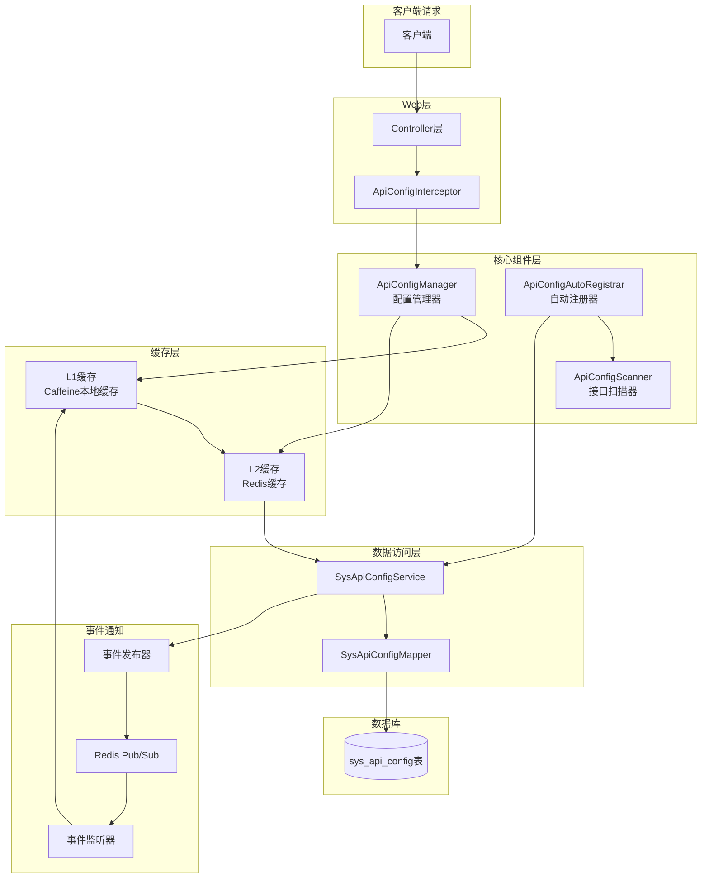
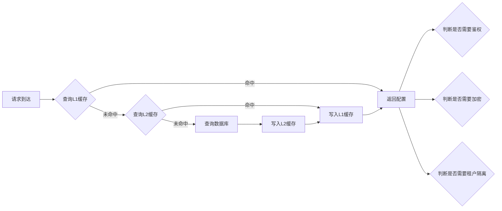
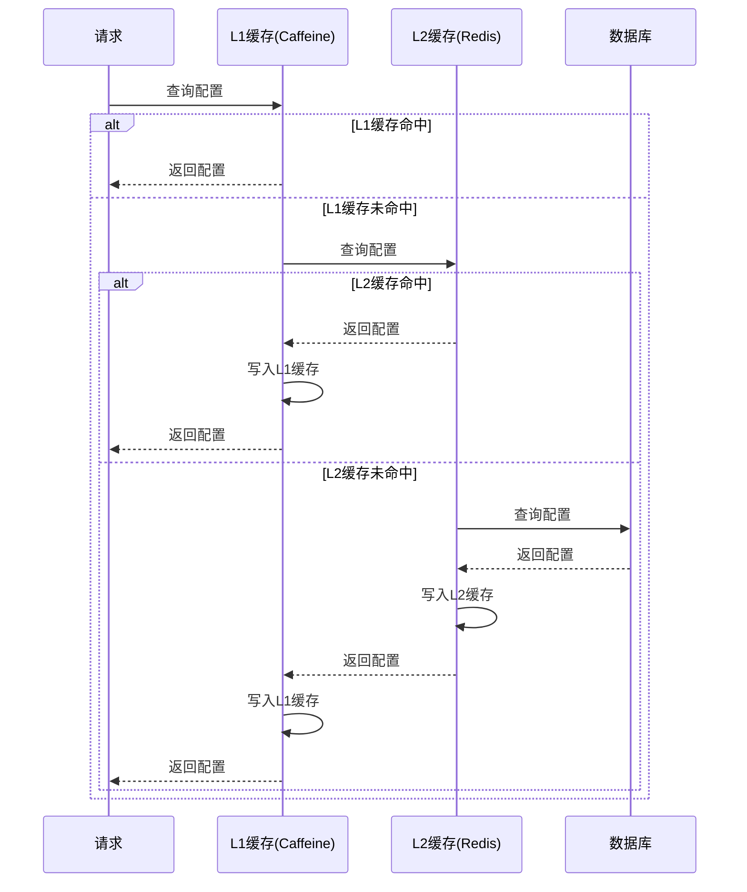
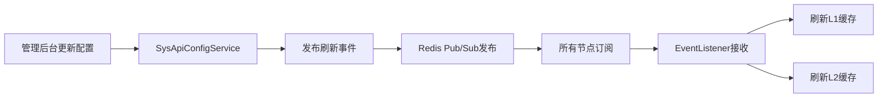
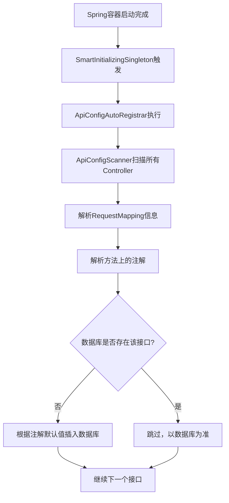

# API 配置管理组件设计文档

## 1. 概述

本文档描述了基于 `sys_api_config` 表的通用接口配置管理组件的设计方案。该组件负责接管系统的接口请求行为，统一管理鉴权、加密、租户等逻辑。

## 2. 系统架构

### 2.1 整体架构图



### 2.2 模块结构

```
forge-starter-api-config/
├── src/main/java/com/mdframe/forge/starter/apiconfig/
│   ├── annotation/              # 自定义注解（如需要）
│   ├── cache/                   # 缓存相关
│   │   ├── ApiConfigCache.java      # 缓存接口
│   │   ├── ApiConfigCaffeineCache.java   # Caffeine实现
│   │   └── ApiConfigRedisCache.java       # Redis实现
│   ├── config/                  # 配置类
│   │   ├── ApiConfigProperties.java
│   │   └── ApiConfigAutoConfiguration.java
│   ├── context/                 # 上下文
│   │   └── ApiConfigContext.java
│   ├── controller/              # 控制器
│   │   ├── SysApiConfigController.java
│   │   └── ApiConfigManageController.java
│   ├── domain/                  # 领域对象
│   │   ├── entity/
│   │   │   └── SysApiConfig.java
│   │   ├── dto/
│   │   │   ├── ApiConfigInfo.java
│   │   │   └── ApiConfigQuery.java
│   │   └── event/
│   │       └── ApiConfigRefreshEvent.java
│   ├── interceptor/             # 拦截器
│   │   └── ApiConfigInterceptor.java
│   ├── mapper/                  # Mapper接口
│   │   └── SysApiConfigMapper.java
│   ├── registry/                # 注册器
│   │   ├── ApiConfigScanner.java
│   │   └── ApiConfigAutoRegistrar.java
│   ├── service/                 # 服务层
│   │   ├── ISysApiConfigService.java
│   │   ├── SysApiConfigServiceImpl.java
│   │   ├── IApiConfigManager.java
│   │   └── ApiConfigManagerImpl.java
│   └── listener/                # 事件监听器
│       └── ApiConfigRefreshListener.java
├── src/main/resources/
│   ├── META-INF/spring/
│   │   └── org.springframework.boot.autoconfigure.AutoConfiguration.imports
│   └── sql/
│       └── api_config_tables.sql
└── pom.xml
```

## 3. 核心组件设计

### 3.1 实体类设计

#### SysApiConfig（数据库实体）

```java
@Data
@EqualsAndHashCode(callSuper = true)
@TableName("sys_api_config")
public class SysApiConfig extends TenantEntity {
    
    @TableId(value = "id", type = IdType.AUTO)
    private Long id;
    
    private String apiName;
    private String apiCode;
    private String reqMethod;
    private String urlPath;
    private String apiVersion;
    private String moduleCode;
    private String serviceId;
    
    // 核心控制开关
    private Integer authFlag;      // 1-需鉴权, 0-忽略鉴权
    private Integer encryptFlag;    // 1-需加密, 0-不加密
    private Integer tenantFlag;    // 1-启用租户隔离, 0-忽略租户
    private Integer limitFlag;     // 1-开启限流, 0-关闭限流
    
    private String sensitiveFields;
    private Integer status;
    private String remark;
}
```

#### ApiConfigInfo（缓存 DTO）

```java
@Data
public class ApiConfigInfo implements Serializable {
    
    private Long id;
    private String apiName;
    private String apiCode;
    private String reqMethod;
    private String urlPath;
    private String apiVersion;
    private String moduleCode;
    private String serviceId;
    
    // 核心控制开关
    private Boolean needAuth;
    private Boolean needEncrypt;
    private Boolean needTenant;
    private Boolean needLimit;
    
    private List<String> sensitiveFields;
    private Boolean enabled;
    private String remark;
    
    // 缓存时间戳
    private Long cacheTime;
}
```

### 3.2 配置优先级与决策引擎

#### 优先级规则

```
数据库配置 > 代码注解配置 > 系统默认值
```

#### 决策引擎流程



#### IApiConfigManager 接口

```java
public interface IApiConfigManager {
    
    /**
     * 根据请求路径和方法获取接口配置
     * 优先级：数据库配置 > 注解配置 > 默认值
     */
    ApiConfigInfo getApiConfig(String urlPath, String method);
    
    /**
     * 刷新指定接口配置缓存
     */
    void refreshApiConfig(String urlPath, String method);
    
    /**
     * 刷新所有接口配置缓存
     */
    void refreshAllApiConfig();
    
    /**
     * 判断接口是否需要鉴权
     */
    boolean needAuth(String urlPath, String method);
    
    /**
     * 判断接口是否需要加密
     */
    boolean needEncrypt(String urlPath, String method);
    
    /**
     * 判断接口是否需要租户隔离
     */
    boolean needTenant(String urlPath, String method);
}
```

### 3.3 缓存架构设计

#### 两级缓存结构



#### 缓存配置

```java
// L1缓存配置（Caffeine）
Cache<String, ApiConfigInfo> localCache = Caffeine.newBuilder()
    .maximumSize(1000)
    .expireAfterWrite(10, TimeUnit.MINUTES)
    .build();

// L2缓存配置（Redis）
String redisKeyPrefix = "api:config:";
long redisExpireSeconds = 1800; // 30分钟
```

### 3.4 缓存刷新机制

#### 刷新流程



#### 事件定义

```java
public class ApiConfigRefreshEvent extends ApplicationEvent {
    
    private final String urlPath;
    private final String method;
    private final RefreshType refreshType; // SINGLE, ALL
    
    public enum RefreshType {
        SINGLE,  // 刷新单个接口
        ALL      // 刷新所有接口
    }
}
```

### 3.5 启动时自动注册

#### 注册流程



#### 注解解析规则

| 注解 | 对应字段 | 默认值 |
|-----|---------|--------|
| @ApiPermissionIgnore | authFlag | 0（忽略鉴权） |
| @ApiDecrypt | encryptFlag | 1（需解密） |
| @ApiEncrypt | encryptFlag | 1（需加密） |
| @IgnoreTenant | tenantFlag | 0（忽略租户） |
| @OperationLog | - | 记录日志 |

## 4. 接口设计

### 4.1 管理后台 CRUD 接口

| 接口路径 | 方法 | 说明 |
|---------|------|------|
| /system/apiConfig/page | GET | 分页查询 |
| /system/apiConfig/list | GET | 列表查询 |
| /system/apiConfig/getById | POST | 根据ID查询 |
| /system/apiConfig/add | POST | 新增 |
| /system/apiConfig/edit | POST | 修改 |
| /system/apiConfig/remove | POST | 删除 |
| /system/apiConfig/removeBatch | POST | 批量删除 |

### 4.2 缓存管理接口

| 接口路径 | 方法 | 说明 |
|---------|------|------|
| /apiConfig/refresh | POST | 刷新所有缓存 |
| /apiConfig/refreshSingle | POST | 刷新单个接口缓存 |
| /apiConfig/clearCache | POST | 清空缓存 |

## 5. 拦截器设计

### 5.1 ApiConfigInterceptor

```java
public class ApiConfigInterceptor implements HandlerInterceptor {
    
    @Override
    public boolean preHandle(HttpServletRequest request, 
                           HttpServletResponse response, 
                           Object handler) throws Exception {
        
        String urlPath = request.getRequestURI();
        String method = request.getMethod();
        
        // 获取接口配置
        ApiConfigInfo config = apiConfigManager.getApiConfig(urlPath, method);
        
        // 应用鉴权配置
        if (config.getNeedAuth()) {
            // 执行鉴权逻辑
        }
        
        // 应用加密配置
        if (config.getNeedEncrypt()) {
            // 标记需要加密响应
        }
        
        // 应用租户配置
        if (config.getNeedTenant()) {
            // 标记需要租户隔离
        }
        
        return true;
    }
}
```

## 6. 配置属性

### 6.1 application.yml 配置示例

```yaml
forge:
  api-config:
    enabled: true
    auto-register: true
    cache:
      local:
        max-size: 1000
        expire-minutes: 10
      redis:
        enabled: true
        expire-seconds: 1800
        key-prefix: "api:config:"
    scan:
      base-packages: "com.mdframe"
```

## 7. 数据库表结构

```sql
CREATE TABLE `sys_api_config` (
  `id` bigint(20) NOT NULL AUTO_INCREMENT COMMENT '主键ID',
  `api_name` varchar(100) NOT NULL COMMENT '接口名称',
  `api_code` varchar(100) DEFAULT NULL COMMENT '接口编码',
  `req_method` varchar(20) NOT NULL COMMENT '请求方式',
  `url_path` varchar(255) NOT NULL COMMENT '接口请求路径',
  `api_version` varchar(20) DEFAULT 'v1.0.0' COMMENT '接口版本号',
  `module_code` varchar(50) NOT NULL COMMENT '所属业务模块',
  `service_id` varchar(100) DEFAULT NULL COMMENT '所属微服务ID',
  `auth_flag` tinyint(1) NOT NULL DEFAULT 1 COMMENT '是否需认证/鉴权',
  `encrypt_flag` tinyint(1) NOT NULL DEFAULT 0 COMMENT '是否需报文加解密',
  `tenant_flag` tinyint(1) NOT NULL DEFAULT 1 COMMENT '是否启用租户隔离',
  `limit_flag` tinyint(1) NOT NULL DEFAULT 0 COMMENT '是否开启限流',
  `sensitive_fields` text DEFAULT NULL COMMENT '需脱敏字段',
  `status` tinyint(1) NOT NULL DEFAULT 1 COMMENT '状态',
  `remark` varchar(500) DEFAULT NULL COMMENT '备注说明',
  `create_by` varchar(64) DEFAULT NULL COMMENT '创建者',
  `create_time` datetime DEFAULT CURRENT_TIMESTAMP COMMENT '创建时间',
  `update_by` varchar(64) DEFAULT NULL COMMENT '更新者',
  `update_time` datetime DEFAULT CURRENT_TIMESTAMP ON UPDATE CURRENT_TIMESTAMP COMMENT '更新时间',
  `tenant_id` bigint(20) DEFAULT NULL COMMENT '租户ID',
  PRIMARY KEY (`id`),
  UNIQUE KEY `uk_method_url` (`url_path`, `req_method`) USING BTREE,
  KEY `idx_module` (`module_code`) USING BTREE
) ENGINE=InnoDB DEFAULT CHARSET=utf8mb4 COMMENT='REST接口配置管理表';
```

## 8. 兼容性说明

### 8.1 现有注解兼容

| 现有注解 | 兼容方式 |
|---------|---------|
| @ApiDecrypt | 自动注册时设置 encryptFlag=1 |
| @ApiEncrypt | 自动注册时设置 encryptFlag=1 |
| @ApiPermissionIgnore | 自动注册时设置 authFlag=0 |
| @OperationLog | 记录日志信息 |
| @IgnoreTenant | 自动注册时设置 tenantFlag=0 |

### 8.2 向后兼容

- 未配置的接口按系统默认值处理
- 已有注解的接口自动同步到数据库
- 数据库配置优先级最高，可覆盖注解配置

## 9. 性能考虑

### 9.1 缓存策略

- L1 缓存：Caffeine，命中率 > 95%
- L2 缓存：Redis，命中率 > 98%
- 缓存预热：启动时加载热点接口配置

### 9.2 并发控制

- 使用 Caffeine 的并发安全特性
- Redis 使用分布式锁防止缓存击穿
- 使用 Spring Event 实现节点间缓存同步

## 10. 扩展性

### 10.1 扩展点

1. **自定义缓存实现**：实现 ApiConfigCache 接口
2. **自定义配置解析**：扩展 ApiConfigScanner
3. **自定义拦截逻辑**：扩展 ApiConfigInterceptor

### 10.2 插件化设计

```java
// 自定义配置解析器
public interface ApiConfigParser {
    ApiConfigInfo parse(Method method, RequestMapping mapping);
}

// 自定义缓存策略
public interface ApiConfigCacheStrategy {
    ApiConfigInfo get(String key);
    void put(String key, ApiConfigInfo value);
    void evict(String key);
    void evictAll();
}
```
