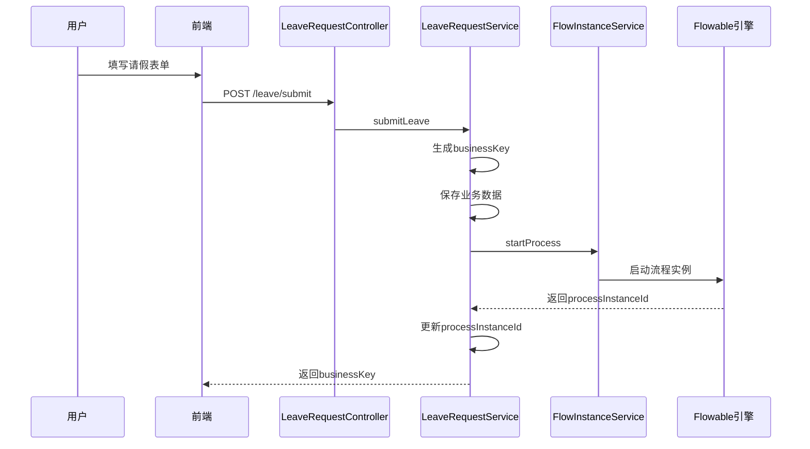
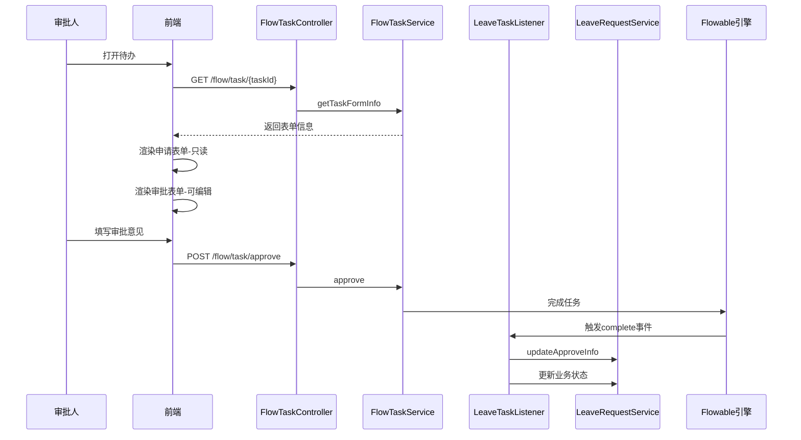

# 请假流程示例实施计划

## 一、概述

本文档详细说明如何根据 `leave-process-integration.md` 设计方案生成请假流程示例代码。

## 二、文件清单

### 2.1 SQL 脚本
| 文件路径 | 说明 |
|---------|------|
| `forge/forge-admin/sql/leave_request.sql` | 请假业务表和菜单数据 |

### 2.2 后端代码
| 文件路径 | 说明 |
|---------|------|
| `forge/forge-flow/src/main/java/com/mdframe/forge/flow/leave/entity/LeaveRequest.java` | 请假实体类 |
| `forge/forge-flow/src/main/java/com/mdframe/forge/flow/leave/mapper/LeaveRequestMapper.java` | Mapper 接口 |
| `forge/forge-flow/src/main/java/com/mdframe/forge/flow/leave/dto/LeaveRequestDTO.java` | 数据传输对象 |
| `forge/forge-flow/src/main/java/com/mdframe/forge/flow/leave/service/LeaveRequestService.java` | 服务接口 |
| `forge/forge-flow/src/main/java/com/mdframe/forge/flow/leave/service/impl/LeaveRequestServiceImpl.java` | 服务实现 |
| `forge/forge-flow/src/main/java/com/mdframe/forge/flow/leave/controller/LeaveRequestController.java` | 控制器 |
| `forge/forge-flow/src/main/java/com/mdframe/forge/flow/leave/listener/LeaveTaskListener.java` | 任务监听器 |

### 2.3 前端代码
| 文件路径 | 说明 |
|---------|------|
| `forge-admin-ui/src/views/leave/apply.vue` | 请假申请页面 |
| `forge-admin-ui/src/views/leave/list.vue` | 我的请假列表页面 |
| `forge-admin-ui/src/api/leave.js` | API 接口 |

### 2.4 BPMN 流程文件
| 文件路径 | 说明 |
|---------|------|
| `forge/forge-admin/sql/leave_process.bpmn20.xml` | 请假流程定义 |

## 三、流程设计

### 3.1 流程图

```
开始 → [申请节点: 填写请假单] → [审批节点: 部门领导审批] → 结束
```

### 3.2 节点配置详情

#### 开始节点 (StartEvent)
- ID: `startEvent`
- 名称: 开始

#### 申请节点 (UserTask)
- ID: `applyTask`
- 名称: 请假申请
- 处理人: `${initiator}` - 流程发起人
- 表单类型: 动态表单
- 表单字段:
  ```json
  [
    {"type": "select", "field": "leaveType", "label": "请假类型", "options": [
      {"label": "年假", "value": "annual"},
      {"label": "病假", "value": "sick"},
      {"label": "事假", "value": "personal"},
      {"label": "婚假", "value": "marriage"},
      {"label": "产假", "value": "maternity"}
    ]},
    {"type": "datePicker", "field": "startTime", "label": "开始时间", "dateType": "datetime"},
    {"type": "datePicker", "field": "endTime", "label": "结束时间", "dateType": "datetime"},
    {"type": "inputNumber", "field": "duration", "label": "请假天数", "precision": 1},
    {"type": "textarea", "field": "reason", "label": "请假原因"},
    {"type": "upload", "field": "attachments", "label": "附件"}
  ]
  ```

#### 审批节点 (UserTask)
- ID: `approveTask`
- 名称: 部门领导审批
- 处理人: `${initiatorLeader}` - 发起人直属领导
- 表单类型: 动态表单
- 表单字段:
  ```json
  [
    {"type": "textarea", "field": "approveComment", "label": "审批意见"},
    {"type": "upload", "field": "approveAttachments", "label": "审批附件"}
  ]
  ```

#### 结束节点 (EndEvent)
- ID: `endEvent`
- 名称: 结束

## 四、数据流转

### 4.1 提交请假申请



### 4.2 审批处理



## 五、关键代码说明

### 5.1 BPMN 流程定义

BPMN XML 文件需要包含：
1. 标准的 BPMN 2.0 命名空间
2. Flowable 扩展命名空间
3. 节点配置（处理人、表单等）

### 5.2 后端服务

`LeaveRequestService` 核心方法：
- `submitLeave()`: 提交请假申请，启动流程
- `saveDraft()`: 保存草稿
- `getByBusinessKey()`: 根据业务Key获取详情
- `updateApproveInfo()`: 更新审批信息

### 5.3 任务监听器

`LeaveTaskListener` 监听任务完成事件，将审批数据保存到业务表。

## 六、实施步骤

### 步骤 1: 执行 SQL 脚本
```bash
# 在数据库中执行
source forge/forge-admin/sql/leave_request.sql
```

### 步骤 2: 部署流程定义
1. 登录系统
2. 进入流程管理 → 流程模型
3. 点击"导入流程"
4. 选择 `leave_process.bpmn20.xml` 文件
5. 部署流程

### 步骤 3: 配置菜单权限
1. 进入系统管理 → 菜单管理
2. 为相应角色分配请假菜单权限

### 步骤 4: 测试流程
1. 以普通用户登录
2. 进入请假管理 → 请假申请
3. 填写表单并提交
4. 以审批人身份登录
5. 在待办任务中处理审批

## 七、注意事项

1. **流程变量**: 启动流程时需要传递 `initiator` 和 `initiatorLeader` 变量
2. **表单数据**: 表单数据以 JSON 格式存储在流程变量中
3. **监听器配置**: 需要在流程定义中正确配置任务监听器
4. **权限控制**: 请假列表只显示当前用户的申请记录

## 八、扩展建议

1. **多级审批**: 可添加条件网关，根据请假天数决定审批级别
2. **会签/或签**: 使用多实例配置实现多人审批
3. **催办功能**: 添加定时任务扫描超时任务
4. **流程转办**: 支持审批人转办给其他人