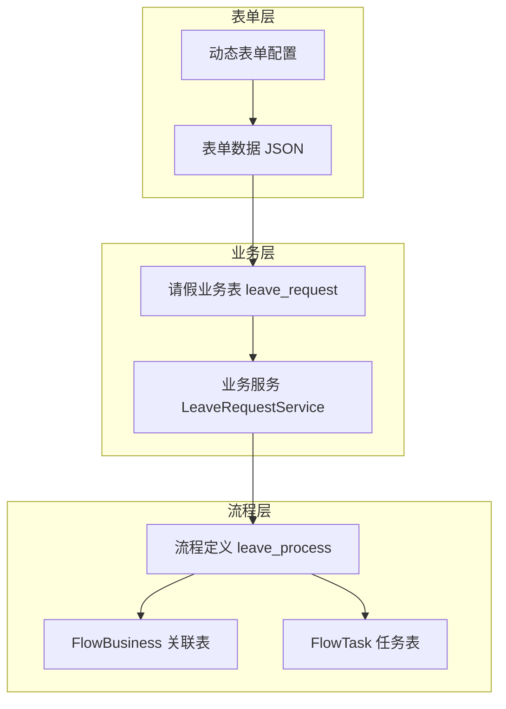
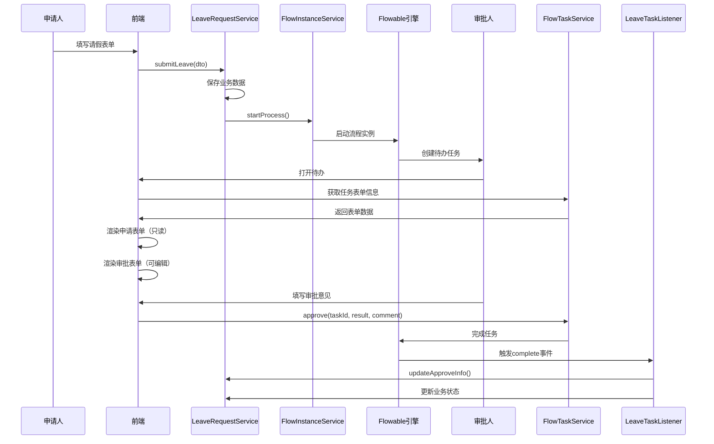

# 请假流程业务集成方案

## 一、业务场景分析

### 1.1 请假流程需求
- 申请人发起请假申请，填写请假信息（请假类型、时间、原因、附件等）
- 部门领导审批，可查看申请人提交的信息
- 领导审批时需要填写审批意见和上传附件
- 审批结果：通过/驳回

### 1.2 数据流转需求
- 申请人的表单数据需要保存并传递给审批人
- 审批人的意见和附件需要保存
- 整个流程的数据需要可追溯

## 二、系统架构设计



## 三、数据库设计

### 3.1 请假业务表

```sql
CREATE TABLE `biz_leave_request` (
  `id` varchar(64) NOT NULL COMMENT '主键ID',
  `business_key` varchar(64) NOT NULL COMMENT '业务Key（关联流程）',
  `process_instance_id` varchar(64) DEFAULT NULL COMMENT '流程实例ID',
  
  -- 申请人信息
  `apply_user_id` varchar(64) NOT NULL COMMENT '申请人ID',
  `apply_user_name` varchar(100) NOT NULL COMMENT '申请人姓名',
  `apply_dept_id` varchar(64) DEFAULT NULL COMMENT '申请部门ID',
  `apply_dept_name` varchar(200) DEFAULT NULL COMMENT '申请部门名称',
  
  -- 请假信息
  `leave_type` varchar(20) NOT NULL COMMENT '请假类型：annual-年假/sick-病假/personal-事假/marriage-婚假/maternity-产假',
  `start_time` datetime NOT NULL COMMENT '开始时间',
  `end_time` datetime NOT NULL COMMENT '结束时间',
  `duration` decimal(10,1) NOT NULL COMMENT '请假天数',
  `reason` text COMMENT '请假原因',
  `attachments` text COMMENT '附件JSON列表',
  
  -- 审批信息
  `status` varchar(20) NOT NULL DEFAULT 'draft' COMMENT '状态：draft-草稿/pending-审批中/approved-已通过/rejected-已驳回/canceled-已取消',
  `approve_user_id` varchar(64) DEFAULT NULL COMMENT '审批人ID',
  `approve_user_name` varchar(100) DEFAULT NULL COMMENT '审批人姓名',
  `approve_time` datetime DEFAULT NULL COMMENT '审批时间',
  `approve_comment` text COMMENT '审批意见',
  `approve_attachments` text COMMENT '审批附件JSON',
  
  -- 系统字段
  `create_time` datetime DEFAULT CURRENT_TIMESTAMP COMMENT '创建时间',
  `update_time` datetime DEFAULT CURRENT_TIMESTAMP ON UPDATE CURRENT_TIMESTAMP COMMENT '更新时间',
  `tenant_id` bigint DEFAULT NULL COMMENT '租户ID',
  
  PRIMARY KEY (`id`),
  UNIQUE KEY `uk_business_key` (`business_key`),
  KEY `idx_apply_user` (`apply_user_id`),
  KEY `idx_process_instance` (`process_instance_id`),
  KEY `idx_status` (`status`)
) ENGINE=InnoDB DEFAULT CHARSET=utf8mb4 COMMENT='请假申请表';
```

### 3.2 流程业务关联表（已存在）

`sys_flow_business` 表已经存在，用于关联业务Key和流程实例。

## 四、流程设计配置

### 4.1 流程图设计

```
开始 → [申请节点: 填写请假单] → [审批节点: 部门领导审批] → 结束
```

### 4.2 节点配置

#### 开始节点
- 无特殊配置

#### 申请节点（UserTask: apply）
- **任务名称**: 请假申请
- **处理人**: `${initiator}` 发起人
- **表单类型**: 动态表单
- **表单字段**:
  - 请假类型（下拉选择）
  - 开始时间（日期选择）
  - 结束时间（日期选择）
  - 请假天数（数字输入，自动计算）
  - 请假原因（多行文本）
  - 附件上传（文件上传）

#### 审批节点（UserTask: approve）
- **任务名称**: 部门领导审批
- **处理人**: `${initiatorLeader}` 发起人直属领导
- **表单类型**: 动态表单
- **表单字段**:
  - 审批意见（多行文本）
  - 附件上传（文件上传）
- **只读字段**: 显示申请人提交的信息

#### 结束节点
- 无特殊配置

## 五、代码实现方案

### 5.1 后端实现

#### 5.1.1 请假实体类

```java
@Data
@TableName("biz_leave_request")
public class LeaveRequest {
    @TableId(type = IdType.ASSIGN_UUID)
    private String id;
    private String businessKey;
    private String processInstanceId;
    
    // 申请人信息
    private String applyUserId;
    private String applyUserName;
    private String applyDeptId;
    private String applyDeptName;
    
    // 请假信息
    private String leaveType;
    private LocalDateTime startTime;
    private LocalDateTime endTime;
    private BigDecimal duration;
    private String reason;
    private String attachments; // JSON格式
    
    // 审批信息
    private String status;
    private String approveUserId;
    private String approveUserName;
    private LocalDateTime approveTime;
    private String approveComment;
    private String approveAttachments; // JSON格式
    
    // 系统字段
    private LocalDateTime createTime;
    private LocalDateTime updateTime;
    private Long tenantId;
}
```

#### 5.1.2 请假服务接口

```java
public interface LeaveRequestService {
    /**
     * 提交请假申请（启动流程）
     */
    String submitLeave(LeaveRequestDTO dto);
    
    /**
     * 保存草稿
     */
    String saveDraft(LeaveRequestDTO dto);
    
    /**
     * 根据businessKey获取请假详情
     */
    LeaveRequest getByBusinessKey(String businessKey);
    
    /**
     * 更新审批信息
     */
    void updateApproveInfo(String businessKey, String comment, String attachments);
}
```

#### 5.1.3 请假服务实现

```java
@Service
public class LeaveRequestServiceImpl implements LeaveRequestService {
    
    @Autowired
    private LeaveRequestMapper leaveRequestMapper;
    
    @Autowired
    private FlowInstanceService flowInstanceService;
    
    @Override
    @Transactional(rollbackFor = Exception.class)
    public String submitLeave(LeaveRequestDTO dto) {
        // 1. 生成业务Key
        String businessKey = "LEAVE_" + UUID.randomUUID().toString().replace("-", "");
        
        // 2. 保存业务数据
        LeaveRequest leave = new LeaveRequest();
        BeanUtils.copyProperties(dto, leave);
        leave.setBusinessKey(businessKey);
        leave.setStatus("pending");
        leave.setCreateTime(LocalDateTime.now());
        leaveRequestMapper.insert(leave);
        
        // 3. 构建流程变量
        Map<String, Object> variables = new HashMap<>();
        variables.put("leaveType", dto.getLeaveType());
        variables.put("duration", dto.getDuration());
        variables.put("reason", dto.getReason());
        // 可以把整个表单数据作为变量传递
        variables.put("formData", JSON.toJSONString(dto));
        
        // 4. 启动流程
        String processInstanceId = flowInstanceService.startProcess(
            "leave_process",           // 流程定义Key
            businessKey,               // 业务Key
            "leave",                   // 业务类型
            dto.getTitle(),            // 流程标题
            variables,                 // 流程变量
            dto.getApplyUserId(),
            dto.getApplyUserName(),
            dto.getApplyDeptId(),
            dto.getApplyDeptName()
        );
        
        // 5. 更新流程实例ID
        leave.setProcessInstanceId(processInstanceId);
        leaveRequestMapper.updateById(leave);
        
        return businessKey;
    }
    
    @Override
    public void updateApproveInfo(String businessKey, String comment, String attachments) {
        LeaveRequest leave = getByBusinessKey(businessKey);
        if (leave != null) {
            leave.setApproveComment(comment);
            leave.setApproveAttachments(attachments);
            leave.setApproveTime(LocalDateTime.now());
            leaveRequestMapper.updateById(leave);
        }
    }
}
```

#### 5.1.4 流程任务监听器

```java
@Component
public class LeaveTaskListener implements TaskListener {
    
    @Autowired
    private LeaveRequestService leaveRequestService;
    
    @Override
    public void notify(DelegateTask delegateTask) {
        String eventName = delegateTask.getEventName();
        
        if ("complete".equals(eventName)) {
            // 任务完成时，保存审批信息
            String processInstanceId = delegateTask.getProcessInstanceId();
            
            // 从流程变量获取businessKey
            String businessKey = (String) delegateTask.getVariable("businessKey");
            
            // 获取审批意见和附件
            String comment = (String) delegateTask.getVariable("approveComment");
            String attachments = (String) delegateTask.getVariable("approveAttachments");
            
            // 更新业务数据
            leaveRequestService.updateApproveInfo(businessKey, comment, attachments);
        }
    }
}
```

### 5.2 前端实现

#### 5.2.1 请假申请页面

```vue
<template>
  <div class="leave-apply">
    <n-card title="请假申请">
      <n-form ref="formRef" :model="formData" :rules="rules" label-placement="left" label-width="100">
        <!-- 请假类型 -->
        <n-form-item label="请假类型" path="leaveType">
          <n-select v-model:value="formData.leaveType" :options="leaveTypeOptions" />
        </n-form-item>
        
        <!-- 时间选择 -->
        <n-form-item label="开始时间" path="startTime">
          <n-date-picker v-model:value="formData.startTime" type="datetime" />
        </n-form-item>
        
        <n-form-item label="结束时间" path="endTime">
          <n-date-picker v-model:value="formData.endTime" type="datetime" @update:value="calcDuration" />
        </n-form-item>
        
        <n-form-item label="请假天数">
          <n-input-number v-model:value="formData.duration" :precision="1" readonly />
        </n-form-item>
        
        <!-- 请假原因 -->
        <n-form-item label="请假原因" path="reason">
          <n-input v-model:value="formData.reason" type="textarea" :rows="4" />
        </n-form-item>
        
        <!-- 附件上传 -->
        <n-form-item label="附件">
          <n-upload :file-list="fileList" @update:file-list="handleFileChange">
            <n-button>上传附件</n-button>
          </n-upload>
        </n-form-item>
      </n-form>
      
      <n-space justify="end">
        <n-button @click="handleSaveDraft">保存草稿</n-button>
        <n-button type="primary" @click="handleSubmit">提交申请</n-button>
      </n-space>
    </n-card>
  </div>
</template>
```

#### 5.2.2 审批页面增强

在现有的待办处理页面基础上，需要增加以下功能：

1. **显示申请人提交的表单数据**（只读）
2. **审批人填写审批意见和附件**
3. **提交时将数据保存到业务表**

## 六、数据流转流程



## 七、实施步骤

### 步骤1：创建业务表
执行SQL创建 `biz_leave_request` 表

### 步骤2：创建后端代码
1. 创建 `LeaveRequest` 实体类
2. 创建 `LeaveRequestMapper`
3. 创建 `LeaveRequestService` 和实现类
4. 创建 `LeaveRequestController`

### 步骤3：设计流程
1. 在流程管理中创建新流程
2. 设计流程图：开始 → 申请 → 审批 → 结束
3. 配置节点属性：
   - 申请节点：处理人=`${initiator}`，表单=请假申请表单
   - 审批节点：处理人=`${initiatorLeader}`，表单=审批表单
4. 部署流程

### 步骤4：创建前端页面
1. 创建请假申请页面 `/leave/apply`
2. 创建我的请假列表页面 `/leave/list`
3. 修改待办处理页面，支持显示业务表单数据

### 步骤5：配置流程监听器
1. 创建 `LeaveTaskListener`
2. 在流程配置中注册监听器

## 八、关键配置说明

### 8.1 流程变量传递
在启动流程时，将业务数据作为流程变量传递：
```java
variables.put("formData", JSON.toJSONString(leaveRequestDTO));
```

### 8.2 表单数据获取
在审批节点，通过 `formKey` 或 `formJson` 获取表单配置，同时从流程变量获取申请人提交的数据。

### 8.3 审批数据保存
通过任务监听器，在任务完成时将审批意见和附件保存到业务表。

## 九、扩展建议

### 9.1 多级审批
如果需要多级审批，可以在流程中添加多个审批节点，使用条件网关控制流转。

### 9.2 会签/或签
使用 Flowable 的多实例配置实现会签或或签。

### 9.3 催办功能
通过定时任务扫描超时任务，发送催办通知。

### 9.4 流程转办/委托
使用 Flowable 的委托功能实现任务转办。